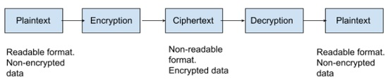

# 331.1 X.509 Certificates and Public Key Infrastructures

#### _Topic 331: Cryptography_

**Weight:** 5

**Description:** Candidates should understand X.509 certificates and public key infrastructures. They should know how to configure and use OpenSSL to implement certification authorities and issue SSL certificates for various purposes.

**Key Knowledge Areas:**

* Understand X.509 certificates, X.509 certificate lifecycle, X.509 certificate fields and X.509v3 certificate extensions
* Understand trust chains and public key infrastructures, including certificate transparency
* Generate and manage public and private keys
* Create, operate and secure a certification authority
* Request, sign and manage server and client certificates
* Revoke certificates and certification authorities
* Basic feature knowledge of Let's Encrypt, ACME and certbot
* Basic feature knowledge of CFSSL

**Partial list of the used files, terms and utilities:**

* openssl (including relevant subcommands)
* OpenSSL configuration
* PEM, DER, PKCS
* CSR
* CRL
* OCSP

### Cryptography concepts

#### What is Cryptography?&#x20;

Cryptography is a method of protecting information and communications through the use of codes, so that only those for whom the information is intended can read and process it.

In computer science, cryptography refers to secure information and communication techniques derived from mathematical concepts and a set of rule-based calculations called algorithms, to transform messages in ways that are hard to decipher. These deterministic algorithms are used for cryptographic key generation, digital signing, verification to protect data privacy, web browsing on the internet and confidential communications such as credit card transactions and email.

#### Uses of Cryptography:

* Encryption: Encryption is the method by which information is converted into secret code that hides the information's true meaning. The science of encrypting and decrypting information is called _cryptography_.
* Integrity: The information cannot be altered in storage or transit between sender and intended receiver without the alteration being detected.
* Authentication: The sender and receiver can confirm each other's identity and the origin/destination of the information.

There are two primary elements in cryptography:

* **Key:** Key is used to encrypt data and must be kept secret
* **Algorithm:** The Method used to encode and decode messages are called _encryption algorithms,_ or _ciphers_. It may or may not be public. **Examples: AES, blowfish, 3DES(old)**

<figure><figcaption></figcaption></figure>


**Ciphers**

In computing, unencrypted data is also known as _plaintext_, and encrypted data is called _ciphertext_. The formulas used to encode and decode messages are called _encryption algorithms,_ or _ciphers_.

The ciphertext may be deciphered (or unencrypted) with a key



#### Symmetric encryption vs Asymmetric encryption

There are two types of encryption in modern  Cryptography.

**Symmetric:** Secret key encryption, also known as _symmetric encryption_, uses a single key to encrypt and decrypt data. This type of encryption is _symmetric_ because the same key is used to encrypt plaintext into ciphertext and decrypt that ciphertext back into plaintext, so both parties must know the key. It is generally faster than Asymmetric encryption. **examples: AES,blowfish**.

<figure><figcaption></figcaption></figure>

**Asymmetric:** Public key cryptography, also referred to as _asymmetric cryptography_, uses public key pairs. One of the paired keys is public, and the other is private. Each of these keys can transform plaintext into encrypted ciphertext -- but ciphertext encrypted with one of the keys can only be decrypted with the other key.

When the public key is used to encrypt ciphertext, that text can only be decrypted using the private key. This enables anyone with access to the public key to encrypt a plaintext message, which only the private key holder will be able to decrypt. This is how private messages can be sent without exchanging a shared secret key.

Text encrypted with the private key can only be decrypted using the public key. This is how a digital signature is created. A ciphertext encrypted with a private key is decrypted using the public key to authenticate the signature.

Public keys are published in publicly accessible repositories, where anyone who needs to communicate with public key pair holders can access them. The key pair owner is the only one who can hold the private key. It must remain secret, or else the key pair can't be trusted to authenticate the owner.

<figure><figcaption></figcaption></figure>

#### Data integrity through hashes

Hash functions provide another type of encryption. Hashing is the transformation of a string of characters into a fixed-length value or key that represents the original string.

* [x] Each string provides a unique hash
* [x] hashing is generally one way
* [x] a salt may be used to improve security (a salt is an additional text value \[typically a random text ]) added to the ciphertext to improve security
* [x] common hashing algorithms include **CRC2(insecure), md5 , sha-1 (most common)**

### PKI and trust chains

Before jumping into  details of how public key infrastructure works, let’s first cover what PKI is to ensure we’re all on the same page.

#### What is PKI? &#x20;

In a nutshell, **public key infrastructure (PKI)** is a system (based on encryption key pairs and digital certificates) that’s used for securing communications between different computer systems. Public Key Infrastructure is made up of hierarchy of **Certificate Authorities** and a **Certificate Signing Request** process.

#### What is Certificate Authotiry?

A **certificate authority**, also known as a **certification authority (CA)**, is a trusted organization that validates authenticity of a **public key**. Their objective is to make the internet a more secure place for organizations and users alike. This means that they play a important role in digital security.


#### Certificate Authorities Are Like Passport Authorities for the Internet 

If you’ve ever gotten a passport to travel internationally, you probably remember the verification process that you went through to prove that you are who you claimed to be. (It probably included some legal papers, photo ID, and maybe fingerprints.)

Once you got your passport, you could use it to prove to anyone that you’re really you. (Even if they’d never met you before.)

Certificate authorities are like that — but for websites and online activities. Just like the passport office, a certificate authority charges a small fee to complete the verification process and issue the certificate. In this case, after they verify a website (or organization), they issue what’s known as a digital certificate. This digital file enables organizations, websites, or other entities to prove who they are — that they’re the real deal.


#### How Certificate Authority works?

Creating and working with Certificates

Operating a Certificate Authority

.

.

.

[https://www.techtarget.com/searchsecurity/definition/cryptography](https://www.techtarget.com/searchsecurity/definition/cryptography)

[https://www.techtarget.com/searchsecurity/definition/encryption](https://www.techtarget.com/searchsecurity/definition/encryption)

[https://www.bartleby.com/subject/engineering/computer-science/concepts/cryptography](https://www.bartleby.com/subject/engineering/computer-science/concepts/cryptography)

[https://www.techtarget.com/searchsecurity/definition/key](https://www.techtarget.com/searchsecurity/definition/key)

[https://sachi73blog.wordpress.com/2013/11/21/symmetric-encryption-vs-asymmetric-encryption/](https://sachi73blog.wordpress.com/2013/11/21/symmetric-encryption-vs-asymmetric-encryption/)

[https://www.thesslstore.com/blog/how-pki-works/](https://www.thesslstore.com/blog/how-pki-works/)

[https://www.thesslstore.com/blog/what-is-a-certificate-authority-ca-and-what-do-they-do/](https://www.thesslstore.com/blog/what-is-a-certificate-authority-ca-and-what-do-they-do/)

.

