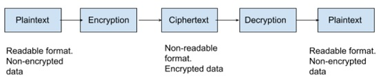
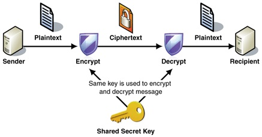
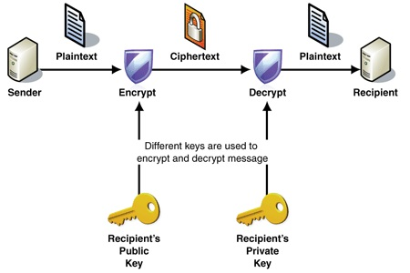
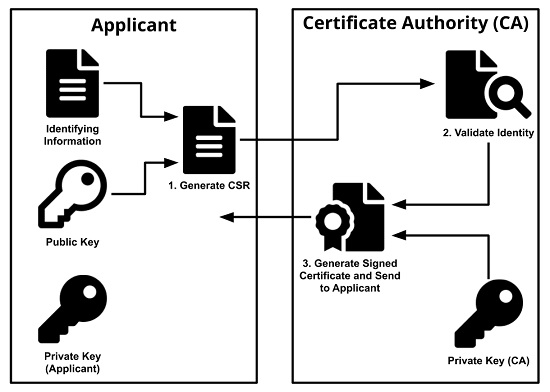
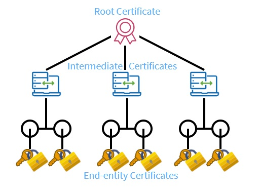
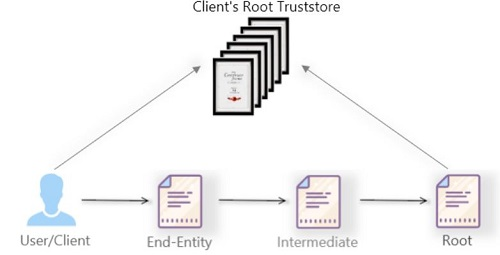
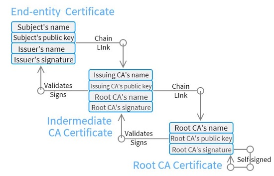
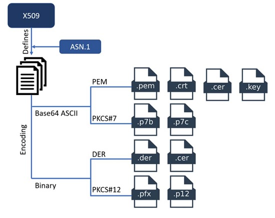

# 331.1 X.509 Certificates and Public Key Infrastructures

#### _Topic 331: Cryptography_

**Weight:** 5

**Description:** Candidates should understand X.509 certificates and public key infrastructures. They should know how to configure and use OpenSSL to implement certification authorities and issue SSL certificates for various purposes.


**Key Knowledge Areas:**

* Understand X.509 certificates, X.509 certificate lifecycle, X.509 certificate fields and X.509v3 certificate extensions
* Understand trust chains and public key infrastructures, including certificate transparency
* Generate and manage public and private keys
* Create, operate and secure a certification authority
* Request, sign and manage server and client certificates
* Revoke certificates and certification authorities
* Basic feature knowledge of Let's Encrypt, ACME and certbot
* Basic feature knowledge of CFSSL

**Partial list of the used files, terms and utilities:**

* openssl (including relevant subcommands)
* OpenSSL configuration
* PEM, DER, PKCS
* CSR
* CRL
* OCSP


## Cryptography concepts

### What is Cryptography?&#x20;

Cryptography is a method of protecting information and communications through the use of codes, so that only those for whom the information is intended can read and process it.

In computer science, cryptography refers to secure information and communication techniques derived from mathematical concepts and a set of rule-based calculations called algorithms, to transform messages in ways that are hard to decipher. These deterministic algorithms are used for cryptographic key generation, digital signing, verification to protect data privacy, web browsing on the internet and confidential communications such as credit card transactions and email.

### Uses of Cryptography:

* Encryption: Encryption is the method by which information is converted into secret code that hides the information's true meaning. The science of encrypting and decrypting information is called _cryptography_.
* Integrity: The information cannot be altered in storage or transit between sender and intended receiver without the alteration being detected.
* Authentication: The sender and receiver can confirm each other's identity and the origin/destination of the information.

There are two primary elements in cryptography:

* **Key:** Key is used to encrypt data and must be kept secret
* **Algorithm:** The Method used to encode and decode messages are called _encryption algorithms,_ or _ciphers_. It may or may not be public. **Examples: AES, blowfish, 3DES(old)**

<figure><figcaption></figcaption></figure>


**Ciphers**

In computing, unencrypted data is also known as _plaintext_, and encrypted data is called _ciphertext_. The formulas used to encode and decode messages are called _encryption algorithms,_ or _ciphers_.

The ciphertext may be deciphered (or unencrypted) with a key


### Symmetric encryption vs Asymmetric encryption

There are two types of encryption in modern  Cryptography.

**Symmetric:** Secret key encryption, also known as _symmetric encryption_, uses a single key to encrypt and decrypt data. This type of encryption is _symmetric_ because the same key is used to encrypt plaintext into ciphertext and decrypt that ciphertext back into plaintext, so both parties must know the key. It is generally faster than Asymmetric encryption. **examples: AES,blowfish**.

<figure><figcaption></figcaption></figure>

**Asymmetric:** Public key cryptography, also referred to as _asymmetric cryptography_, uses public key pairs. One of the paired keys is public, and the other is private. Each of these keys can transform plaintext into encrypted ciphertext -- but ciphertext encrypted with one of the keys can only be decrypted with the other key.

When the public key is used to encrypt ciphertext, that text can only be decrypted using the private key. This enables anyone with access to the public key to encrypt a plaintext message, which only the private key holder will be able to decrypt. This is how private messages can be sent without exchanging a shared secret key.

Text encrypted with the private key can only be decrypted using the public key. This is how a digital signature is created. A ciphertext encrypted with a private key is decrypted using the public key to authenticate the signature.

Public keys are published in publicly accessible repositories, where anyone who needs to communicate with public key pair holders can access them. The key pair owner is the only one who can hold the private key. It must remain secret, or else the key pair can't be trusted to authenticate the owner.

<figure><figcaption></figcaption></figure>

### Data integrity through hashes

Hash functions provide another type of encryption. Hashing is the transformation of a string of characters into a fixed-length value or key that represents the original string.

* [x] Each string provides a unique hash
* [x] hashing is generally one way
* [x] a salt may be used to improve security (a salt is an additional text value \[typically a random text ]) added to the ciphertext to improve security
* [x] common hashing algorithms include **CRC2(insecure), md5 , sha-1 (most common)**


Hashing utilities&#x20;

* **md5sum**: Creates a hash based on input&#x20;
* **openssl dgst**


## PKI and trust chains

Before jumping into  details of how public key infrastructure works, let’s first cover what PKI is to ensure we’re all on the same page.

### What is PKI? &#x20;

In a nutshell, **public key infrastructure (PKI)** is a system (based on encryption key pairs and digital certificates) that’s used for securing communications between different computer systems. Public Key Infrastructure is made up of hierarchy of **Certificate Authorities** and a **Certificate Signing Request** process.

### What is Certificate Authotiry?

A **certificate authority (CA)**, also sometimes referred to as a **certification authority**, is a company or organization that acts to validate the identities of entities (such as websites, email addresses, companies, or individual persons) and bind them to cryptographic keys through the issuance of electronic documents known as **digital certificates**.


#### Certificate Authorities Are Like Passport Authorities for the Internet <a href="#certificate-authorities-are-like-passport-authorities-for-the-internet" id="certificate-authorities-are-like-passport-authorities-for-the-internet"></a>

If you’ve ever gotten a passport to travel internationally, you probably remember the verification process that you went through to prove that you are who you claimed to be. (It probably included some legal papers, photo ID, and maybe fingerprints.)

Once you got your passport, you could use it to prove to anyone that you’re really you. (Even if they’d never met you before.)

Certificate authorities are like that — but for websites and online activities. Just like the passport office, a certificate authority charges a small fee to complete the verification process and issue the certificate. In this case, after they verify a website (or organization), they issue what’s known as a digital certificate. This digital file enables organizations, websites, or other entities to prove who they are — that they’re the real deal.


### What is **Certificate Signing Request?**

Certificate Signing Request(CSR) are essentially public keys that are generated and may be submitted to a CA to be signed.

When CA signs a CSR, it produces a certificate that is trusted by the signing CA.

### How Certificate Authority works?

a CA is a trusted third party that validate the authenticity of a public key.

<figure><figcaption></figcaption></figure>

### chain of trust

The SSL/TLS internet security standard is based on a trust relationship model, also called “certificate chain of trust.”

there is a root CA that has signs verified CA certificate

<figure><figcaption></figcaption></figure>

by trusting CA certificate, you trust all certificates signed by that CA.

<figure><figcaption></figcaption></figure>

lets take a closer look:

<figure><figcaption></figcaption></figure>

_A CA public key has typically been signed by another CA that is trusted._

### OCSP , CRL

the CA can invalidate the certificate if need be by using either OCSP(Online Certificate Status Protocol) or by using a CRL(Certificate Revocation List)

### Creating and working with Certificates

<pre><code>#Creating a private key
openssl genrsa -&#x3C;algorithm> -out &#x3C;key_filename> &#x3C;key_size>
openssl genrsa -aes128 -out mykey.pem 2048
<strong>
</strong><strong># Generating a self-signed certificate (public key)
</strong>openssl req -utf8 -new -key &#x3C;key_filename> -x509 -days &#x3C;cert_lifespan> -out &#x3C;cert_filename>

#Display Certificate
openssl x509 -in mycert.crt -text -noout

#Creating a CSR
openssl req -new -key &#x3C;priv_key.pem> -out &#x3C;output.csr>
</code></pre>

### X.509 Certificate File Format

The openssl command creates **PEM** formatted files by default. Furthermore, there are different X.509 certificate formats like DER, PEM, PKCS#7 and PKCS#12. CAs will provide the certificates with one of these formats. Here, PKCS#7 and PEM formats use Base64 ASCII encoding & DER and PKCS#12 use binary encoding. Likewise, all the certificates have different extensions based on their used encoding and format.

<figure><figcaption></figcaption></figure>

#### PEM Format

Usually, CAs (Certificate Authorities), provide certificates in PEM format which are encoded files in Base64 ASCII. The file type of this certificate can be .crt, .pem, .cer or .key. And this .pem file can include the server certificate, the intermediate certificate and the private key file within a single file. It’s also possible that the server and the intermediate certificate can be provided in a separate file, .crt or .cer and the private key in a .key file.

PEM files can be opened through text editors like notepad and MS word, as it uses an ASCII encoding. Also, the PEM file contains the certificate between the statements —- BEGIN CERTIFICATE—- and —-END CERTIFICATE—-. The private key is between the —- BEGIN RSA PRIVATE KEY—– and —–END RSA PRIVATE KEY—– statements and the CSR is between the statements —–BEGIN CERTIFICATE REQUEST—– and —–END CERTIFICATE REQUEST—–.

#### PKCS#7 Format

The PKCS#7 format is a Cryptographic Message Syntax Standard which uses a Base64 ASCII encoding file with .p7b or .p7c extension. Also, only this certificate can be stored and not its private keys. This certificate is contained within the statement —–BEGIN PKCS7—– and —–END PKCS7—–.

#### DER Format

DER Certificates are mainly used for Java-based web servers and they are in binary form with an extension of .der or .cer files.

#### PKCS#12 Format

The PKCS#12 certificates are mostly used in the Windows platform and they offer two different extensions of files, .pfx and .p12. It uses a binary form and helps to store the server certificate, the intermediate certificate and the private key within a single .pfx file with password protection.

Various openssl sub-commands can do conversion as noted below:

<pre><code><strong>#DER to PEM:
</strong>openssl x509 -inform der -in certificate.cer -out certificate.pem

#PEM to DER:
openssl x509 -outform der -in certificate.pem -out certificate.der
#p7b/pkcs#7 to PEM:
openssl pkcs7 -print_certs -in certificate.p7b -out certificate.pem.

#PEM to p7b/pkcs#7:
openssl pkcs7 -print_certs -in certificate.p7b -out certificate.cer
</code></pre>

### Operating a Certificate Authority

The CA has three primary responsibilities: &#x20;

• Sign valid CSRs&#x20;

• Maintain security of their private key&#x20;

• Revoke compromised or misused certificates

### Operating CA

first let take a look at openssl configurations, if we run `openssl ca` command with no options, it will shows what configurations  files using:

```
[root@rocky8 ~]# openssl ca
Using configuration from /etc/pki/tls/openssl.cnf
Can't open /etc/pki/CA/private/cakey.pem for reading, No such file or directory
140316000794432:error:02001002:system library:fopen:No such file or directory:crypto/bio/bss_file.c:69:fopen('/etc/pki/CA/private/cakey.pem','r')
140316000794432:error:2006D080:BIO routines:BIO_new_file:no such file:crypto/bio/bss_file.c:76:
unable to load CA private key
```

it shows that is unable to find a private key. so use following commands to create a private-key:

```
[root@rocky8 ~]# openssl genrsa -des3 2048 > /etc/pki/CA/private/cakey.pem
-bash: /etc/pki/CA/private/cakey.pem: No such file or directory
[root@rocky8 ~]# mkdir -p /etc/pki/CA/private/
[root@rocky8 ~]# openssl genrsa -des3 2048 > /etc/pki/CA/private/cakey.pem
Generating RSA private key, 2048 bit long modulus (2 primes)
...................................................................................................................................................................................................................+++++
..............................................................................................................+++++
e is 65537 (0x010001)
Enter pass phrase:
Verifying - Enter pass phrase:
[root@rocky8 ~]#
```

now we can continue using following commands:

```
#Creating a private key
openssl genrsa -<algorithm> -out <key_filename> <key_size>
openssl genrsa -aes128 -out mykey.key 2048

#Generating a self-signed certificate (public key)
openssl req -utf8 -new -key <key_filename> -x509 -days <cert-lifespan> -out <cert_filename> -set_serial 0
#note: you would add -set_serial <serial-num> for a CA certificate, it is stored in /etc/pki/CA/serial

#Signing a CSR as a CA (requires CA keys)
openssl ca -in <CSR> -out <crt>

#view the content of certificate
openssl x509 -in <cert_filename.crt> -text -nout | less

```

**note: `-set_serial`** allows a serial number to be set for a self-signed certificate.&#x20;


There are a couple required files that openssl ca must have to work (creation commands noted below):

* **`echo 00 > /etc/pki/CA/serial`**&#x20;
* **`touch /etc/pki/CA/index.html`**


> it is good to know that there is an  alternative tool for openssl on redhat which is called  **genkey** It is Simpler than openssl and  uses TUI .See genkey --help for a list of subcommands


that's all.

.

.

.

resources:

[https://www.techtarget.com/searchsecurity/definition/cryptography](https://www.techtarget.com/searchsecurity/definition/cryptography)

[https://www.techtarget.com/searchsecurity/definition/encryption](https://www.techtarget.com/searchsecurity/definition/encryption)

[https://www.bartleby.com/subject/engineering/computer-science/concepts/cryptography](https://www.bartleby.com/subject/engineering/computer-science/concepts/cryptography)

[https://www.techtarget.com/searchsecurity/definition/key](https://www.techtarget.com/searchsecurity/definition/key)

[https://sachi73blog.wordpress.com/2013/11/21/symmetric-encryption-vs-asymmetric-encryption/](https://sachi73blog.wordpress.com/2013/11/21/symmetric-encryption-vs-asymmetric-encryption/)

[https://www.thesslstore.com/blog/how-pki-works/](https://www.thesslstore.com/blog/how-pki-works/)

[https://www.ssl.com/faqs/what-is-a-certificate-authority/](https://www.ssl.com/faqs/what-is-a-certificate-authority/)

[https://www.keyfactor.com/blog/certificate-chain-of-trust/](https://www.keyfactor.com/blog/certificate-chain-of-trust/)

[https://aboutssl.org/ssl-guide/](https://aboutssl.org/ssl-guide/)

[https://kb.iweb.com/hc/en-us/articles/230268628-SSL-TLS-issues-POODLE-BEAST-SWEET32-attacks-and-the-End-of-SSLv3-OpenSSL-Security-Advisory](https://kb.iweb.com/hc/en-us/articles/230268628-SSL-TLS-issues-POODLE-BEAST-SWEET32-attacks-and-the-End-of-SSLv3-OpenSSL-Security-Advisory)

.


.


