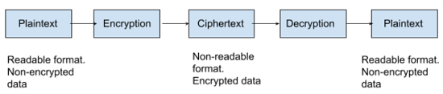

# 331.1 X.509 Certificates and Public Key Infrastructures

#### _Topic 331: Cryptography_

**Weight:** 5

**Description:** Candidates should understand X.509 certificates and public key infrastructures. They should know how to configure and use OpenSSL to implement certification authorities and issue SSL certificates for various purposes.

**Key Knowledge Areas:**

* Understand X.509 certificates, X.509 certificate lifecycle, X.509 certificate fields and X.509v3 certificate extensions
* Understand trust chains and public key infrastructures, including certificate transparency
* Generate and manage public and private keys
* Create, operate and secure a certification authority
* Request, sign and manage server and client certificates
* Revoke certificates and certification authorities
* Basic feature knowledge of Let's Encrypt, ACME and certbot
* Basic feature knowledge of CFSSL

**Partial list of the used files, terms and utilities:**

* openssl (including relevant subcommands)
* OpenSSL configuration
* PEM, DER, PKCS
* CSR
* CRL
* OCSP

### Cryptography concepts

#### What is Cryptography?&#x20;

Cryptography is a method of protecting information and communications through the use of codes, so that only those for whom the information is intended can read and process it.

In computer science, cryptography refers to secure information and communication techniques derived from mathematical concepts and a set of rule-based calculations called algorithms, to transform messages in ways that are hard to decipher. These deterministic algorithms are used for cryptographic key generation, digital signing, verification to protect data privacy, web browsing on the internet and confidential communications such as credit card transactions and email.

#### Uses of Cryptography:

* Encryption: Encryption is the method by which information is converted into secret code that hides the information's true meaning. The science of encrypting and decrypting information is called _cryptography_.
* Integrity: The information cannot be altered in storage or transit between sender and intended receiver without the alteration being detected.
* Authentication: The sender and receiver can confirm each other's identity and the origin/destination of the information.

There are two primary elements in cryptography:

* Key: Key is used to encrypt data and must be kept secret
* Algorithm:  The Method used to encode and decode messages are called _encryption algorithms,_ or _ciphers_. It may or may not be public. Examples: AES, blowfish, 3DES(old)

<figure><figcaption></figcaption></figure>


**Ciphers**

In computing, unencrypted data is also known as _plaintext_, and encrypted data is called _ciphertext_. The formulas used to encode and decode messages are called _encryption algorithms,_ or _ciphers_.

The ciphertext may be deciphered (or unencrypted) with a key



#### Asymmetric encryption vs symmetric encryption

There are two types of encryption in modern  Cryptography.

PKI and trust chains

Creating and working with Certificates

Operating a Certificate Authority

.

.

.

[https://www.techtarget.com/searchsecurity/definition/cryptography](https://www.techtarget.com/searchsecurity/definition/cryptography)

[https://www.techtarget.com/searchsecurity/definition/encryption](https://www.techtarget.com/searchsecurity/definition/encryption)

.

