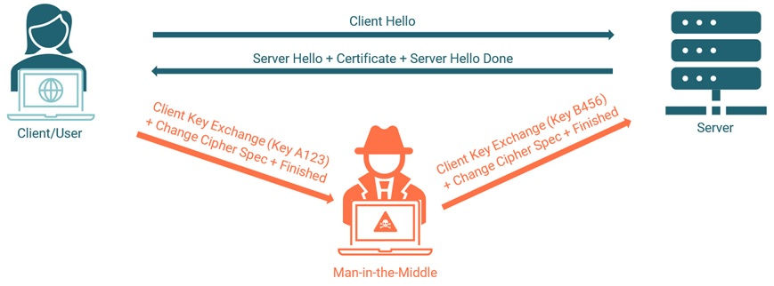

# 331.2 X.509 Certificates for Encryption, Signing and Authentication

**Weight:** 4

**Description:** Candidates should be able to use X.509 certificates for both server and client authentication. This includes implementing user and server authentication for Apache HTTPD. The version of Apache HTTPD covered is 2.4 or higher.


**Key Knowledge Areas:**

* Understand SSL, TLS, including protocol versions and ciphers
* Configure Apache HTTPD with mod\_ssl to provide HTTPS service, including SNI and HSTS
* Configure Apache HTTPD with mod\_ssl to serve certificate chains and adjust the cipher configuration (no cipher-specific knowledge)
* Configure Apache HTTPD with mod\_ssl to authenticate users using certificates
* Configure Apache HTTPD with mod\_ssl to provide OCSP stapling
* Use OpenSSL for SSL/TLS client and server tests

**Partial list of the used files, terms and utilities:**

* httpd.conf
* mod\_ssl
* openssl (including relevant subcommands)

## SSL, TLS and common Transport Security Threats

### SSL and TLS&#x20;

SSL and TLS were developed primarily to protect Web transactions, but they can be used to protect any type network traffic that utilizes TCP at the transport layer. Both SSL and TLS are located above TCP in the protocol stack. Applications that interface with TCP when security is not required interface with SSL or TLS when security is required.

| SSL                                                               | TLS                                                                                         |   |
| ----------------------------------------------------------------- | ------------------------------------------------------------------------------------------- | - |
| stands for Secure Sockets Layer                                   | stands for Transport Layer Security                                                         |   |
| originally the protocol used to secure web traffic                | The TLS protocol is the successor to SSL beginning with TLS 1.0 which replaced SSLv3        |   |
| The latest version of SSL is SSLV3, which **has been deprecated** | The current standard is TLS 1.2; however, TLS 1.3 has been purposed as an Internet Standard |   |
| **Due to the deprecated nature of SSL, it should not be used.**   |                                                                                             |   |

### Transport Layer Seurity

SSL and TLS both are solutions to answer security issues exists in a public network communication. The protocols meet the following needs:&#x20;

• Securely encrypt exchanged data&#x20;

• Authenticate at least one party&#x20;

• Ensure data integrity&#x20;

• Prevent replay attacks&#x20;

_Transport layer security achieves this through the use of PKI as well as general encryption practice._


**How does TLS work?**

TLS uses a combination of symmetric and asymmetric cryptography, as this provides a good compromise between performance and security when transmitting data securely.

****

**THE TLS/SSL HANDSHAKE PROCESS**

1. Each TLS certificate consists of a key pair made of a public key and private key.\
   These keys are important because they interact behind the scenes during website transactions.
2. Every time you visit a website, the client server and web browser communicate to ensure there is a secure TLS/SSL encrypted connection.
3. When a web browser (or client) directs to a secured website, the website server shares its TLS/SSL certificate and its public key with the client to establish a secure connection and a unique session key.
4. The browser confirms that it recognizes and trusts the issuer, or Certificate Authority, of the SSL certificate—in this case DigiCert. The browser also checks to ensure the TLS/SSL certificate is unexpired, unrevoked, and that it can be trusted.
5. The browser sends back a symmetric session key and the server decrypts the symmetric session key using its private key. The server then sends back an acknowledgement encrypted with the session key to start the encrypted session.
6. Server and browser now encrypt all transmitted data with the session key. They begin a secure session that protects message privacy, message integrity, and server security.




### Man-in-the-Middle Attack

A man-in-the-middle attack is a type of eavesdropping attack, where attackers interrupt an existing conversation or data transfer. After inserting themselves in the "middle" of the transfer, the attackers pretend to be both legitimate participants. This enables an attacker to intercept information and data from either party while also sending malicious links or other information to both legitimate participants in a way that might not be detected until it is too late.

You can think of this type of attack as similar to the game of telephone where one person's words are carried along from participant to participant until it has changed by the time it reaches the final person. In a man-in-the-middle attack, the middle participant manipulates the conversation unknown to either of the two legitimate participants, acting to retrieve confidential information and otherwise cause damage.

_Common abbreviations for a man-in-the-middle attack including MITM, MitM, MiM, and MIM._

There are different types of Man in the Middle Attacks, one of them is SSL Hijackting:

<figure><figcaption></figcaption></figure>

> _This is what it is critically important to use TLS 1.3 or newer as soon as feasible. It is also important to encrypt all traffic._&#x20;

**POODLE attack vulnerability**

The POODLE attack (which stands for "Padding Oracle On Downgraded Legacy Encryption", CVE-2014-3566) is a [man-in-the-middle](https://en.wikipedia.org/wiki/Man-in-the-middle\_attack) (MITM) exploit which allows a hacker to decrypt select content within the SSL session.

Variations of the POODLE vulnerability affects TLS because an active MITM attacker can force a browser to downgrade the session down to SSLv3, which can then be exploited.

\
**BEAST attack vulnerability**

The BEAST attack, reported as CVE-2011-3389, exploits a weakness in SSL/TLS cipher-block chaining (CBC), allowing a [man-in-the-middle](https://en.wikipedia.org/wiki/Man-in-the-middle\_attack) attacker to recover certain session information, such as cookie data, from what should be a secure connection.

> With each TLS update, vulnerabilities such as POODLE and BEAST are patched, and weak ciphers are de-supported.

## Working with Apache's mod\_ssl


To know about Apache web server visit my lpic2 book: [https://borosan.gitbook.io/lpic2-exam-guide/2081-implementing-a-web-server#httpd.conf](https://borosan.gitbook.io/lpic2-exam-guide/2081-implementing-a-web-server#httpd.conf)


### ssl.conf

It is located inside `/etc/httpd/conf.d/` directory .The most important parts:

```
## Configure Cipher Usage:
#   SSL Cipher Suite:
#   List the ciphers that the client is permitted to negotiate.
#   See the mod_ssl documentation for a complete list.
#   The OpenSSL system profile is configured by default.  See
#   update-crypto-policies(8) for more details.
SSLCipherSuite PROFILE=SYSTEM
SSLProxyCipherSuite PROFILE=SYSTEM

#   User agents such as web browsers are not configured for the user's
#   own preference of either security or performance, therefore this
#   must be the prerogative of the web server administrator who manages
#   cpu load versus confidentiality, so enforce the server's cipher order.
SSLHonorCipherOrder on


## Secure http traffic with PKI: 
#   Point SSLCertificateFile at a PEM encoded certificate.  If
#   the certificate is encrypted, then you will be prompted for a
#   pass phrase.  Note that restarting httpd will prompt again.  Keep
#   in mind that if you have both an RSA and a DSA certificate you
#   can configure both in parallel (to also allow the use of DSA
#   ciphers, etc.)
#   Some ECC cipher suites (http://www.ietf.org/rfc/rfc4492.txt)
#   require an ECC certificate which can also be configured in
#   parallel.
SSLCertificateFile /etc/pki/tls/certs/localhost.crt

## Server Private Key:
#   If the key is not combined with the certificate, use this
#   directive to point at the key file.  Keep in mind that if
#   you've both a RSA and a DSA private key you can configure
#   both in parallel (to also allow the use of DSA ciphers, etc.)
#   ECC keys, when in use, can also be configured in parallel
SSLCertificateKeyFile /etc/pki/tls/private/localhost.key

#Server Certificate Chain:
SSLCertificateChainFile /etc/pki/tls/certs/server-chain.crt


## Authenticate with a client certificate: 
#   Certificate Authority (CA):
#   Set the CA certificate verification path where to find CA
#   certificates for client authentication or alternatively one
#   huge file containing all of them (file must be PEM encoded)
#SSLCACertificateFile /etc/pki/tls/certs/ca-bundle.crt

#   Client Authentication (Type):
#   Client certificate verification type and depth.  Types are
#   none, optional, require and optional_no_ca.  Depth is a
#   number which specifies how deeply to verify the certificate
#   issuer chain before deciding the certificate is not valid.
#SSLVerifyClient require
#SSLVerifyDepth  10
```

OCSP Stapling is one of the many new features introduced with httpd 2.4. It allows client software using SSL to communicate with your server to efficiently check that your server certificate has not been revoked.

```
#OCSP Stapling: 
SSLUseStapling On 
SSLStaplingCache "shmcb:logs/ssl_stapling(32 768)" 
```

_OCSP Stapling doesn't exit in ssl.conf file and should be added in the global section not in the Virtual Host section._

### SNI&#x20;

**Server Name Identification (SNI)** is an extension of the Secure Socket Layer (SSL) and Transport Layer Security (TLS) protocol that enables you to host multiple SSL certificates on a single unique Internet Protocol (IP) address.

**The Problem**

The problem with using named virtual hosts over SSL is that named virtual hosts rely on knowing what hostname is being requested, and the request can't be read until the SSL connection is established. The ordinary behavior, then, is that the SSL connection is set up using the configuration in the default virtual host for the address where the connection was received.

While Apache can renegotiate the SSL connection later after seeing the hostname in the request (and does), that's too late to pick the right server certificate to use to match the request hostname during the initial handshake, resulting in browser warnings/errors about certificates having the wrong hostname in them.

And while it's possible to put multiple hostnames in a modern certificate and just use that one certificate in the default vhost, there are many hosting providers who are hosting far too many sites on a single address for that to be practical for them.

**The solution**

The solution is an extension to the SSL protocol called\
**Server Name Indication** ([RFC 4366](http://www.ietf.org/rfc/rfc4366.txt)), which\
allows the client to include the requested hostname in the first message of its SSL handshake (connection setup). This allows the server to determine the correct named virtual host for the request and set the connection up accordingly from the start.

With SNI, you can have many virtual hosts sharing the same IP address and port, and each one can have its own unique certificate (and the rest of the configuration).


&#x20;**Server Name Indication (SNI)**&#x20;

• Historically, Apache was only able to bind a certificate to a single socket.&#x20;

• Starting with Apache 2.2.12 and OpenSSL v0.9.8j, it is possible to have many certificates bound to the same socket.

&#x20;• This allows the use of name-based virtual hosts with unique certificates.

&#x20;• **SSLStrictSNIVHostCheck**




### HSTS

HTTP Strict Transport Security (HSTS) is a web security policy mechanism used for securing HTTPS websites against downgrade attacks. HSTS prevents your web browser from accessing the website over non-HTTPS connections.

To enable HSTS for Service Manager , you only need to enable HSTS in the web server (Apache or IIS) or the web application server (Tomcat or WebSphere) so that an HTTP header named **Strict-Transport-Security** is added when an HTTPS session has already been established.


**HTTPS Strict Transport Security (HSTS)**

&#x20;• HSTS is a way to encourage encryption for an entire domain rather than select parts.&#x20;

• A special header is sent by the web server which instructs the browser to direct all traffic over SSL.&#x20;

• Header always set **Strict-Transport-Security "max-age=300; includeSubDomains; preload"**.


### Troubleshooting using openssl

There are more  usefull openssl commands:

```
## Establish a secure connection: 
openssl s_client -connect <host>:<port> 

## Validate a trust chain: 
openssl verify -verbose <certificate> 

## Show all certificates in the certificate chain
openssl s_client -connect <host>:<port> -showcerts

## Forces a specific cipher. Useful for testing enabled SSL ciphers
openssl s_client -connect <host>:<port> -cipher DHE-RSA-AES256-SHA

## View Certificate details: 
openssl x509 —text <cert_file> 

```

that's all.

.

.

.

resources:

[https://www.internetsociety.org/deploy360/tls/basics/?gclid=CjwKCAjw9suYBhBIEiwA7iMhNE6kSxuyEI2Q-l6TWljb4fajZoD22KG86iRnknekuJHIUVuz1boQ-RoCCk8QAvD\_BwE](https://www.internetsociety.org/deploy360/tls/basics/?gclid=CjwKCAjw9suYBhBIEiwA7iMhNE6kSxuyEI2Q-l6TWljb4fajZoD22KG86iRnknekuJHIUVuz1boQ-RoCCk8QAvD\_BwE)

[https://www.digicert.com/how-tls-ssl-certificates-work](https://www.digicert.com/how-tls-ssl-certificates-work)

[https://www.veracode.com/security/man-middle-attack](https://www.veracode.com/security/man-middle-attack)

[https://docs.rackspace.com/support/how-to/using-sni-to-host-multiple-ssl-certificates-in-apache/#:\~:text=Server%20Name%20Identification%20(SNI)%20is,Internet%20Protocol%20(IP)%20address.](https://docs.rackspace.com/support/how-to/using-sni-to-host-multiple-ssl-certificates-in-apache/)

__[https://www.atlantic.net/dedicated-server-hosting/how-to-set-up-http-strict-transport-security-hsts-for-apache-on-ubuntu-20-04/#:\~:text=HTTP%20Strict%20Transport%20Security%20(HSTS)%20is%20a%20web%20security%20policy,that%20serve%20requests%20over%20HTTP.](https://www.atlantic.net/dedicated-server-hosting/how-to-set-up-http-strict-transport-security-hsts-for-apache-on-ubuntu-20-04/)

[https://docs.microfocus.com/SM/9.60/Hybrid/Content/security/concepts/support\_of\_http\_strict\_transport\_security\_protocol.htm](https://docs.microfocus.com/SM/9.60/Hybrid/Content/security/concepts/support\_of\_http\_strict\_transport\_security\_protocol.htm)

[https://docs.pingidentity.com/bundle/solution-guides/page/iqs1569423823079.html#:\~:text=In%20the%20command%20line%2C%20enter,domain%20from%20the%20connection%20results.](https://docs.pingidentity.com/bundle/solution-guides/page/iqs1569423823079.html)

..
