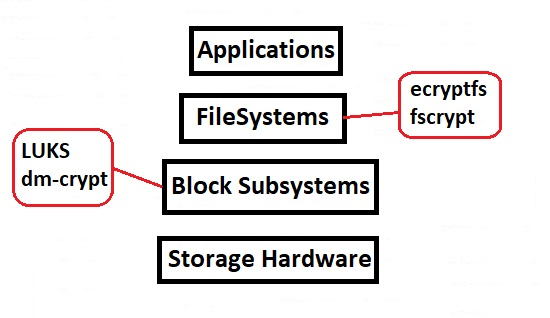

# 331.3 Encrypted File Systems

**Weight:** 3

**Description:** Candidates should be able to set up and configure encrypted file systems.


**Key Knowledge Areas:**

* Understand block device and file system encryption
* Use dm-crypt with LUKS1 to encrypt block devices
* Use eCryptfs to encrypt file systems, including home directories and PAM integration
* Awareness of plain dm-crypt
* Awareness of LUKS2 features
* Conceptual understanding of Clevis for LUKS devices and Clevis PINs for TMP2 and Network Bound Disk Encryption (NBDE)/Tang

**The following is a partial list of the used files, terms and utilities:**

* cryptsetup (including relevant subcommands)
* cryptmount
* /etc/crypttab
* ecryptfsd
* ecryptfs-\* commands
* mount.ecryptfs, umount.ecryptfs
* pam\_ecryptfs

## Disk Encryption Concepts

Data encryption at rest is a must-have for any modern company. Many companies, however, don't encrypt their disks, because they fear the potential performance penalty caused by encryption overhead.

Protecting Removable medias and adding additional data security are some use cases of disk encryption.

### Methods of disk Encryption

* **Block Device**
* **File System Level**

Whole disk encryption protects a disk in the event of theft or accidental loss. Whole disk encryption encrypts the entire disk including swap files, system files, and hibernation files. If an encrypted disk is lost, stolen, or placed into another computer, the encrypted state of the drive remains unchanged, and only an authorized user can access its contents. Whole disk encryption cannot protect you when you have logged into the system during startup and then leave your computer unattended. Unauthorized users could open any file on the disk. This is where file encryption comes in.

### Disk Encryption Tools

* **dm-encrypt** and LUKS (Two different tools, usually goes hand-in-hand)
* **cryptmount** (useful for end-user to encrypt data)
* **eCryptfs** (file system level encryption)
* **EncFS** (Like eCryptfs but more user friendly)

<figure><figcaption></figcaption></figure>

lets start with block device encryption.

### LUKS

According to Wikipedia, the [Linux Unified Key Setup](https://en.wikipedia.org/wiki/Linux\_Unified\_Key\_Setup) (LUKS) is a disk encryption specification created by Clemens Fruhwirth in 2004 and was originally intended for Linux. LUKS uses [device mapper crypt (](https://en.wikipedia.org/wiki/Dm-crypt)`dm-crypt`[)](https://en.wikipedia.org/wiki/Dm-crypt) as a kernel module to handle encryption on the block device level. There are different front-end tools developed to encrypt Linux partitions

### Working with LUKS

I have added a new 10G disk to my machine and I have created a new volume on that disk using fdisk.


visit my lpic1 book: [https://borosan.gitbook.io/lpic1-exam-guide/1041-create-partitions-and-filesystems#fdisk](https://borosan.gitbook.io/lpic1-exam-guide/1041-create-partitions-and-filesystems#fdisk).


&#x20;Now we want to setup a LUKS encrypted volume on that partition. For that we use `cryptsetup`tool.

### cryptsetup

By default redhat distributions come with cryptsetup but you might need to install it.

```
[root@rocky8 ~]# cryptsetup luksFormat /dev/sdb1

WARNING!
========
This will overwrite data on /dev/sdb1 irrevocably.

Are you sure? (Type 'yes' in capital letters): YES
Enter passphrase for /dev/sdb1:
Verify passphrase:
[root@rocky8 ~]#
```

it takes a moment  to create LUKS format partition and then come back to our prompt, next we need to mount our partition  using cryptsetup but instead of using luksFormat sub-command we  should use luksOpen:

```
[root@rocky8 ~]# cryptsetup luksOpen /dev/sdb1 myencvol
Enter passphrase for /dev/sdb1:
[root@rocky8 ~]#
```

now our volume is open for writting, if we take a look at mapper system we  can see its link:

```
[root@rocky8 ~]# ls -l  /dev/mapper/
total 0
crw-------. 1 root root 10, 236 Apr  4 16:17 control
lrwxrwxrwx. 1 root root       7 Apr  4 18:31 myencvol -> ../dm-2
lrwxrwxrwx. 1 root root       7 Apr  4 16:17 vg--os-root -> ../dm-0
lrwxrwxrwx. 1 root root       7 Apr  4 16:17 vg--os-swap -> ../dm-1
```

we can use `myencvol` like any other disk, next we put a file system on top of that encrypted volume:

```
[root@rocky8 ~]# mkfs.ext4 /dev/mapper/myencvol
mke2fs 1.45.6 (20-Mar-2020)
Creating filesystem with 2617088 4k blocks and 655360 inodes
Filesystem UUID: 68cff192-42fb-4dee-a022-ce7b1092a8a1
Superblock backups stored on blocks:
        32768, 98304, 163840, 229376, 294912, 819200, 884736, 1605632

Allocating group tables: done
Writing inode tables: done
Creating journal (16384 blocks): done
Writing superblocks and filesystem accounting information: done
```

create a directory to mount this volume to:

```
[root@rocky8 ~]# mkdir /mysecret
[root@rocky8 ~]#
[root@rocky8 ~]# mount /dev/mapper/myencvol /mysecret/
[root@rocky8 ~]#
[root@rocky8 ~]# ll /mysecret/
total 16
drwx------. 2 root root 16384 Apr  4 18:42 lost+found
[root@rocky8 ~]#
[root@rocky8 ~]# mount | grep mysecret
/dev/mapper/myencvol on /mysecret type ext4 (rw,relatime,seclabel)
```

create some file on the volume:

```
[root@rocky8 ~]# echo "IwasHere" >  /mysecret/IwasHere.txt
[root@rocky8 ~]# ll /mysecret/
total 20
-rw-r--r--. 1 root root     9 Apr  4 18:50 IwasHere.txt
drwx------. 2 root root 16384 Apr  4 18:42 lost+found
```

You can easily close the volume using `luksClose` sub-command of `cryptsetup` (just like `luksOpen`), but do not forget to unmount (umount.ecryptfs)the volume first.&#x20;

That is how we can create an encrypted volume using cryptsetup command. It's also important to know how persistently mapping that volume on boot. In order to mount LUKS volume on boot we need to create a key  to allow the system to access encrypted volume. The easiest way to create a key is using  `dd` command:

```
[root@rocky8 ~]# dd if=/dev/urandom of=/root/mylukskey bs=4096 count=1
1+0 records in
1+0 records out
4096 bytes (4.1 kB, 4.0 KiB) copied, 0.000284125 s, 14.4 MB/s
[root@rocky8 ~]#
[root@rocky8 ~]# chmod 600 /root/mylukskey
[root@rocky8 ~]#
[root@rocky8 ~]# cat /root/mylukskey
▒▒n+▒▒LEʅf▒L▒*&▒Kg>:(▒ ▒vJ5h▒ʖ▒▒▒@▒d▒=W▒TK=▒LL▒@▒F▒c▒▒▒W▒ϱM▒xt▒I[C▒(▒▒=Y▒fŔ▒
                     S(l▒Hyo▒▒7f▒▒se|L
▒h▒>a▒▒▒L▒q+▒ԝ'▒▒▒▒▒O!r#▒▒O▒cT▒▒      i3"s5爊▒▒`▒
▒▒"▒+:q▒P5▒▒0#{▒"▒iki▒t'~vu]h7<▒▒e▒I▒▒&▒▒](▒▒n#rK▒▒G▒J)▒z▒qލ.>▒~▒▒*▒D@▒▒^▒▒,b4
▒▒}%▒▒▒@S燍Ꝕ\'▒+0u)▒▒▒▒3▒-9▒▒

```

now we need to add that key to our encrypted volume:

```
[root@rocky8 ~]# cryptsetup luksAddKey /dev/sdb1 /root/mylukskey
Enter any existing passphrase:
[root@rocky8 ~]#
```

now we that  have add the key to the volume and that can be used to mount(mount.ecryptfs) the volume on boot.

Still we need to setup a couple of file in order to successfully mount the volume. Lets take a look at this special file which is used by cryptsetup to mount on boot. the crypttab file.

### crypttab

The crypttab file usually does not exist and it should be create in /etc/ directory. It look like fstab file except that it is used for LUKS encrypted volumes.

```
[root@rocky8 ~]# vim /etc/crypttab

```

```
[root@rocky8 ~]# cat /etc/crypttab
myencvol /dev/sdb1 /root/mylukskey luks
```

the interesting step at this point for mounting LUKS encrypted volumes is that you have to go to /etc/fstab and add it  like a normal block device

```

[root@rocky8 ~]# mkdir /here

[root@rocky8 ~]# tail -2  /etc/fstab
#mounting LUKS encrypted volume
/dev/mapper/myencvol /here ext4 defaults 0 0

[root@rocky8 ~]# mount -a
[root@rocky8 ~]#

[root@rocky8 ~]# ls /here/
IwasHere.txt  lost+found
```


**LUKS**&#x20;

**Create encrypted volume**&#x20;

cryptsetup luksFormat dev&#x20;

cryptsetup IuksOpen dev&#x20;


**mapping Luks Keys**&#x20;

cryptsetup IuksAddKey dev keyfile&#x20;


**Mount on boot with Crypttab**&#x20;

/etc/crypttab&#x20;

/etc/fstab


now lets take a look at filesystem encryption:

### eCryptfs

eCryptfs (_Enterprise Cryptographic Filesystem_) is a package of disk encryption software for Linux. Its implementation is a POSIX-compliant **filesystem-level encryption layer**, aiming to offer functionality similar to that of GnuPG at the operating system level, and has been part of the Linux kernel since version 2.6.19.

#### Install eCryptfs

eCryptfs is already included in the official Ubuntu repositories, so we can install it using the apt command `apt install ecryptfs-utils –y` , but in Redhat distributions you might need to install epel repository first `yum install epel-release -y  && yum install ecryptfs-utils` .&#x20;

**Using eCryptfs**

To use  ecryptfs package, you only need to run a mount command to create an encrypted directory  `mount -t ecryptfs /src_dir /dest_sir`&#x20;

This command will prompt for encryption settings and then create the _\<dest\_dir>_ as an encrypted directory. The settings may be supplied using the `-o parameter=value` format with the command as well.&#x20;

note: The command does require root privilege .&#x20;

Once mounted, the directory may be used in a typical fashion .

Once the directory is unmounted, the data becomes unreadable.

* [x] to add an eCryptfs mount passphrase to the kernel keyring **`ecryptfs-add-passphrase`**&#x20;
* [x] Use **`ecryptfs-manager`** to manage keys&#x20;
* [x] **`ecryptfs-stat`** can provide information on files encrypted using ecryptfs

_see `man`  `mount.ecryptfs`, `umount.ecryptfs`_


There are a number of commands included in the ecryptfs-utils package that provides enhanced functionality .

There is a suite of commands that are usable by non-super users for creating and using an encrypted **\~/Private** directory&#x20;

* Setup with `ecryptfs-setup-private`&#x20;
* Mount and unmount using `ecryptfs-mount-private` and `ecryptfs-unmount-private` is used.


**eCryptfs PAM integration**

PAM integration is supported with ecryptfs using the module **pam\_ecryptfs.so.** This allows for automatic mounting of encrypted volumes on login.&#x20;

To configure the integration File system options and mount points must be supplied in /etc/fstab

The ecryptfs mount passphrase must be stored in \~/.ecryptfs/wrapped-passphrase&#x20;

* Edit /etc/pam.d/login: **`auth required pam_ecryptfs.so unwrap`**&#x20;
* Edit /etc/pam.d/common-session: **`session optional pam_encryptfs.so unwrap`**&#x20;

_See `man pam_ecryptfs` for additional information._

### encfs

The encfs package provides similar functionality to ecryptfs but it is designed to be used by non-superusers .

Create and mount an encrypted repository, run encfs \~/.name \~/name .name and name may be any current directories that your current user has access to Work with \~/name as a normal directory; \~/.name is where the encrypted data is stored.

&#x20;Similar to ecryptfs, you are prompted for input during setup. Note that absolute file paths are required .

* [x] Use `encfsctl passwd ~/name` to change the passphrase if desired&#x20;
* [x] Use `fusermount -u ~/name` to unmount and secure data&#x20;

_See `man encfs` for more information_

all in all:


#### Disk Encrypotion with eCryptfs and EncFS&#x20;

#### _**eCryptfs provides file system level encryption:**_&#x20;

• Uses crypt package&#x20;

• Mount a new directory using the ecryptfs type&#x20;

• PAM module provided for automatic mounting options (pam\_ecryptfs)

• ecryptfs-util package provides helper utilities&#x20;

_**EncFS is similar to Cryptfs but targets non-superusers**_

• Allows for the creation of encrypted repositories by standard users


that's all.

.

.

.

resources:

[https://blog.cloudflare.com/speeding-up-linux-disk-encryption/](https://blog.cloudflare.com/speeding-up-linux-disk-encryption/)

[https://docs.openstack.org/security-guide/secrets-management/secrets-management-use-cases.html](https://docs.openstack.org/security-guide/secrets-management/secrets-management-use-cases.html)

[https://www.redhat.com/sysadmin/disk-encryption-luks](https://www.redhat.com/sysadmin/disk-encryption-luks)

[https://www.golinuxcloud.com/mount-luks-encrypted-disk-partition-linux/](https://www.golinuxcloud.com/mount-luks-encrypted-disk-partition-linux/)

[https://en.wikipedia.org/wiki/ECryptfs](https://en.wikipedia.org/wiki/ECryptfs)

.

###


File System Encryption with Ecryptfs

Working with LUKS
