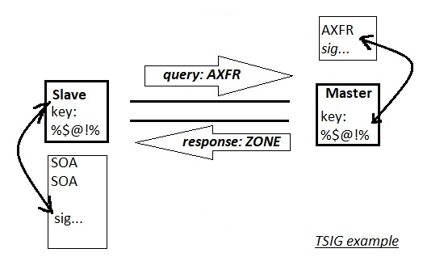

# 331.4 DNS and Cryptography

**Weight:** 5

**Description:** Candidates should have experience and knowledge of cryptography in the context of DNS and its implementation using BIND. The version of BIND covered is 9.7 or higher.


**Key Knowledge Areas:**

* Understand the concepts of DNS, zones and resource records
* Understand DNSSEC, including key signing keys, zone signing keys and relevant DNS records such as DS, DNSKEY, RRSIG, NSEC, NSEC3

and NSEC3PARAM

* Configure and troubleshoot BIND as an authoritative name server serving DNSSEC secured zones
* Manage DNSSEC signed zones, including key generation, key rollover and re-signing of zones
* Configure BIND as an recursive name server that performs DNSSEC validation on behalf of its clients
* Understand CAA and DANE, including relevant DNS records such as CAA and TLSA
* Use CAA and DANE to publish X.509 certificate and certificate authority information in DNS
* Use TSIG for secure communication with BIND
* Awareness of DNS over TLS and DNS over HTTPS
* Awareness of Multicast DNS

**Partial list of the used files, terms and utilities:**

* named.conf
* dnssec-keygen
* dnssec-signzone
* dnssec-settime
* dnssec-dsfromkey
* rndc (including relevant subcommands)
* dig
* delv
* openssl (including relevant subcommands)

## Working with DNS

### DNS overview

DNS is a hierarchical distributed database that stores IP addresses and other data and allows queries by name.

#### DNS server types <a href="#dns_server_types" id="dns_server_types"></a>

A DNS server stores a database of domain names, and then processes domain names based on DNS queries that come from a client in a network.

* **Authoritative server** An authoritative server is a server that holds the DNS name records, including A, AAAA, and CNAME.
* **A non-authoritative** server constructs a cache file based on previous queries for domains. It does not hold original name records.

#### Recursive resolver ,  iterative resolver <a href="#recursive_resolver" id="recursive_resolver"></a>

A _recursive resolver_ is the server that sends a query to the authoritative or non-authoritative server for resolution. A recursive resolver is so-called because it performs each query for a given name and returns the final result.

This is in contrast to an _iterative resolver_, which only returns a referral to the next DNS servers that might have the answer.


That was a quick overview , for review visit my LPIC2 book: [https://borosan.gitbook.io/lpic2-exam-guide/2071-basic-dns-server-configuration#whats-is-dns](https://borosan.gitbook.io/lpic2-exam-guide/2071-basic-dns-server-configuration#whats-is-dns)


#### Zones and Resource Records

DNS configurations are made up of Zones And Resource Records (RRs)

**Zones**

* **Public zone :** A public zone is visible to the internet. You can create DNS records in a public zone to publish your service on the internet. For example, you might create an A record in a public zone called `example.com.` (note the trailing dot) for your public website `www.example.com.`.
* **Private zone :** A private zone is any zone that cannot be queried over the public internet.
* **Delegated subzone:** DNS allows the owner of a zone to use NS records to delegate a subdomain to a different name server. Resolvers follow these records and send queries for the subdomain to the target name server specified in the delegation. For example, you can create separate zones for both `example.com` and `subdomain.example.com`, each with its own authoritative name server. Because `subdomain.example.com` is a child domain of `example.com`, the method to enable the authoritative name server for the subdomain to be located from the parent domain's zone is called delegation. Delegation is essentially a pointer to the authoritative name server for a subdomain. To enable delegation in Cloud DNS, you can add NS records for the subdomains in the zone of the parent domain.


That was a quick overview , to review visit my LPIC2 book: [https://borosan.gitbook.io/lpic2-exam-guide/2072-create-and-maintain-dns-zones#dns-zones](https://borosan.gitbook.io/lpic2-exam-guide/2072-create-and-maintain-dns-zones#dns-zones)


#### Split horizon DNS <a href="#split_horizon_dns" id="split_horizon_dns"></a>

Split horizon is a term used to describe an instance when two zones, one to be used by the internal network and the other to be used by the external network (usually the internet), are created for the same domain. Split-horizon DNS lets you serve different answers (different resource record sets) for the same name depending on who is asking.

For example, you can provide the development/staging version of your app if the query comes from the development network, and the production/public version of your app if the query comes from the public internet.

#### &#x20;Resources Records <a href="#records" id="records"></a>

Resource records are used to store data about domain names and IP addresses. A DNS zone database is made up of a collection of resource records. Each resource record specifies information about a particular object. The server uses these records to answer queries for hosts in its zone.

&#x20;Each individual DNS record has a type (name and number), an expiration time (time to live), and type-specific data. Some of the commonly used record types are:

* **A:** Address record, which maps host names to their IPv4 address.
* **AAAA:** IPv6 Address record, which maps host names to their IPv6 address.
* **CNAME:** Canonical name record, which specifies alias names.
* **MX:** Mail exchange record, which is used in routing requests to mail servers.
* **NS:** Name server record, which delegates a DNS zone to an authoritative server.
* **PTR:** Pointer record, which defines a name associated with an IP address.
* **SOA:** Start of authority, used to designate the primary name server and administrator responsible for a zone. Each zone hosted on a DNS server must have an SOA (start of authority) record. You can modify the record as needed (for example, you can change the serial number to an arbitrary number to support date-based versioning).


to review, visit my lpic2 book: [https://borosan.gitbook.io/lpic2-exam-guide/2071-basic-dns-server-configuration#dns-resource-records-rrs](https://borosan.gitbook.io/lpic2-exam-guide/2071-basic-dns-server-configuration#dns-resource-records-rrs)


#### Record sets <a href="#record_sets" id="record_sets"></a>

Records with the same name and of the same type but with different data values are called record sets. When you create a record, if a set with the same name and type exists, the record is added to this matching set. If there's no matching set, a new set is created and appended to the list of record sets.

This is an example of a record set with more than one record having the same name and type:

| DNS name                    | Type | TTL (seconds) | Data          |
| --------------------------- | ---- | ------------- | ------------- |
| `db-01.dev.gcp.example.com` | A    | 50            | `10.128.1.35` |
| `db-01.dev.gcp.example.com` | A    | 50            | `10.128.1.10` |


### Delegation of subdomains <a href="#delegation_of_subdomains" id="delegation_of_subdomains"></a>

When creating records, make sure that the NS and SOA records match each other. Conflicting NS and SOA records can cause some resolvers to reject the delegation as invalid and refuse to cache `NO DATA` responses to queries. This can result in a large unexpected number of queries against your public managed zones by third-party recursive resolvers when resolvers query your public managed zones for records that do not exist.


### Registrar <a href="#registrar" id="registrar"></a>

A domain name registrar is an organization that manages the reservation of internet domain names for public zones. A registrar must be accredited by a generic top-level domain (gTLD) registry or a country code top-level domain (ccTLD) registry. This is how _upper-level_ name servers agree on SOA and update NS records for the zone to direct requests to caching or authoritative name servers.

### SOA serial number <a href="#soa_serial_number" id="soa_serial_number"></a>

The SOA serial number is a version number for a DNS zone. For all name servers to be current with the version of a zone, they must have the same SOA serial number. The serial numbers of SOA records created in DNS managed zones [monotonically](https://wikipedia.org/wiki/Monotonic\_function) increase with each transactional change to a zone's record sets.

However, you can change the serial number of an SOA record to an arbitrary number, including an ISO 8601-formatted date, as recommended in [RFC 1912](https://tools.ietf.org/html/rfc1912).


**EDNS**

EDNS stands for Extended DNS. EDNS gives us a mechanism to send DNS data in larger packets over UDP. The most popular implementation of EDNS is DNSSEC.

**History of EDNS**&#x20;

Traditional DNS responses are typically small in size (less than 512 bytes) and fit nicely into a small UDP packet. Sometimes we have to transfer larger DNS records.

Original DNS protocol uses UDP and stores information in a way that fills the entire UDP packet – meaning one can’t add additional info to the packet.

EDNS “tacks on” an extra packet for additional information so we can utilize more services in DNS.

It also opens us up to an attack using packets called DNS amplification.

**EDNS is essential for the implementation of DNS Security Extensions (DNSSEC)**.



**BIND DNS**

Berkeley Internet Name Domain (BIND) is the most popular Domain Name System (DNS) server in use today. It was developed in the 1980s at the University of Berkley and is currently in version 9. BIND is an open source system [free to download and use](https://www.isc.org/downloads/bind/), offered under the Mozilla Public License.

BIND can be used to run a caching DNS server or an authoritative name server, and provides features like load balancing, notify, dynamic update, split DNS, DNSSEC, IPv6, and more.

* The primary configuration file is located in etc/named. conf
* &#x20;The objectives on LPIC exam 303-200 cover securing DNS with BIND in particular. visit my book: [https://borosan.gitbook.io/lpic2-exam-guide/2073-securing-a-dns-server#207.3-securing-a-dns-server](https://borosan.gitbook.io/lpic2-exam-guide/2073-securing-a-dns-server#207.3-securing-a-dns-server)


## Securing BIND

### TSIG

Transaction signatures (TSIG) is a mechanism used to secure DNS messages and to provide secure server-to-server communication (usually between master and slave server, but can be extended for dynamic updates as well). TSIG can protect the following type of transactions between two DNS servers:

* Zone transfer
* Notify
* Dynamic updates
* Recursive query messages etc

TSIG is available for BIND v8.2 and above.&#x20;

#### How TSIG works ?

TSIG uses shared secrets and a one-way hash function to authenticate DNS messages.&#x20;

<figure><figcaption></figcaption></figure>

In a simplest way we use tsig to secure zone transfer between Master and slave dns server. TSIG uses shared secrets and a one-way hash function to authenticate DNS messages. TSIG is easy and lightweight for resolvers and named.


for TSIG configuration read my LPIC2 book: [https://borosan.gitbook.io/lpic2-exam-guide/2073-securing-a-dns-server#transaction-signatures-tsig](https://borosan.gitbook.io/lpic2-exam-guide/2073-securing-a-dns-server#transaction-signatures-tsig)


### Running BIND in a chroot jail

This is not limited to BIND, but software that can be accessed from the outside, such as DNS servers, can take over the entire system if a vulnerability is exploited. Even if the software is hijacked, it is a technology called " **chroot (change root)** " that keeps the damage only within the software .

<figure><figcaption></figcaption></figure>

To explain it briefly, separate from the original " root **directory (top directory)** " , create a " **root directory " for individual software.** Hence the name " **change root** ".

<figure><figcaption></figcaption></figure>

By " chrooting " in this way, you can prevent the leakage of important information stored in the original etc directory and var directory . It cannot be said that\
" chrooting " alone provides complete security, but with attacks that exploit DNS vulnerabilities making headlines almost every day, it is safer to proactively adopt measures that can be taken.


for configuration vist my lpic2 book: [https://borosan.gitbook.io/lpic2-exam-guide/2073-securing-a-dns-server#chroot](https://borosan.gitbook.io/lpic2-exam-guide/2073-securing-a-dns-server#chroot)


### /etc/named.conf

(rocky8):

```
[root@rocky8 ~]# cat /etc/named.conf
//
// named.conf
//
// Provided by Red Hat bind package to configure the ISC BIND named(8) DNS
// server as a caching only nameserver (as a localhost DNS resolver only).
//
// See /usr/share/doc/bind*/sample/ for example named configuration files.
//

options {
        listen-on port 53 { 127.0.0.1; };
        listen-on-v6 port 53 { ::1; };
        directory       "/var/named";
        dump-file       "/var/named/data/cache_dump.db";
        statistics-file "/var/named/data/named_stats.txt";
        memstatistics-file "/var/named/data/named_mem_stats.txt";
        secroots-file   "/var/named/data/named.secroots";
        recursing-file  "/var/named/data/named.recursing";
        allow-query     { localhost; };

        /*
         - If you are building an AUTHORITATIVE DNS server, do NOT enable recursion.
         - If you are building a RECURSIVE (caching) DNS server, you need to enable
           recursion.
         - If your recursive DNS server has a public IP address, you MUST enable access
           control to limit queries to your legitimate users. Failing to do so will
           cause your server to become part of large scale DNS amplification
           attacks. Implementing BCP38 within your network would greatly
           reduce such attack surface
        */
        recursion yes;

        dnssec-enable yes;
        dnssec-validation yes;

        managed-keys-directory "/var/named/dynamic";

        pid-file "/run/named/named.pid";
        session-keyfile "/run/named/session.key";

        /* https://fedoraproject.org/wiki/Changes/CryptoPolicy */
        include "/etc/crypto-policies/back-ends/bind.config";
};

logging {
        channel default_debug {
                file "data/named.run";
                severity dynamic;
        };
};

zone "." IN {
        type hint;
        file "named.ca";
};

include "/etc/named.rfc1912.zones";
include "/etc/named.root.key";

```

(ubuntu16.04):

```
root@server1:/etc/bind# cat named.conf
// This is the primary configuration file for the BIND DNS server named.
//
// Please read /usr/share/doc/bind9/README.Debian.gz for information on the 
// structure of BIND configuration files in Debian, *BEFORE* you customize 
// this configuration file.
//
// If you are just adding zones, please do that in /etc/bind/named.conf.local

include "/etc/bind/named.conf.options";
include "/etc/bind/named.conf.local";
include "/etc/bind/named.conf.default-zones";
```


To review this file and see differences between distros visit my LPIC2 book:[https://borosan.gitbook.io/lpic2-exam-guide/2071-basic-dns-server-configuration#etc-named.conf](https://borosan.gitbook.io/lpic2-exam-guide/2071-basic-dns-server-configuration#etc-named.conf)


Important configuration directives:

* **allow-query** — Specifies which hosts are allowed to query this nameserver. By default, all hosts are allowed to query. An access control list, or collection of IP addresses or networks may be used here to only allow particular hosts to query the nameserver.
* **allow-recursion** — Similar to allow-query, this option applies to recursive queries. By default, all hosts are allowed to perform recursive queries on the nameserver.
* **allow-transfer** — Specifies the slave servers that are allowed to request a transfer of the zone's information. The default is to allow all transfer requests.
*   **allow-update** — Specifies the hosts that are allowed to dynamically update information in their zone. The default is to deny all dynamic update requests.

    Be careful when allowing hosts to update information about their zone. Do not enable this option unless the host specified is completely trusted. In general, it better to have an administrator manually update the records for a zone and reload the named service.


review other options in my LPIC2 book:[https://borosan.gitbook.io/lpic2-exam-guide/2072-create-and-maintain-dns-zones#1.options-statement](https://borosan.gitbook.io/lpic2-exam-guide/2072-create-and-maintain-dns-zones#1.options-statement)


### rndc

BIND includes a utility called rndc (Remote Name Daemon Control) which allows command line administration of the named daemon from the localhost or a remote host.

In order to prevent unauthorized access to the named daemon, BIND uses a shared secret key authentication method to grant privileges to hosts. This means an identical key must be present in both /etc/named.conf and the rndc configuration file, /etc/rndc.conf.

The name server control utility, rndc, sends named digitally signed commands over a TCP connection. The configuration file for rndc is ‘/etc/rndc.conf’. This configuration file stores configuration information such as the name server to connect to and which key to use for the digital signature. The rndc utility is started when named is started using the initialization script. An rndc.conf file can be generated with a random key with the rndc-confgen commandline utility. rndc related files are like this:

<figure><figcaption></figcaption></figure>

lets takea look at rndc.key file:

```
root@server1:/etc/bind# ls -al rndc*
-rw-r----- 1 bind bind 77 Mar  5 22:20 rndc.key
root@server1:/etc/bind# cat rndc.key 
key "rndc-key" {
    algorithm hmac-md5;
    secret "JFLwN7Sd/sGbIdan+y/XtQ==";
};
root@server1:/etc/bind# rndc reload
server reload successful
```

for demonstration lets remove and recreate rndc.key :

```
root@server1:/etc/bind# rm rndc.key 
root@server1:/etc/bind# ls -al rndc*
ls: cannot access 'rndc*': No such file or directory
root@server1:/etc/bind# rndc reload
rndc: neither /etc/bind/rndc.conf nor /etc/bind/rndc.key was found

root@server1:/etc/bind# rndc-confgen -r /dev/urandom -a
wrote key file "/etc/bind/rndc.key"
root@server1:/etc/bind# ls -al rndc*
-rw------- 1 root bind 77 Apr 17 23:48 rndc.key
root@server1:/etc/bind# cat rndc.key 
key "rndc-key" {
    algorithm hmac-md5;
    secret "sIfJgn3msN0RnyzNz6mixQ==";
};
```

We have removed and recreate a rndc.key lets set rights:

```
root@server1:/etc/bind# chown bind.bind rndc.key 
root@server1:/etc/bind# chmod 640 rndc.key
```

and check it:

```
root@server1:/etc/bind# systemctl start bind9.service 
root@server1:/etc/bind# systemctl status bind9.service 
● bind9.service - BIND Domain Name Server
   Loaded: loaded (/lib/systemd/system/bind9.service; enabled; vendor preset: en
  Drop-In: /run/systemd/generator/bind9.service.d
           └─50-insserv.conf-$named.conf
   Active: active (running) since Wed 2018-04-18 00:10:51 PDT; 27min ago
     Docs: man:named(8)

root@server1:/etc/bind# rndc reload
server reload successful
```

for generating rndc.cong and requred key use `rndc-confgen -r /dev/urandom>/etc/bind/rndc.conf` command, after creating that we have to include the file , and use it but that is not our topic for now.

Except rndc remote features of rndc we can use it locally. Like most of Services in Linux world, when we change a configuration file in BIND or change zones(as we see in next lessons) we need to restart bind service, but there a problem! By restarting bind service all caches would be cleared and that it not acceptable, so instead of that, we use rndc tool. rndc read configuration files and reflect zone changes but does not clear cahce.

```
root@server1:/etc/bind# rndc reload
server reload successful
```

also it is possible to clear specific domain name from cache results with `rndc flushname google.com` . to flush every thing in the system `rndc flush` and many other features, but that is enough for now!


This part was from my LPIC2 book, visit: [https://borosan.gitbook.io/lpic2-exam-guide/2071-basic-dns-server-configuration#usr-sbin-rndc](https://borosan.gitbook.io/lpic2-exam-guide/2071-basic-dns-server-configuration#usr-sbin-rndc)


## DNS Utilities

### dig

Dig stands for (Domain Information Groper) is a network administration command-line tool for querying DNS. It is useful for verifying and troubleshooting DNS problems and also to perform DNS lookups and displays the answers that are returned from the DNS, with no options dig find "A" record of a domain:

```
[root@rocky8 ~]# dig google.com

; <<>> DiG 9.11.36-RedHat-9.11.36-3.el8 <<>> google.com
;; global options: +cmd
;; Got answer:
;; ->>HEADER<<- opcode: QUERY, status: NOERROR, id: 10633
;; flags: qr rd ra; QUERY: 1, ANSWER: 1, AUTHORITY: 0, ADDITIONAL: 1

;; OPT PSEUDOSECTION:
; EDNS: version: 0, flags:; MBZ: 0x0005, udp: 512
;; QUESTION SECTION:
;google.com.                    IN      A

;; ANSWER SECTION:
google.com.             5       IN      A       172.217.18.110

;; Query time: 120 msec
;; SERVER: 192.168.108.2#53(192.168.108.2)
;; WHEN: Tue Sep 06 01:04:03 +0430 2022
;; MSG SIZE  rcvd: 55

```

**query options**

The **dig** command provides a number of query options that affect the way in which lookups are made and the results displayed. Some of these set or reset flag bits in the query header, some determine which sections of the answer get printed, and others determine the timeout and retry strategies. Each query option is identified by a keyword preceded by a plus sign (+). Some keywords set or reset an option. These can be preceded by the string `no` to negate the meaning of that keyword. Other keywords assign values to options like the timeout interval. They have the form **`+keyword=value`**. &#x20;

```
[root@rocky8 ~]# dig google.com +nostat

; <<>> DiG 9.11.36-RedHat-9.11.36-3.el8 <<>> google.com +nostat
;; global options: +cmd
;; Got answer:
;; ->>HEADER<<- opcode: QUERY, status: NOERROR, id: 45572
;; flags: qr rd ra; QUERY: 1, ANSWER: 1, AUTHORITY: 0, ADDITIONAL: 1

;; OPT PSEUDOSECTION:
; EDNS: version: 0, flags:; MBZ: 0x0005, udp: 512
;; QUESTION SECTION:
;google.com.                    IN      A

;; ANSWER SECTION:
google.com.             5       IN      A       142.250.185.238
```

some other useful dig commands:

| dig command                                                                | Description                                    |
| -------------------------------------------------------------------------- | ---------------------------------------------- |
| dig google.com MX                                                          | Querying MX record for a domain                |
| dig google.com SOA                                                         | Querying SOA record for a domain               |
| dig google.com TTL                                                         | Querying TTL Record for Domain                 |
| dig @8.8.8.8 google.com                                                    | Using another DNS server for querying          |
| dig                                                                        | Shows dig command version and root DNS servers |
| dig google.com +nocomments +noquestion +noauthority +noadditional +nostats | Querying only answer section                   |
| dig google.com ANY +noall +answer                                          | Querying ALL DNS Records Types                 |

dig command has lots of options, and its hard to type options every time.We can store options like `+noall +answer`options permanently in`.digrc` file under user’s home directory. This way , whenever dig command execute it will show only answer section of dig output.

dig is part of the BIND domain name server software suite. dig command replaces older tool such as nslookup and the host.


I brought this part from my LPIC2  book to you: [https://borosan.gitbook.io/lpic2-exam-guide/2071-basic-dns-server-configuration#dig](https://borosan.gitbook.io/lpic2-exam-guide/2071-basic-dns-server-configuration#dig)


### delv

BIND 9.10 contains a new debugging tool that is a successor to `dig`. It is called `delv`  (DNS lookup and validation utility).It works very much like `dig`, but it understands DNSSEC better.

`delv` checks the DNSSEC validation chain using the same code that is used by the BIND 9 DNS server itself. Compared to  `dig +sigchase`, `delv` is much closer to what really happens inside a DNS server.

In general, you should use `delv` the same way you have been using `dig`. But `delv` is not an enhanced version of `dig`; it is an entirely new program.

```
[root@rocky8 ~]# delv www.google.com
;; validating com/DS: verify failed due to bad signature (keyid=20826): RRSIG validity period has not begun
;; validating com/DS: no valid signature found
;; RRSIG validity period has not begun resolving 'com/DS/IN': 192.168.108.2#53
;; no valid DS resolving 'www.google.com/A/IN': 192.168.108.2#53
;; resolution failed: no valid DS
```

```
[root@rocky8 ~]# delv -h
Usage:  delv [@server] {q-opt} {d-opt} [domain] [q-type] [q-class]
Where:  domain    is in the Domain Name System
        q-class  is one of (in,hs,ch,...) [default: in]
        q-type   is one of (a,any,mx,ns,soa,hinfo,axfr,txt,...) [default:a]
        q-opt    is one of:
                 -4                  (use IPv4 query transport only)
                 -6                  (use IPv6 query transport only)
                 -a anchor-file      (specify root and dlv trust anchors)
                 -b address[#port]   (bind to source address/port)
                 -c class            (option included for compatibility;
                 -d level            (set debugging level)
                 -h                  (print help and exit)
                 -i                  (disable DNSSEC validation)
                 -m                  (enable memory usage debugging)
                 -p port             (specify port number)
                 -q name             (specify query name)
                 -t type             (specify query type)
                                      only IN is supported)
                 -v                  (print version and exit)
                 -x dot-notation     (shortcut for reverse lookups)

```

| Options          | Description                                               |   |
| ---------------- | --------------------------------------------------------- | - |
| <h4>+rtrace</h4> | Just to list all queried RRs; no further DNSSEC details   |   |
| <h4>+mtrace</h4> | Same as rtrace but with the full content of all RRs       |   |
| <h4>+vtrace</h4> | Tracing the validation process with many additional notes |   |

## Securing DNS with DNSSEC

### DNSSEC <a href="#dnssec" id="dnssec"></a>

DNSSEC creates a secure domain name system by adding cryptographic signatures to existing DNS records. These digital signatures are stored in DNS name servers alongside common record types like A, AAAA, MX, CNAME, etc. By checking its associated signature, you can verify that a requested DNS record comes from its authoritative name server and wasn’t altered en-route, opposed to a fake record injected in a man-in-the-middle attack.

To facilitate signature validation, DNSSEC adds a few new DNS record types:

* **RRSIG** - Contains a cryptographic signature
* **DNSKEY** - Contains a public signing key
* **DS** - Contains the hash of a DNSKEY record
* **NSEC** and **NSEC3** - For explicit denial-of-existence of a DNS record
* **CDNSKEY** and **CDS** - For a child zone requesting updates to DS record(s) in the parent zone.

The interaction between RRSIG, DNSKEY, and DS records, as well as how they add a layer of trust on top of DNS, is what we’ll be talking about here.

### RRsets

The first step towards securing a zone with DNSSEC is to group all the records with the same type into a resource record set (RRset). For example, if you have three AAAA records in your zone on the same label (i.e. label.example.com), they would all be bundled into a single AAAA RRset.

<figure><figcaption></figcaption></figure>

It’s actually this full RRset that gets digitally signed, opposed to individual DNS records. Of course, this also means that you must request and validate all of the AAAA records from a zone with the same label instead of validating only one of them.

### Zone-Signing Keys

Each zone in DNSSEC has a zone-signing key pair (ZSK): the private portion of the key digitally signs each RRset in the zone, while the public portion verifies the signature.&#x20;

<figure><figcaption></figcaption></figure>

### RRSIG

To enable DNSSEC, a zone operator creates digital signatures for each RRset using the private ZSK and stores them in their name server as RRSIG records. This is like saying, “These are my DNS records, they come from my server, and they should look like this.”

However, these RRSIG records are useless unless DNS resolvers have a way of verifying the signatures. The zone operator also needs to make their public ZSK available by adding it to their name server in a DNSKEY record.

When a DNSSEC resolver requests a particular record type (e.g., AAAA), the name server also returns the corresponding RRSIG. The resolver can then pull the DNSKEY record containing the public ZSK from the name server. Together, the RRset, RRSIG, and public ZSK can validate the response.

<figure><figcaption></figcaption></figure>

If we trust the zone-signing key in the DNSKEY record, we can trust all the records in the zone. But, what if the zone-signing key was compromised? We need a way to validate the public ZSK.

### Key-Signing Keys

In addition to a zone-signing key, DNSSEC name servers also have a key-signing key (KSK). The KSK validates the DNSKEY record in exactly the same way as our ZSK secured the rest of our RRsets in the previous section: It signs the public ZSK (which is stored in a DNSKEY record), creating an RRSIG for the DNSKEY.

<figure><figcaption></figcaption></figure>

Just like the public ZSK, the name server publishes the public KSK in another DNSKEY record, which gives us the DNSKEY RRset shown above. Both the public KSK and public ZSK are signed by the private KSK. Resolvers can then use the public KSK to validate the public ZSK.

Validation for resolvers now looks like this:

* Request the desired RRset, which also returns the corresponding RRSIG record.
* Request the DNSKEY records containing the public ZSK and public KSK, which also returns the RRSIG for the DNSKEY RRset.
* Verify the RRSIG of the requested RRset with the public ZSK.
* Verify the RRSIG of the DNSKEY RRset with the public KSK.

<figure><figcaption></figcaption></figure>

Of course, the DNSKEY RRset and corresponding RRSIG records can be cached, so the DNS name servers aren’t constantly being bombarded with unnecessary requests.


**Chain of Trust**&#x20;

• KSKs are provided and published by the parent of a child zone.&#x20;

• This continues all the way to the root dns servers which have their KSK signed in a key signing ceremony.&#x20;


### Implementing DNSSEC

For now we partially demonstrate DNSSEC.To start we need two pairs of keys , first KSK (Key Signing Key ) for DNSKEY record it self and another a of ZSK (Zone Signing Key) to sign the zone and zone validation.

### dnssec-keygen

dnssec-keygen generates keys for DNSSEC (Secure DNS), first lets generate KSK keys, that is easy(ubuntu16.04):

```
root@server1:/etc/bind# mkdir dnsseckeys
root@server1:/etc/bind# cd dnsseckeys/
root@server1:/etc/bind/dnsseckeys# dnssec-keygen -a RSASHA256 -b 512 -n ZONE -f KSK myzone.
Generating key pair..++++++++++++ .....++++++++++++ 
Kmyzone.+008+44989
root@server1:/etc/bind/dnsseckeys# ls -l
total 8
-rw-r--r-- 1 root bind 334 Apr  9 00:30 Kmyzone.+008+44989.key
-rw------- 1 root bind 624 Apr  9 00:30 Kmyzone.+008+44989.private

root@server1:/etc/bind/dnsseckeys# cat Kmyzone.+008+44989.key 
; This is a key-signing key, keyid 44989, for myzone.
; Created: 20180409072341 (Mon Apr  9 00:23:41 2018)
; Publish: 20180409072341 (Mon Apr  9 00:23:41 2018)
; Activate: 20180409072341 (Mon Apr  9 00:23:41 2018)
myzone. IN DNSKEY 257 3 8 AwEAAZkoKDolZNo2nlCxcRYncVQ+U1eg6f+0pAKA9W1GThUWYrnbm/T2 tcOKptbVf3Ly406hiPdSqVx/yhFYfPq2J6M=

root@server1:/etc/bind/dnsseckeys# cat Kmyzone.+008+44989.private 
Private-key-format: v1.3
Algorithm: 8 (RSASHA256)
Modulus: mSgoOiVk2jaeULFxFidxVD5TV6Dp/7SkAoD1bUZOFRZiudub9Pa1w4qm1tV/cvLjTqGI91KpXH/KEVh8+rYnow==
PublicExponent: AQAB
PrivateExponent: XbbRroqVBGTpSEza+ohV8wtT6cmfhQReWt3Xzu529rVSg9EyNjDc8qRgCiow5Phf3O4iZwHpZPrJ/ViztqKz+Q==
Prime1: ydBI9XugtVxwcPXa+N7jRtE2vuLvyxmLM+g+i4kAycc=
Prime2: wkdv2F4vUHqaY1dkSX1vToWJlufRfe3yTSQPXv1KE0U=
Exponent1: PbkiV1I0WMOo8COBkVQ6FtKt97vYszlgxcNmPa7tOsk=
Exponent2: EKLlZPXLv2yAQ/l70P84xNSSj6WSPuJdWVW5Kz0tVrE=
Coefficient: H/1FEkLLkgaxuXntlJ3illIhWvu9u1pD9DW7Qvab7A8=
Created: 20180409072341
Publish: 20180409072341
Activate: 20180409072341
```

Whereas

| dnssec-keygen switches |                                                                                                                                   |
| ---------------------- | --------------------------------------------------------------------------------------------------------------------------------- |
| -a                     | Defines algorithm                                                                                                                 |
| -b                     | keysize                                                                                                                           |
| -n                     | nametype,can be weather ZONE for DNSSEC or HOST for TSIG                                                                          |
| -f                     | Set the specified flag in the flag field of the KEY/DNSKEY record.The only recognized flags are KSK (Key Signing Key) and REVOKE. |

dnssec also need a pair of ZSK keys to sign the zone with them:

```
root@server1:/etc/bind/dnsseckeys# dnssec-keygen -a RSASHA256 -b 512 -n ZONE myzone.
Generating key pair....++++++++++++ ..............++++++++++++ 
Kmyzone.+008+63075
root@server1:/etc/bind/dnsseckeys# ls -l
total 20
-rw-r--r-- 1 root bind 368 Apr  9 00:53 db.myzone
-rw-r--r-- 1 root bind 334 Apr  9 00:30 Kmyzone.+008+44989.key
-rw------- 1 root bind 624 Apr  9 00:30 Kmyzone.+008+44989.private
-rw-r--r-- 1 root bind 335 Apr  9 01:33 Kmyzone.+008+63075.key
-rw------- 1 root bind 624 Apr  9 01:33 Kmyzone.+008+63075.private
```


For implementing DNS-SEC use `-n ZONE` but here for TSIG we have used `-n HOST`.


### dnssec-signzone

Obviously dnssec-signzone signs a zone and produces a signed version of the zone.

```
root@server1:/etc/bind/dnsseckeys# cp ../zonedbfiles/db.myzone .

root@server1:/etc/bind/dnsseckeys# dnssec-signzone -o myzone. -S db.myzoneFetching ZSK 63075/RSASHA256 from key repository.
Fetching KSK 44989/RSASHA256 from key repository.
Verifying the zone using the following algorithms: RSASHA256.
Zone fully signed:
Algorithm: RSASHA256: KSKs: 1 active, 0 stand-by, 0 revoked
                      ZSKs: 1 active, 0 stand-by, 0 revoked
db.myzone.signed
```

Lets take a look at inside:

```
root@server1:/etc/bind/dnsseckeys# cat db.myzone.signed 
; File written on Mon Apr  9 01:45:42 2018
; dnssec_signzone version 9.10.3-P4-Ubuntu
myzone.            604800    IN SOA    myzone. root.myzone. (
                    51         ; serial
                    604800     ; refresh (1 week)
                    86400      ; retry (1 day)
                    2419200    ; expire (4 weeks)
                    604800     ; minimum (1 week)
                    )
            604800    RRSIG    SOA 8 1 604800 (
                    20180509074542 20180409074542 63075 myzone.
                    eHu3B0s9AcclEMfkaXK+zUcqnhYTRXO2BBoR
                    s4z9DGxbwcTXoy8MbIACkuVOhkM6+tQ8r7pr
                    clIKoUALm4I4mQ== )
.
.
.
```

It generates additional required NSEC and RRSIG records also.&#x20;


**Enabling DNSSEC** requires following parameters in **/etc/named.conf** :

**dnssec-enable yes;**&#x20;

**dnssec-validation yes;**&#x20;

Do not forget to include the **key files** in **`/etc/bind/named.conf`** and finally use signed file **`db.myzone.signed`** in **`/etc/bind/named.conf.local`** .



&#x20;Other commands to understand

• **dnssec- settime** - Manages the validity period of a given key.&#x20;

• **dnssec-dsfromkey** - Used to generate the DS RR for a given KSK.&#x20;



This part has brougt to you from my LPIC2 book: [https://borosan.gitbook.io/lpic2-exam-guide/2073-securing-a-dns-server#implementing-dnssec](https://borosan.gitbook.io/lpic2-exam-guide/2073-securing-a-dns-server#implementing-dnssec)



**DO and AD bits**&#x20;

• The **DO** and **AD** bits are contained in DNS queries and responses.&#x20;

• **DO** stands for DNSSEC OK and indicates that a client will understand a DNSSEC response.&#x20;

• **AD** stands for Authenticated Data and is set when data returned by a server that is authenticated with DNSSEC.



**Why EDNS is important for DNSSEC?**

This is important for DNSSEC, since the **+do** bit that signals DNSSEC-awareness is carried within EDNS, and DNSSEC responses are larger than traditional DNS. If DNS servers and network environment cannot support large UDP packets, it will cause retransmission over TCP, or the larger UDP responses will be discarded. Users will likely experience slow DNS resolution or unable to resolve certain names at all.

Note that EDNS applies whether or not you are validating DNSSEC because BIND has DNSSEC enabled by default.


### DANE

**DNS-based Authentication of Named Entities (DANE)** is a great feature that uses the advantages of a DNSSEC signed zone in order to tell the client which TLS certificate he has to expect when connecting to a secure destination over HTTPS or SMTPS.&#x20;

Via a secure channel (DNSSEC) the client can request the public key of the server. This means, that a Man-in-the-Middle attack (MITM) with a spoofed certificate would be exposed directly, i.e., is not possible anymore. Furthermore, the trust to certificate authorities (CAs) is not needed anymore.

in other **** worlds, DANE is: “Encrypted communication on the Internet often uses Transport Layer Security (TLS), **which depends on third parties to certify the keys used.**

<figure><figcaption></figcaption></figure>

Today, a browser establishes a secure TLS connection to a known server (DNS name) with an “unkown” certificate (not proved by the end user). We are relying to certificate authorities (CAs), which once verified the certificate to be owned by the server operator. Unluckily, any CA is able to sign every certificate in the world, even if a certificate is NOT owned by the server itself, but by a malicious third party that wants to intercept the secure communication via a man-in-the-middle (MITM) attack.

With the new DNS resource record “TLSA”, the hashed public key is publicized within the DNS server of the same authority/entity that owns the TLS server, e.g., an HTTPS server or an SMTPS mail gateway. **Now, an end user client can really validate that the server TLS certificate is owned by the same organization which owns the DNSSEC server. Hence, MITM attacks with spoofed certificates are not possible anymore.**

#### **TLSA** Resource **Record**

The TLSA DNS resource record (RR) is used to associate a TLS server certificate or public key with the domain name where the record is found, thus forming a "TLSA certificate association". In conjunction with DNSSEC signatures, this will permit better and more secure ways for applications to authenticate certificates. Here's an example **:**

```
_25._tcp.dnssec-ws01.ws01.ws.dnssec.bayern. ( 300 IN TLSA 3 0 1 
                                          013027A95A04392917A68B4
                                          8F9620DBC78783AC6 )
```

that's all.

.

.

.

reources:

[https://cloud.google.com/dns/docs/dns-overview#:\~:text=DNS%20is%20a%20hierarchical%20distributed,to%20communicate%20with%20each%20other.](https://cloud.google.com/dns/docs/dns-overview)

[https://www.ibm.com/docs/en/i/7.1?topic=concepts-dns-resource-records](https://www.ibm.com/docs/en/i/7.1?topic=concepts-dns-resource-records)

[https://www.howtouselinux.com/post/dns\_edns](https://www.howtouselinux.com/post/dns\_edns)

[https://ns1.com/resources/bind-dns-pros-cons-and-alternatives#:\~:text=What%20is%20BIND%3F,under%20the%20Mozilla%20Public%20License.](https://ns1.com/resources/bind-dns-pros-cons-and-alternatives)

[https://en.wikipedia.org/wiki/Extension\_Mechanisms\_for\_DNS](https://en.wikipedia.org/wiki/Extension\_Mechanisms\_for\_DNS)

[https://dnsinstitute.com/documentation/dnssec-guide/ch03s05.html](https://dnsinstitute.com/documentation/dnssec-guide/ch03s05.html)

[https://www.cyberciti.biz/faq/unix-linux-bind-named-configuring-tsig/](https://www.cyberciti.biz/faq/unix-linux-bind-named-configuring-tsig/)

[https://oxynotes.com/?p=3919](https://oxynotes.com/?p=3919)

[https://web.mit.edu/rhel-doc/3/rhel-rg-en-3/s1-bind-namedconf.html](https://web.mit.edu/rhel-doc/3/rhel-rg-en-3/s1-bind-namedconf.html)

[https://www.cloudflare.com/dns/dnssec/how-dnssec-works/](https://www.cloudflare.com/dns/dnssec/how-dnssec-works/)

[https://weberblog.net/how-to-use-danetlsa/](https://weberblog.net/how-to-use-danetlsa/)

.
