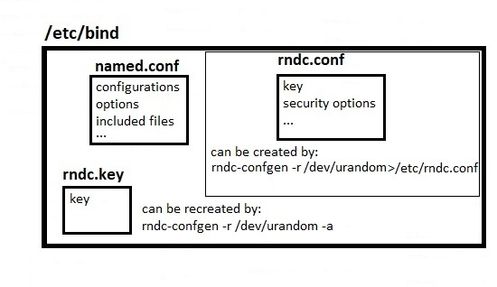

# 331.4 DNS and Cryptography

**Weight:** 5

**Description:** Candidates should have experience and knowledge of cryptography in the context of DNS and its implementation using BIND. The version of BIND covered is 9.7 or higher.


**Key Knowledge Areas:**

* Understand the concepts of DNS, zones and resource records
* Understand DNSSEC, including key signing keys, zone signing keys and relevant DNS records such as DS, DNSKEY, RRSIG, NSEC, NSEC3

and NSEC3PARAM

* Configure and troubleshoot BIND as an authoritative name server serving DNSSEC secured zones
* Manage DNSSEC signed zones, including key generation, key rollover and re-signing of zones
* Configure BIND as an recursive name server that performs DNSSEC validation on behalf of its clients
* Understand CAA and DANE, including relevant DNS records such as CAA and TLSA
* Use CAA and DANE to publish X.509 certificate and certificate authority information in DNS
* Use TSIG for secure communication with BIND
* Awareness of DNS over TLS and DNS over HTTPS
* Awareness of Multicast DNS

**Partial list of the used files, terms and utilities:**

* named.conf
* dnssec-keygen
* dnssec-signzone
* dnssec-settime
* dnssec-dsfromkey
* rndc (including relevant subcommands)
* dig
* delv
* openssl (including relevant subcommands)

## Working with DNS

### DNS overview

DNS is a hierarchical distributed database that stores IP addresses and other data and allows queries by name.

#### DNS server types <a href="#dns_server_types" id="dns_server_types"></a>

A DNS server stores a database of domain names, and then processes domain names based on DNS queries that come from a client in a network.

* **Authoritative server** An authoritative server is a server that holds the DNS name records, including A, AAAA, and CNAME.
* **A non-authoritative** server constructs a cache file based on previous queries for domains. It does not hold original name records.

#### Recursive resolver ,  iterative resolver <a href="#recursive_resolver" id="recursive_resolver"></a>

A _recursive resolver_ is the server that sends a query to the authoritative or non-authoritative server for resolution. A recursive resolver is so-called because it performs each query for a given name and returns the final result.

This is in contrast to an _iterative resolver_, which only returns a referral to the next DNS servers that might have the answer.


That was a quick overview , for review visit my LPIC2 book: [https://borosan.gitbook.io/lpic2-exam-guide/2071-basic-dns-server-configuration#whats-is-dns](https://borosan.gitbook.io/lpic2-exam-guide/2071-basic-dns-server-configuration#whats-is-dns)


#### Zones and Resource Records

DNS configurations are made up of Zones And Resource Records (RRs)

**Zones**

* **Public zone :** A public zone is visible to the internet. You can create DNS records in a public zone to publish your service on the internet. For example, you might create an A record in a public zone called `example.com.` (note the trailing dot) for your public website `www.example.com.`.
* **Private zone :** A private zone is any zone that cannot be queried over the public internet.
* **Delegated subzone:** DNS allows the owner of a zone to use NS records to delegate a subdomain to a different name server. Resolvers follow these records and send queries for the subdomain to the target name server specified in the delegation. For example, you can create separate zones for both `example.com` and `subdomain.example.com`, each with its own authoritative name server. Because `subdomain.example.com` is a child domain of `example.com`, the method to enable the authoritative name server for the subdomain to be located from the parent domain's zone is called delegation. Delegation is essentially a pointer to the authoritative name server for a subdomain. To enable delegation in Cloud DNS, you can add NS records for the subdomains in the zone of the parent domain.


That was a quick overview , to review visit my LPIC2 book: [https://borosan.gitbook.io/lpic2-exam-guide/2072-create-and-maintain-dns-zones#dns-zones](https://borosan.gitbook.io/lpic2-exam-guide/2072-create-and-maintain-dns-zones#dns-zones)


#### Split horizon DNS <a href="#split_horizon_dns" id="split_horizon_dns"></a>

Split horizon is a term used to describe an instance when two zones, one to be used by the internal network and the other to be used by the external network (usually the internet), are created for the same domain. Split-horizon DNS lets you serve different answers (different resource record sets) for the same name depending on who is asking.

For example, you can provide the development/staging version of your app if the query comes from the development network, and the production/public version of your app if the query comes from the public internet.

#### &#x20;Resources Records <a href="#records" id="records"></a>

Resource records are used to store data about domain names and IP addresses. A DNS zone database is made up of a collection of resource records. Each resource record specifies information about a particular object. The server uses these records to answer queries for hosts in its zone.

&#x20;Each individual DNS record has a type (name and number), an expiration time (time to live), and type-specific data. Some of the commonly used record types are:

* **A:** Address record, which maps host names to their IPv4 address.
* **AAAA:** IPv6 Address record, which maps host names to their IPv6 address.
* **CNAME:** Canonical name record, which specifies alias names.
* **MX:** Mail exchange record, which is used in routing requests to mail servers.
* **NS:** Name server record, which delegates a DNS zone to an authoritative server.
* **PTR:** Pointer record, which defines a name associated with an IP address.
* **SOA:** Start of authority, used to designate the primary name server and administrator responsible for a zone. Each zone hosted on a DNS server must have an SOA (start of authority) record. You can modify the record as needed (for example, you can change the serial number to an arbitrary number to support date-based versioning).


to review, visit my lpic2 book: [https://borosan.gitbook.io/lpic2-exam-guide/2071-basic-dns-server-configuration#dns-resource-records-rrs](https://borosan.gitbook.io/lpic2-exam-guide/2071-basic-dns-server-configuration#dns-resource-records-rrs)


#### Record sets <a href="#record_sets" id="record_sets"></a>

Records with the same name and of the same type but with different data values are called record sets. When you create a record, if a set with the same name and type exists, the record is added to this matching set. If there's no matching set, a new set is created and appended to the list of record sets.

This is an example of a record set with more than one record having the same name and type:

| DNS name                    | Type | TTL (seconds) | Data          |
| --------------------------- | ---- | ------------- | ------------- |
| `db-01.dev.gcp.example.com` | A    | 50            | `10.128.1.35` |
| `db-01.dev.gcp.example.com` | A    | 50            | `10.128.1.10` |


### Delegation of subdomains <a href="#delegation_of_subdomains" id="delegation_of_subdomains"></a>

When creating records, make sure that the NS and SOA records match each other. Conflicting NS and SOA records can cause some resolvers to reject the delegation as invalid and refuse to cache `NO DATA` responses to queries. This can result in a large unexpected number of queries against your public managed zones by third-party recursive resolvers when resolvers query your public managed zones for records that do not exist.


### Registrar <a href="#registrar" id="registrar"></a>

A domain name registrar is an organization that manages the reservation of internet domain names for public zones. A registrar must be accredited by a generic top-level domain (gTLD) registry or a country code top-level domain (ccTLD) registry. This is how _upper-level_ name servers agree on SOA and update NS records for the zone to direct requests to caching or authoritative name servers.

### SOA serial number <a href="#soa_serial_number" id="soa_serial_number"></a>

The SOA serial number is a version number for a DNS zone. For all name servers to be current with the version of a zone, they must have the same SOA serial number. The serial numbers of SOA records created in DNS managed zones [monotonically](https://wikipedia.org/wiki/Monotonic\_function) increase with each transactional change to a zone's record sets.

However, you can change the serial number of an SOA record to an arbitrary number, including an ISO 8601-formatted date, as recommended in [RFC 1912](https://tools.ietf.org/html/rfc1912).


**EDNS**

EDNS stands for Extended DNS. EDNS gives us a mechanism to send DNS data in larger packets over UDP. The most popular implementation of EDNS is DNSSEC.

**History of EDNS**&#x20;

Traditional DNS responses are typically small in size (less than 512 bytes) and fit nicely into a small UDP packet. Sometimes we have to transfer larger DNS records.

Original DNS protocol uses UDP and stores information in a way that fills the entire UDP packet – meaning one can’t add additional info to the packet.

EDNS “tacks on” an extra packet for additional information so we can utilize more services in DNS.

It also opens us up to an attack using packets called DNS amplification.

**EDNS is essential for the implementation of DNS Security Extensions (DNSSEC)**.



**BIND DNS**

Berkeley Internet Name Domain (BIND) is the most popular Domain Name System (DNS) server in use today. It was developed in the 1980s at the University of Berkley and is currently in version 9. BIND is an open source system [free to download and use](https://www.isc.org/downloads/bind/), offered under the Mozilla Public License.

BIND can be used to run a caching DNS server or an authoritative name server, and provides features like load balancing, notify, dynamic update, split DNS, DNSSEC, IPv6, and more.

* The primary configuration file is located in etc/named. conf
* &#x20;The objectives on LPIC exam 303-200 cover securing DNS with BIND in particular. visit my book: [https://borosan.gitbook.io/lpic2-exam-guide/2073-securing-a-dns-server#207.3-securing-a-dns-server](https://borosan.gitbook.io/lpic2-exam-guide/2073-securing-a-dns-server#207.3-securing-a-dns-server)


## Securing BIND

### TSIG

Transaction signatures (TSIG) is a mechanism used to secure DNS messages and to provide secure server-to-server communication (usually between master and slave server, but can be extended for dynamic updates as well). TSIG can protect the following type of transactions between two DNS servers:

* Zone transfer
* Notify
* Dynamic updates
* Recursive query messages etc

TSIG is available for BIND v8.2 and above. TSIG uses shared secrets and a one-way hash function to authenticate DNS messages. TSIG is easy and lightweight for resolvers and named.

### Running BIND in a chroot jail

This is not limited to BIND, but software that can be accessed from the outside, such as DNS servers, can take over the entire system if a vulnerability is exploited. Even if the software is hijacked, it is a technology called " **chroot (change root)** " that keeps the damage only within the software .

<figure><figcaption></figcaption></figure>

To explain it briefly, separate from the original " root **directory (top directory)** " , create a " **root directory " for individual software.** Hence the name " **change root** ".

<figure><figcaption></figcaption></figure>

By " chrooting " in this way, you can prevent the leakage of important information stored in the original etc directory and var directory . It cannot be said that\
" chrooting " alone provides complete security, but with attacks that exploit DNS vulnerabilities making headlines almost every day, it is safer to proactively adopt measures that can be taken.


for configuration vist my lpic2 book: [https://borosan.gitbook.io/lpic2-exam-guide/2073-securing-a-dns-server#chroot](https://borosan.gitbook.io/lpic2-exam-guide/2073-securing-a-dns-server#chroot)


### Options statements

Configuration directives:

* **allow-query** — Specifies which hosts are allowed to query this nameserver. By default, all hosts are allowed to query. An access control list, or collection of IP addresses or networks may be used here to only allow particular hosts to query the nameserver.
* **allow-recursion** — Similar to allow-query, this option applies to recursive queries. By default, all hosts are allowed to perform recursive queries on the nameserver.
* **allow-transfer** — Specifies the slave servers that are allowed to request a transfer of the zone's information. The default is to allow all transfer requests.
*   **allow-update** — Specifies the hosts that are allowed to dynamically update information in their zone. The default is to deny all dynamic update requests.

    Be careful when allowing hosts to update information about their zone. Do not enable this option unless the host specified is completely trusted. In general, it better to have an administrator manually update the records for a zone and reload the named service.


review other options in my LPIC2 book:[https://borosan.gitbook.io/lpic2-exam-guide/2072-create-and-maintain-dns-zones#1.options-statement](https://borosan.gitbook.io/lpic2-exam-guide/2072-create-and-maintain-dns-zones#1.options-statement)


### rndc

BIND includes a utility called rndc (Remote Name Daemon Control) which allows command line administration of the named daemon from the localhost or a remote host.

In order to prevent unauthorized access to the named daemon, BIND uses a shared secret key authentication method to grant privileges to hosts. This means an identical key must be present in both /etc/named.conf and the rndc configuration file, /etc/rndc.conf.

The name server control utility, rndc, sends named digitally signed commands over a TCP connection. The configuration file for rndc is ‘/etc/rndc.conf’. This configuration file stores configuration information such as the name server to connect to and which key to use for the digital signature. The rndc utility is started when named is started using the initialization script. An rndc.conf file can be generated with a random key with the rndc-confgen commandline utility. rndc related files are like this:

<figure><figcaption></figcaption></figure>

lets takea look at rndc.key file:

```
root@server1:/etc/bind# ls -al rndc*
-rw-r----- 1 bind bind 77 Mar  5 22:20 rndc.key
root@server1:/etc/bind# cat rndc.key 
key "rndc-key" {
    algorithm hmac-md5;
    secret "JFLwN7Sd/sGbIdan+y/XtQ==";
};
root@server1:/etc/bind# rndc reload
server reload successful
```

for demonstration lets remove and recreate rndc.key :

```
root@server1:/etc/bind# rm rndc.key 
root@server1:/etc/bind# ls -al rndc*
ls: cannot access 'rndc*': No such file or directory
root@server1:/etc/bind# rndc reload
rndc: neither /etc/bind/rndc.conf nor /etc/bind/rndc.key was found

root@server1:/etc/bind# rndc-confgen -r /dev/urandom -a
wrote key file "/etc/bind/rndc.key"
root@server1:/etc/bind# ls -al rndc*
-rw------- 1 root bind 77 Apr 17 23:48 rndc.key
root@server1:/etc/bind# cat rndc.key 
key "rndc-key" {
    algorithm hmac-md5;
    secret "sIfJgn3msN0RnyzNz6mixQ==";
};
```

We have removed and recreate a rndc.key lets set rights:

```
root@server1:/etc/bind# chown bind.bind rndc.key 
root@server1:/etc/bind# chmod 640 rndc.key
```

and check it:

```
root@server1:/etc/bind# systemctl start bind9.service 
root@server1:/etc/bind# systemctl status bind9.service 
● bind9.service - BIND Domain Name Server
   Loaded: loaded (/lib/systemd/system/bind9.service; enabled; vendor preset: en
  Drop-In: /run/systemd/generator/bind9.service.d
           └─50-insserv.conf-$named.conf
   Active: active (running) since Wed 2018-04-18 00:10:51 PDT; 27min ago
     Docs: man:named(8)

root@server1:/etc/bind# rndc reload
server reload successful
```

for generating rndc.cong and requred key use `rndc-confgen -r /dev/urandom>/etc/bind/rndc.conf` command, after creating that we have to include the file , and use it but that is not our topic for now.

Except rndc remote features of rndc we can use it locally. Like most of Services in Linux world, when we change a configuration file in BIND or change zones(as we see in next lessons) we need to restart bind service, but there a problem! By restarting bind service all caches would be cleared and that it not acceptable, so instead of that, we use rndc tool. rndc read configuration files and reflect zone changes but does not clear cahce.

```
root@server1:/etc/bind# rndc reload
server reload successful
```

also it is possible to clear specific domain name from cache results with `rndc flushname google.com` . to flush every thing in the system `rndc flush` and many other features, but that is enough for now!


This part was from my LPIC2 book, visit: [https://borosan.gitbook.io/lpic2-exam-guide/2071-basic-dns-server-configuration#usr-sbin-rndc](https://borosan.gitbook.io/lpic2-exam-guide/2071-basic-dns-server-configuration#usr-sbin-rndc)



## Securing DNS with DNSSEC

### DNSSEC <a href="#dnssec" id="dnssec"></a>

The Domain Name System Security Extension (DNSSEC) addresses vulnerabilities to DNS data. DNSSEC is a suite of IETF specifications that provides authentication of DNS data, authenticated denial of existence, and data integrity to DNS clients (resolvers). In short, DNSSEC provides a way for software to verify the origin of DNS data and validate that it has not been modified in transit.



**Why EDNS is important for DNSSEC?**

This is important for DNSSEC, since the **+do** bit that signals DNSSEC-awareness is carried within EDNS, and DNSSEC responses are larger than traditional DNS. If DNS servers and network environment cannot support large UDP packets, it will cause retransmission over TCP, or the larger UDP responses will be discarded. Users will likely experience slow DNS resolution or unable to resolve certain names at all.

Note that EDNS applies whether or not you are validating DNSSEC because BIND has DNSSEC enabled by default.


.

.

.

reources:

[https://cloud.google.com/dns/docs/dns-overview#:\~:text=DNS%20is%20a%20hierarchical%20distributed,to%20communicate%20with%20each%20other.](https://cloud.google.com/dns/docs/dns-overview)

[https://www.ibm.com/docs/en/i/7.1?topic=concepts-dns-resource-records](https://www.ibm.com/docs/en/i/7.1?topic=concepts-dns-resource-records)

[https://www.howtouselinux.com/post/dns\_edns](https://www.howtouselinux.com/post/dns\_edns)

[https://ns1.com/resources/bind-dns-pros-cons-and-alternatives#:\~:text=What%20is%20BIND%3F,under%20the%20Mozilla%20Public%20License.](https://ns1.com/resources/bind-dns-pros-cons-and-alternatives)

[https://en.wikipedia.org/wiki/Extension\_Mechanisms\_for\_DNS](https://en.wikipedia.org/wiki/Extension\_Mechanisms\_for\_DNS)

[https://dnsinstitute.com/documentation/dnssec-guide/ch03s05.html](https://dnsinstitute.com/documentation/dnssec-guide/ch03s05.html)

[https://www.cyberciti.biz/faq/unix-linux-bind-named-configuring-tsig/](https://www.cyberciti.biz/faq/unix-linux-bind-named-configuring-tsig/)

[https://oxynotes.com/?p=3919](https://oxynotes.com/?p=3919)

[https://web.mit.edu/rhel-doc/3/rhel-rg-en-3/s1-bind-namedconf.html](https://web.mit.edu/rhel-doc/3/rhel-rg-en-3/s1-bind-namedconf.html)

.
