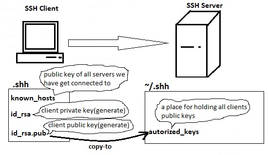
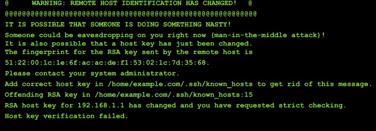
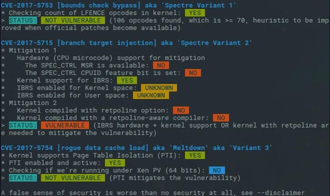

# 332.1 Host Hardening

#### _Topic 332: Host Security_

**Weight:** 5

**Description:** Candidates should be able to secure computers running Linux against common threats.


**Key Knowledge Areas:**

* Configure BIOS and boot loader (GRUB 2) security
* Disable unused software and services
* Understand and drop unnecessary capabilities for specific systemd units and the entire system
* Understand and configure Address Space Layout Randomization (ASLR), Data Execution Prevention (DEP) and Exec-Shield
* Black and white list USB devices attached to a computer using USBGuard
* Create an SSH CA, create SSH certificates for host and user keys using the CA and configure OpenSSH to use SSH certificates
* Work with chroot environments
* Use systemd units to limit the system calls and capabilities available to a process
* Use systemd units to start processes with limited or no access to specific files and devices
* Use systemd units to start processes with dedicated temporary and /dev directories and without network access
* Understand the implications of Linux Meltdown and Spectre mitigations and enable/disable the mitigations
* Awareness of polkit
* Awareness of the security advantages of virtualization and containerization

**The following is a partial list of the used files, terms and utilities:**

* grub.cfg
* systemctl
* getcap
* setcap
* capsh
* sysctl
* /etc/sysctl.conf
* /etc/usbguard/usbguard-daemon.conf
* /etc/usbguard/rules.conf
* usbguard
* ssh-keygen
* /etc/ssh/
* \~/.ssh/
* /etc/ssh/sshd\_config
* chroot


## Kernel Security

### &#x20;Disabling unnecessary software&#x20;

• Every running program presents a possible security threat.&#x20;

• Disabling unused services is a good security practice.&#x20;

• Use systemctl and chkconfig to disable services.&#x20;

• Commonly disabled services include atd, ava hi-daemon, cups.

### &#x20;Limiting resource usage&#x20;

• The user may limit system resources such as threads, open files, and memory.&#x20;

> There are both soft and hard limits:&#x20;
>
> A regular user may temporarily bypass soft limits Hard limits may only be raised by root and are enforced by the kernel A user or group may apply limits

• The **paml\_limits.so** module allows operators to control how much of any one resource a user may access through hard and soft limits.

• Most systems come with pam.so preloaded.&#x20;

• The ulimit command may be used to adjust these limits at runtime.&#x20;

> Here are some of the more common options for ulimit:
>
> \-a: All current limits are reported&#x20;
>
> \-f: The maximum size of files written by the shell and its children&#x20;
>
> \-t: The maximum amount of cpu time in seconds&#x20;
>
> \-u: The maximum number of processes available to a single user&#x20;
>
> \-T: The maximum number of threads

• Limits may be set persistently in /etc/security/limits.conf.&#x20;


visit my LPIC1: [https://borosan.gitbook.io/lpic1-exam-guide/1101-perform-security-administration-tasks#ulimit](https://borosan.gitbook.io/lpic1-exam-guide/1101-perform-security-administration-tasks#ulimit)


### &#x20;Tuning kernel parameters&#x20;

• The sysctl command is capable of displaying and setting kernel parameters.

```
[root@rocky8 ~]# sysctl -a | less
[root@rocky8 ~]# sysctl -ar icmp
net.ipv4.icmp_echo_ignore_all = 0
net.ipv4.icmp_echo_ignore_broadcasts = 1
net.ipv4.icmp_errors_use_inbound_ifaddr = 0
net.ipv4.icmp_ignore_bogus_error_responses = 1
net.ipv4.icmp_msgs_burst = 50
net.ipv4.icmp_msgs_per_sec = 1000
net.ipv4.icmp_ratelimit = 1000
net.ipv4.icmp_ratemask = 6168
net.ipv6.icmp.ratelimit = 1000
net.netfilter.nf_conntrack_icmp_timeout = 30
net.netfilter.nf_conntrack_icmpv6_timeout = 30
```


**Sysctl Review**&#x20;

**View Settings:**&#x20;

sysctl -a&#x20;

sysctl -ar \<search\_pattern>&#x20;

procfs&#x20;

**Setting parameters:**&#x20;

sysctl -w  \<param>=\<value>

**Persist changes:**&#x20;

etc/sysctl.conf



for full review visit my LPIC2 book: [https://borosan.gitbook.io/lpic2-exam-guide/2042-adjusting-storage-device-access#sysctl](https://borosan.gitbook.io/lpic2-exam-guide/2042-adjusting-storage-device-access#sysctl)


• Parameters map to the procfs filesystem.&#x20;

```
[root@rocky8 ~]# ls -l  /proc/sys
total 0
dr-xr-xr-x. 1 root root 0 Sep  6 07:57 abi
dr-xr-xr-x. 1 root root 0 Sep  6 04:41 crypto
dr-xr-xr-x. 1 root root 0 Sep  6 07:57 debug
dr-xr-xr-x. 1 root root 0 Sep  6 07:57 dev
dr-xr-xr-x. 1 root root 0 Apr  4 16:17 fs
dr-xr-xr-x. 1 root root 0 Apr  4 16:17 kernel
dr-xr-xr-x. 1 root root 0 Sep  6 05:46 net
dr-xr-xr-x. 1 root root 0 Sep  6 07:57 user
dr-xr-xr-x. 1 root root 0 Sep  6 07:57 vm

[root@rocky8 ~]# ll /proc/sys/net/ipv4/icmp*
-rw-r--r--. 1 root root 0 Sep  6 08:05 /proc/sys/net/ipv4/icmp_echo_ignore_all
-rw-r--r--. 1 root root 0 Sep  6 07:57 /proc/sys/net/ipv4/icmp_echo_ignore_broadcasts
-rw-r--r--. 1 root root 0 Sep  6 07:57 /proc/sys/net/ipv4/icmp_errors_use_inbound_ifaddr
-rw-r--r--. 1 root root 0 Sep  6 07:57 /proc/sys/net/ipv4/icmp_ignore_bogus_error_responses
-rw-r--r--. 1 root root 0 Sep  6 07:57 /proc/sys/net/ipv4/icmp_msgs_burst
-rw-r--r--. 1 root root 0 Sep  6 07:57 /proc/sys/net/ipv4/icmp_msgs_per_sec
-rw-r--r--. 1 root root 0 Sep  6 07:57 /proc/sys/net/ipv4/icmp_ratelimit
-rw-r--r--. 1 root root 0 Sep  6 07:57 /proc/sys/net/ipv4/icmp_ratemask

```


visit my LPIC1 book: [https://borosan.gitbook.io/lpic1-exam-guide/1011-determine-and-configure-hardware-settings#proc](https://borosan.gitbook.io/lpic1-exam-guide/1011-determine-and-configure-hardware-settings#proc)


• Kernel parameters set persistently in the file /etc/sysctl.conf.&#x20;

> See kernel-docs for additional information.


in modern linux distributions, the location of configs might be different:

\[root@rocky8 \~]# cat /etc/sysctl.conf sysctl settings are defined through files in /usr/lib/sysctl.d/, /run/sysctl.d/, and /etc/sysctl.d/.

Vendors settings live in /usr/lib/sysctl.d/. To override a whole file, create a new file with the same in /etc/sysctl.d/ and put new settings there. To override only specific settings, add a file with a lexically later name in /etc/sysctl.d/ and put new settings there.

For more information, see sysctl.conf(5) and sysctl.d(5).


### **Linux Capabilities**

#### Why capabilities?

Linux capabilities **provide a subset of the available root privileges** to a process. This effectively breaks up root privileges into smaller and distinctive units. Each of these units can then be independently be granted to processes. This way the full set of privileges is reduced and decreasing the risks of exploitation.

To better understand how Linux capabilities work, let’s have a look first at the problem it tries to solve.

Let’s assume we are running a process as a normal user. This means we are non-privileged. We can only access data that owned by us, our group, or which is marked for access by all users. At some point in time, our process needs a little bit more permissions to fulfill its duties, like opening a network socket. The problem is that normal users can not open a socket, as this requires root permissions.


#### Capabilities Sets

Inherited capabilities

* **CapEff**: The _effective_ capability&#x20;
* **CapPrm**: (_Permitted_)
* **CapInh**
* **CapBnd**
* **CapAmb**


#### Processes  Capabilities

To see the capabilities for a particular process, use the **status** file in the /proc directory. As it provides more details, let’s limit it only to the information related to Linux capabilities.\
Note that for all running processes capability information is maintained per thread, for binaries in the file system it’s stored in extended attributes.

> You can find the capabilities defined in /usr/include/linux/capability.h

You can find the capabilities of the current process in `cat /proc/self/status` or doing `capsh --print` and of other users in `/proc/<pid>/status`

```
cat /proc/1234/status | grep Cap
cat /proc/$$/status | grep Cap #This will print the capabilities of the current process
```

This command should return 5 lines on most systems.

* CapInh = Inherited capabilities
* CapPrm = Permitted capabilities
* CapEff = Effective capabilities
* CapBnd = Bounding set
* CapAmb = Ambient capabilities set

```
#These are the typical capabilities of a root owned process (all)
CapInh: 0000000000000000
CapPrm: 0000003fffffffff
CapEff: 0000003fffffffff
CapBnd: 0000003fffffffff
CapAmb: 0000000000000000
```

These hexadecimal numbers don’t make sense. Using the capsh utility we can decode them into the capabilities name.

```
capsh --decode=0000003fffffffff
0x0000003fffffffff=cap_chown,cap_dac_override,cap_dac_read_search,cap_fowner,cap_fsetid,cap_kill,cap_setgid,cap_setuid,cap_setpcap,cap_linux_immutable,cap_net_bind_service,cap_net_broadcast,cap_net_admin,cap_net_raw,cap_ipc_lock,cap_ipc_owner,cap_sys_module,cap_sys_rawio,cap_sys_chroot,cap_sys_ptrace,cap_sys_pacct,cap_sys_admin,cap_sys_boot,cap_sys_nice,cap_sys_resource,cap_sys_time,cap_sys_tty_config,cap_mknod,cap_lease,cap_audit_write,cap_audit_control,cap_setfcap,cap_mac_override,cap_mac_admin,cap_syslog,cap_wake_alarm,cap_block_suspend,37
```

Lets check now the **capabilities** used by `ping`:

```
cat /proc/9491/status | grep Cap
CapInh:    0000000000000000
CapPrm:    0000000000003000
CapEff:    0000000000000000
CapBnd:    0000003fffffffff
CapAmb:    0000000000000000

capsh --decode=0000000000003000
0x0000000000003000=cap_net_admin,cap_net_raw
```

Although that works, there is another and easier way. To see the capabilities of a running process, simply use the **getpcaps** tool followed by its process ID (PID). You can also provide a list of process IDs.

```
getpcaps 1234
```

Lets check here the capabilities of `tcpdump` after having giving the binary enough capabilities (`cap_net_admin` and `cap_net_raw`) to sniff the network (_tcpdump is running in process 9562_):

```
#The following command give tcpdump the needed capabilities to sniff traffic
$ setcap cap_net_raw,cap_net_admin=eip /usr/sbin/tcpdump

$ getpcaps 9562
Capabilities for `9562': = cap_net_admin,cap_net_raw+ep

$ cat /proc/9562/status | grep Cap
CapInh:    0000000000000000
CapPrm:    0000000000003000
CapEff:    0000000000003000
CapBnd:    0000003fffffffff
CapAmb:    0000000000000000

$ capsh --decode=0000000000003000
0x0000000000003000=cap_net_admin,cap_net_raw
```

As you can see the given capabilities corresponds with the results of the 2 ways of getting the capabilities of a binary.\
The _getpcaps_ tool uses the **capget()** system call to query the available capabilities for a particular thread. This system call only needs to provide the PID to obtain more information.

#### Binaries Capabilities

Binaries can have capabilities that can be used while executing. For example, it's very common to find `ping` binary with `cap_net_raw` capability:

```
getcap /usr/bin/ping
/usr/bin/ping = cap_net_raw+ep
```

You can **search binaries with capabilities** using:

```
getcap -r / 2>/dev/null
```

#### Dropping capabilities with capsh

If we drop the CAP\_NET\_RAW capabilities for _ping_, then the ping utility should no longer work.

```
capsh --drop=cap_net_raw --print -- -c "tcpdump"
```

Besides the output of _capsh_ itself, the _tcpdump_ command itself should also raise an error.

> /bin/bash: /usr/sbin/tcpdump: Operation not permitted

The error clearly shows that the ping command is not allowed to open an ICMP socket. Now we know for sure that this works as expected.

#### Remove Capabilities

You can remove capabilities of a binary with

```
setcap -r </path/to/binary>
```


### User Capabilities

Apparently **it's possible to assign capabilities also to users**. This probably means that every process executed by the user will be able to use the users capabilities.\
A few files new to be configured to give a user certain capabilities but the one assigning the capabilities to each user will be `/etc/security/capability.conf`.\
File example:

```
# Simple
cap_sys_ptrace               developer
cap_net_raw                  user1

# Multiple capablities
cap_net_admin,cap_net_raw    jrnetadmin
# Identical, but with numeric values
12,13                        jrnetadmin

# Combining names and numerics
cap_sys_admin,22,25          jrsysadmin
```


### USB Gurd

The **USBGuard** software framework provides system protection against intrusive USB devices by implementing basic whitelisting and blacklisting capabilities based on device attributes. To enforce a user-defined policy, **USBGuard** uses the Linux kernel USB device authorization feature. The **USBGuard** framework provides the following components:

* The daemon component with an inter-process communication (IPC) interface for dynamic interaction and policy enforcement.
* The command-line interface to interact with a running **USBGuard** instance.
* The rule language for writing USB device authorization policies.
* The C++ API for interacting with the daemon component implemented in a shared library.


**To create the initial rule set:**

usbguard generate-policy > /etc/usbguard/rules.conf

**To customize the USBGuard rule set:**

edit the `/etc/usbguard/rules.conf`

**To start the USBGuard daemon`:`**

systemctl enable usbguard.service `--now`

**To list all USB devices recognized by USBGuard`:`**

usbguard list-devices

**To authorize a device to interact with the system:**

usbguard allow-device \<device-num>

**To deauthorize and remove a device from the system:**

usbguard reject-device \<device-num>

**To just deauthorize a device:**

usbguard block-device \<device-num>


**USBGuard** uses the _block_ and _reject_ terms with the following meaning:

* block - do not talk to this device for now
* reject - ignore this device as if did not exist

To see all options  use `usbguard --help` command



#### Creating a White List and a Black List

The `usbguard-daemon.conf` file is loaded by the `usbguard` daemon after it parses its command-line options and is used to configure runtime parameters of the daemon. To override the default configuration file (`/etc/usbguard/usbguard-daemon.conf`), use the `-c` command-line option. See the `usbguard-daemon(8)` man page for further details.

To create a white list or a black list, edit the `usbguard-daemon.conf` file and use its options



**Important**

The daemon provides the **USBGuard** public IPC interface. In Red Hat Enterprise Linux, the access to this interface is by default limited to the `root` user only. Consider setting either the `IPCAccessControlFiles` option (recommended) or the `IPCAllowedUsers` and `IPCAllowedGroups` options to limit access to the IPC interface. Do not leave the ACL unconfigured as this exposes the IPC interface to all local users and it allows them to manipulate the authorization state of USB devices and modify the **USBGuard** policy.


### Managing ASLR:&#x20;

• ASLR stands for Address Space Layout Randomization.&#x20;

• It ensures that every time a program loads, it loads into a different place in memory.


Setting or Un-setting ASLR:

&#x20;ALSR is controlled by the kernel parameter **`kernel.randomize_va_space`**&#x20;

This value may be controlled using sysctl or in /etc/sysctl.conf (see notes earlier in this section)&#x20;

* A value of 2 means ALSR is fully functional&#x20;
* A value of 1 means ALSR is operating in conservative mode&#x20;
* A value of 0 means ALSR is disabled


### The NX bit

• The NX bit is a CPU feature.&#x20;

• It prevents execution from protected memory areas. By limiting executable memory space, malicious programs have a harder time executing arbitrary code


**Verify NX bit set**&#x20;

As NX is at the CPU level, you must look at CPU information to verify it:&#x20;

`grep -Fw nx /proc/cpuinfo`


### Exec-Shield

Exec-Shield is a software solution for the same problem designed to support CPUs without this feature.

### ICMP security settings:

&#x20;• Network security may be enhanced through kernel parameter tuning.&#x20;

• Disabling ICMP is a common security measure that may be achieved by setting the parameter net.ipv4.icmp\_echo\_ignore\_all to 1.

```
[root@rocky8 ~]# sysctl -w net.ipv4.icmp_echo_ignore_all=1
net.ipv4.icmp_echo_ignore_all = 1
```

> You might only want to prevent response to ICMP echo broadcasts&#x20;
>
> Setting the `net.ipv4.icmp_echo_ignore_broadcasts` to 1 prevents an ICMP echo response from the kernel

### SSH Certificate Authority

In LPIC-2  we learned how SSH Key Based authenticationworks. As we mentioned when ssh connection is started, the public key of ssh server is transferrd to the client(stored in ./ssh/known\_hosts) and the client will use it to continue negotiation with the server and user will be required to get authenticated by sending username and password.

Its possible to omit entring user name and password and get connected to the ssh server using client public and private key.

<figure><figcaption><p>SSH Key-Based Authentication</p></figcaption></figure>


Read my LPIC-2 book to review:[https://borosan.gitbook.io/lpic2-exam-guide/2123-secure-shell-ssh#configuring-ssh-key-based-authentication](https://borosan.gitbook.io/lpic2-exam-guide/2123-secure-shell-ssh#configuring-ssh-key-based-authentication)


#### SSH Public Key Authentication Problems

There are two problems with SSH Public Key Authentication.

1.  #### Trust On First Use (a.k.a. TOFU)

    When an SSH connection is first established, an SSH server sends its public key to identify itself to a user. The user can accept the public key offered by the SSH server and assume that the host is trusted if the user connects to it first time. This authentication scheme is called "trust on first use" or TOFU.

    If the host's IP, name or public key change, the user can no longer trust this combination of the hostname, the IP and the public key. The user sees a scary warning.\


    <figure><figcaption></figcaption></figure>

> The user can alert security folks or ignore the warning by removing the old key. For cloud environments, however, an IP address and a hostname can be reused many times. Users learn to ignore those warnings, because there is no way to learn whether it's an attack or an IP or a hostname change. Let's call it TOFU fatigue.

2\.  A second problem of public keys for security is caused by complexities of public key distribution. Imagine a deployment with 100 servers and 10 users, where every user has 2 public keys. You have to build a system that distributes 20 user's public keys on each server and 100 public keys to every user's computer, and keep those up to date. There are quite a few ways of implementing a centralized authentication authority, such as LDAP, but these are sometimes overkill.

#### about SSH CA Based Authentication

SSH actually has the functionality to use a certificate authority to authenticate servers and clients. This works both ways. Using this system, you can authenticate a host to a client, avoiding confusing messages about being unable to validate the authenticity of the host. You can also validate the client to the host, allowing you to register a new SSH key in one place and allow access across your organization.

#### Configuring SSH CA Based Authentication

For demonstration lets authenticate a host to a client.

### Chroot Environments&#x20;

• A chroot environment is a ‘fake root’ that is set for a specific user and process.&#x20;

• The chroot command is used by root to create the environment using a pre-configured area in the filesystem.&#x20;

• An unprivileged process is unable to access files outside of a chroot environment.&#x20;

• Be mindful of hard links in chroot environments.they can get out!


Modern technologies allow isolation of the entire system as opposed to simply the file system:&#x20;

• **Virtualization** is similar to a chroot environment but at a much more advanced level.&#x20;

• **Containerization** is similar in nature when it comes to resource segmentation and process isolation.


### Meltdown and Spectre

Spectre and Meltdown vulnerabilities are hardware vulnerabilities of your processor or CPU. Mainly they are found in Intel based processors. A lot of desktops, servers and laptops are affected by spectre and meltdown vulnerabilities. The good news is that it is really hard to crack a system with these vulnerabilities. A report says, no incident was found that verifies that spectre and meltdown vulnerabilities were used to exploit user data. But it’s still a concern these days. Let’s see what these are.

* **Spectre Vulnerability** :  Spectre vulnerability breaks the isolation between the applications installed on your computer. So an attacker can trick a less secure application to reveal information about other secure applications from the kernel module of the operating system.
* **Meltdown Vulnerability** : Meltdown breaks the isolation between the user, the applications and the operating system. So an attacker can write a program to access the memory location of that program as well as other programs and get secret information out of the system.

#### &#x20;Check if your Linux machine is patched against Meltdown and Spectre:

there’s a way for you to check as well. Open up a terminal window and issue the following command:

```
git clone https://github.com/speed47/spectre-meltdown-checker.git
```

> note: You will need to have git installed for the above command to run.

Once the above command completes, change into the newly created directory with the command `cd spectre-meltdown-checker`. Set the correct permissions for the checker file with the command `chmod u+x spectre-meltdown-checker.sh` and then execute the file with the command __ `./spectre-meltdown-checker.sh`. The command will run its check and report immediately:

<figure><figcaption></figcaption></figure>

> Due to the passage of time, updating the operating system usually solves the problem.

### polkit

PolKit (formerly known as PolicyKit) is an application framework that acts as a negotiator between the unprivileged user session and the privileged system context. Whenever a process from the user session tries to carry out an action in the system context, PolKit is queried. Based on its configuration—specified in a so-called “policy”—the answer could be “yes”, “no”, or “needs authentication”. Unlike classical privilege authorization programs such as sudo, PolKit does not grant `root` permissions to an entire session, but only to the action in question.

## Securing Grub

You may be interested in how to prevent ordinary users from doing whatever they like, if you share your computer with other people.

&#x20;One thing which could be a security hole is that the user can do too many things with GRUB, because GRUB allows one to modify its configuration and run arbitrary commands at run-time. So it is necessary to disable all the interactive operations.

Thus, GRUB provides a password feature, so that only administrators can start the interactive operations (i.e. editing menu entries and entering the command-line interface).


Securing Grub :

* **Grub 1:** does not support unique user accounts, only passwords for entries Specify password agoodpw in menu entry in grub.conf in order to password protect Securing&#x20;
* **Grub 2:** Grub 2 allows for a two types of password A global password that protects editing menu entries An operating system password that protects booting specific menu entries.


lets take a look at grub configurations:

```
[root@centos7 grub.d]# pwd
/etc/grub.d
[root@centos7 grub.d]# ll
total 72
-rwxr-xr-x. 1 root root  8702 Jul 28  2020 00_header
-rwxr-xr-x. 1 root root  1043 Mar 21  2019 00_tuned
-rwxr-xr-x. 1 root root   232 Jul 28  2020 01_users
-rwxr-xr-x. 1 root root 10781 Jul 28  2020 10_linux
-rwxr-xr-x. 1 root root 10275 Jul 28  2020 20_linux_xen
-rwxr-xr-x. 1 root root  2559 Jul 28  2020 20_ppc_terminfo
-rwxr-xr-x. 1 root root 11169 Jul 28  2020 30_os-prober
-rwxr-xr-x. 1 root root   214 Jul 28  2020 40_custom
-rwxr-xr-x. 1 root root   216 Jul 28  2020 41_custom
-rw-r--r--. 1 root root   483 Jul 28  2020 README
```


To full review of grub and grub2 read my LPIC1 book: [https://borosan.gitbook.io/lpic1-exam-guide/1022-install-a-boot-manager#grub](https://borosan.gitbook.io/lpic1-exam-guide/1022-install-a-boot-manager#grub)



These step are for demonstration only. Do not repeat them on your production systems. The steps and commands might be different based on your OS. Read Documentations.


Securing Grub Configuring users in /etc/grub.d/01\_users:

before:

```
[root@centos7 grub.d]# cat 01_users
#!/bin/sh -e
cat << EOF
if [ -f \${prefix}/user.cfg ]; then
  source \${prefix}/user.cfg
  if [ -n "\${GRUB2_PASSWORD}" ]; then
    set superusers="root"
    export superusers
    password_pbkdf2 root \${GRUB2_PASSWORD}
  fi
fi
EOF
```

after:

```
[root@centos7 grub.d]# cat 01_users
#!/bin/sh -e
cat << EOF
if [ -f \${prefix}/user.cfg ]; then
  source \${prefix}/user.cfg
  if [ -n "\${GRUB2_PASSWORD}" ]; then
    set superusers="root"
    export superusers
    password_pbkdf2 root \${GRUB2_PASSWORD}
  fi
fi
password user1 user1password
password user2 user2password
EOF
```

Copy Configuring **menu entries** from  /boot/grub2/grub.cfg &#x20;

```
menuentry 'CentOS Linux (3.10.0-1160.el7.x86_64) 7 (Core)' --class centos --class gnu-linux --class gnu --class os --unrestricted $menuentry_id_option 'gnulinux-3.10.0-1160.el7.x86_64-advanced-21d3b367-651e-420f-b94d-43040b72360a' {
        load_video
        set gfxpayload=keep
        insmod gzio
        insmod part_msdos
        insmod xfs
        set root='hd0,msdos1'
        if [ x$feature_platform_search_hint = xy ]; then
          search --no-floppy --fs-uuid --set=root --hint-bios=hd0,msdos1 --hint-efi=hd0,msdos1 --hint-baremetal=ahci0,msdos1 --hint='hd0,msdos1'  052308ef-1d3c-4cab-a5e5-a5d5c9fc0a2a
        else
          search --no-floppy --fs-uuid --set=root 052308ef-1d3c-4cab-a5e5-a5d5c9fc0a2a
        fi
        linux16 /vmlinuz-3.10.0-1160.el7.x86_64 root=UUID=21d3b367-651e-420f-b94d-43040b72360a ro crashkernel=auto rhgb quiet LANG=en_US.UTF-8
        initrd16 /initramfs-3.10.0-1160.el7.x86_64.img
}

```

and copy them in to **/etc/grub.d/40\_custom** and modify. change `--unrestricted` to  `--users user1,user2` :

```
#!/bin/sh
exec tail -n +3 $0
# This file provides an easy way to add custom menu entries.  Simply type the
# menu entries you want to add after this comment.  Be careful not to change
# the 'exec tail' line above.
menuentry 'CentOS Linux (3.10.0-1160.el7.x86_64) 7 (Core)' --class centos --class gnu-linux --class gnu --class os --users user1,user2 $menuentry_id_option 'gnulinux-3.10.0-1160.el7.x86_64-advanced-21d3b367-651e-420f-b94d-43040b72360a' {
        load_video
        set gfxpayload=keep
        insmod gzio
        insmod part_msdos
        insmod xfs
        set root='hd0,msdos1'
        if [ x$feature_platform_search_hint = xy ]; then
          search --no-floppy --fs-uuid --set=root --hint-bios=hd0,msdos1 --hint-efi=hd0,msdos1 --hint-baremetal=ahci0,msdos1 --hint='hd0,msdos1'  052308ef-1d3c-4cab-a5e5-a5d5c9fc0a2a
        else
          search --no-floppy --fs-uuid --set=root 052308ef-1d3c-4cab-a5e5-a5d5c9fc0a2a
        fi
        linux16 /vmlinuz-3.10.0-1160.el7.x86_64 root=UUID=21d3b367-651e-420f-b94d-43040b72360a ro crashkernel=auto rhgb quiet LANG=en_US.UTF-8
        initrd16 /initramfs-3.10.0-1160.el7.x86_64.img
}

```

Building grub configuration via **grub2-mkconfig -o /boot/grub2/grub.cfg**  command :&#x20;

```
[root@centos7 grub.d]# grub2-mkconfig -o /boot/grub2/grub.cfg
Generating grub configuration file ...
Found linux image: /boot/vmlinuz-3.10.0-1160.el7.x86_64
Found initrd image: /boot/initramfs-3.10.0-1160.el7.x86_64.img
Found linux image: /boot/vmlinuz-0-rescue-251fad2d7b5049ecbb24a0bb534b6986
Found initrd image: /boot/initramfs-0-rescue-251fad2d7b5049ecbb24a0bb534b6986.img
done
```

and done.

.

.

.

resources:

[https://www.gnu.org/software/grub/manual/legacy/Security.html](https://www.gnu.org/software/grub/manual/legacy/Security.html)

[https://book.hacktricks.xyz/linux-hardening/privilege-escalation/linux-capabilities](https://book.hacktricks.xyz/linux-hardening/privilege-escalation/linux-capabilities)

[https://blog.container-solutions.com/linux-capabilities-why-they-exist-and-how-they-work](https://blog.container-solutions.com/linux-capabilities-why-they-exist-and-how-they-work)

[https://access.redhat.com/documentation/en-us/red\_hat\_enterprise\_linux/7/html/security\_guide/sec-using-usbguard](https://access.redhat.com/documentation/en-us/red\_hat\_enterprise\_linux/7/html/security\_guide/sec-using-usbguard)

[https://meltdownattack.com/](https://meltdownattack.com/)

[https://linuxhint.com/check-patch-spectre-meltdown-arch-linux/#:\~:text=Spectre%20and%20Meltdown%20vulnerabilities%20are,a%20system%20with%20these%20vulnerabilities.](https://linuxhint.com/check-patch-spectre-meltdown-arch-linux/)

[https://www.ncsc.gov.uk/guidance/meltdown-and-spectre-guidance](https://www.ncsc.gov.uk/guidance/meltdown-and-spectre-guidance)

[https://documentation.suse.com/sles/15-SP1/html/SLES-all/cha-security-policykit.html](https://documentation.suse.com/sles/15-SP1/html/SLES-all/cha-security-policykit.html)

.

