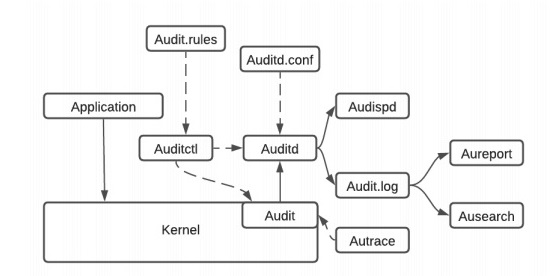

# 332.2 Host Intrusion Detection

**Weight:** 5

**Description:** Candidates should be familiar with the use and configuration of common host intrusion detection software. This includes managing the Linux Audit system and verifying a system's integrity.


**Key Knowledge Areas:**

* Use and configure the Linux Audit system
* Use chkrootkit
* Use and configure rkhunter, including updates
* Use Linux Malware Detect
* Automate host scans using cron
* Use RPM and DPKG package management tools to verify the integrity of installed files
* Configure and use AIDE, including rule management
* Awareness of OpenSCAP

**Partial list of the used files, terms and utilities:**

* auditd
* auditctl
* ausearch, aureport
* auditd.conf
* audit.rules
* pam\_tty\_audit.so
* chkrootkit
* rkhunter
* /etc/rkhunter.conf
* maldet
* conf.maldet
* rpm
* dpkg
* aide
* /etc/aide/aide.conf


## Thread Detections Tools

The important thing about threat detection tools is that these are post-incident tools. That means you are alerted once your system has been already compromised!

The tools you need to know about:

* AIDE : standard intrusion detection tool
* OPENScap : RedHat tool for system monitoring&#x20;
* Linux Malware Detect : another tool for detecting malicious software&#x20;
* Rkhunter : hunt rootkits
* Chkrootkit : hunt rootkits


For the test it is important to:

* know commands and options
* good understanding of concepts
* Know configuration directives


### AIDE

Advanced Intrusion Detection Environment (AIDE) **** is a powerful open source intrusion detection tool that uses predefined rules to check the integrity of files and directories in the Linux operating system. AIDE has its own database to check the integrity of files and directories.

AIDE helps monitor those files that are recently changed or modified. You can keep track of files or directories when someone tries to modify or change them.


&#x20;**Is AIDE secure?**

AIDE is secured by SELinux. SElinux secures the AIDE process with mandatory access control. It defines process types (domains) for each process running on the system. SELinux AIDE policy is very flexible, allowing users to set up their AIDE processes in as secure a method as possible.&#x20;


There is a possibility that in some of the Linux distributions, AIDE is not installed. You need to  install it first.

```
[root@rocky8 ~]# dnf list aide
Last metadata expiration check: 2:14:58 ago on Tue 06 Sep 2022 12:59:57 PM +0430.
Installed Packages
aide.x86_64                                                        0.16-14.el8_5.1                                                         @appstream
```

You can check the version of AIDE using `aide -v` .

#### /etc/aide.conf

In AIDE, the path of the configuration file is `/etc/aide.conf`. This configuration can initialize or check the database. In this configuration, some rules are already predefined such as PERMS, NORMAL, LSPP, DATAONLY, and so on. These custom rules contain many defaults related to permissions, inodes, numbers of links, `acl`, `selinux`, etc. One example of a custom rule is :

```shell
$ PERMS= p+i+n+u+g+acl+selinux
```

&#x20;Where:

* `p`: permission
* `i` : inode
* `N` : number of links
* `g` : group
* `acl` : access control list
* `selinux` : SELinux security context

These rules help in tracking and detecting files. If you put PERMS rules on any directory or files, then all these rules are implemented for tracking and monitoring. Using all these declared rules, you can also create your custom rules, which are a combination of multiple rules.

Before initializing the AIDE database, it is important to set rules for directories or files. You can do this in the `/etc/aide.conf` file itself. Suppose you want to keep track of the `/etc/passwd` file so that you can put rules like PERMS on that file to check the integrity of the file using an AIDE database.

```
[root@rocky8 ~]# cat /etc/aide.conf
# Example configuration file for AIDE.

@@define DBDIR /var/lib/aide
@@define LOGDIR /var/log/aide

# The location of the database to be read.
database=file:@@{DBDIR}/aide.db.gz

# The location of the database to be written.
#database_out=sql:host:port:database:login_name:passwd:table
#database_out=file:aide.db.new
database_out=file:@@{DBDIR}/aide.db.new.gz

# Whether to gzip the output to database
gzip_dbout=yes

# Default.
verbose=5

report_url=file:@@{LOGDIR}/aide.log
report_url=stdout
#report_url=stderr
#NOT IMPLEMENTED report_url=mailto:root@foo.com
#NOT IMPLEMENTED report_url=syslog:LOG_AUTH

# These are the default rules.
#
#p:      permissions
#i:      inode:
#n:      number of links
#u:      user
#g:      group
#s:      size
#b:      block count
#m:      mtime
#a:      atime
#c:      ctime
#S:      check for growing size
#acl:           Access Control Lists
#selinux        SELinux security context
#xattrs:        Extended file attributes
#md5:    md5 checksum
#sha1:   sha1 checksum
#sha256:        sha256 checksum
#sha512:        sha512 checksum
#rmd160: rmd160 checksum
#tiger:  tiger checksum

#haval:  haval checksum (MHASH only)
#gost:   gost checksum (MHASH only)
#crc32:  crc32 checksum (MHASH only)
#whirlpool:     whirlpool checksum (MHASH only)

#R:             p+i+n+u+g+s+m+c+acl+selinux+xattrs+md5
#L:             p+i+n+u+g+acl+selinux+xattrs
#E:             Empty group
#>:             Growing logfile p+u+g+i+n+S+acl+selinux+xattrs

# You can create custom rules like this.
# With MHASH...
# ALLXTRAHASHES = sha1+rmd160+sha256+sha512+whirlpool+tiger+haval+gost+crc32
ALLXTRAHASHES = sha1+rmd160+sha256+sha512+tiger
# Everything but access time (Ie. all changes)
EVERYTHING = R+ALLXTRAHASHES

# Sane
# NORMAL = R+sha512
NORMAL = p+i+n+u+g+s+m+c+acl+selinux+xattrs+sha512

# For directories, don't bother doing hashes
DIR = p+i+n+u+g+acl+selinux+xattrs

# Access control only
PERMS = p+u+g+acl+selinux+xattrs

# Logfile are special, in that they often change
LOG = p+u+g+n+S+acl+selinux+xattrs

# Content + file type.
CONTENT = sha512+ftype

# Extended content + file type + access.
CONTENT_EX = sha512+ftype+p+u+g+n+acl+selinux+xattrs

# Some files get updated automatically, so the inode/ctime/mtime change
# but we want to know when the data inside them changes
DATAONLY =  p+n+u+g+s+acl+selinux+xattrs+sha512

# Next decide what directories/files you want in the database.

/boot       CONTENT_EX
/opt        CONTENT

# Admins dot files constantly change, just check perms
/root/\..* PERMS
# Otherwise get all of /root.
/root   CONTENT_EX

# These are too volatile
!/usr/src
!/usr/tmp

# Otherwise get all of /usr.
/usr    CONTENT_EX

# trusted databases
/etc/hosts$      CONTENT_EX
/etc/host.conf$  CONTENT_EX
/etc/hostname$   CONTENT_EX
/etc/issue$      CONTENT_EX
/etc/issue.net$  CONTENT_EX
/etc/protocols$  CONTENT_EX
/etc/services$   CONTENT_EX
/etc/localtime$  CONTENT_EX
/etc/alternatives CONTENT_EX
/etc/sysconfig   CONTENT_EX
/etc/mime.types$ CONTENT_EX
/etc/terminfo    CONTENT_EX
/etc/exports$    CONTENT_EX
/etc/fstab$      CONTENT_EX
/etc/passwd$     CONTENT_EX
/etc/group$      CONTENT_EX
/etc/gshadow$    CONTENT_EX
/etc/shadow$     CONTENT_EX
/etc/subgid$     CONTENT_EX
/etc/subuid$     CONTENT_EX
/etc/security/opasswd$ CONTENT_EX
/etc/skel        CONTENT_EX
/etc/subuid$     CONTENT_EX
/etc/subgid$     CONTENT_EX
/etc/sssd        CONTENT_EX
/etc/machine-id$ CONTENT_EX
/etc/swid        CONTENT_EX
/etc/system-release-cpe$ CONTENT_EX
/etc/shells$     CONTENT_EX
/etc/tmux.conf$  CONTENT_EX
/etc/xattr.conf$ CONTENT_EX


# networking
/etc/hosts.allow$   CONTENT_EX
/etc/hosts.deny$    CONTENT_EX
/etc/firewalld      CONTENT_EX
!/etc/NetworkManager/system-connections
/etc/NetworkManager CONTENT_EX
/etc/networks$ CONTENT_EX
/etc/dhcp CONTENT_EX
/etc/wpa_supplicant CONTENT_EX
/etc/resolv.conf$ DATAONLY
/etc/nscd.conf$ CONTENT_EX

# logins and accounts
/etc/login.defs$ CONTENT_EX
/etc/libuser.conf$ CONTENT_EX
/var/log/faillog$ PERMS
/var/log/lastlog$ PERMS
/var/run/faillock PERMS
/etc/pam.d CONTENT_EX
/etc/security CONTENT_EX
/etc/securetty$ CONTENT_EX
/etc/polkit-1 CONTENT_EX
/etc/sudo.conf$ CONTENT_EX
/etc/sudoers$ CONTENT_EX
/etc/sudoers.d CONTENT_EX

# Shell/X startup files
/etc/profile$ CONTENT_EX
/etc/profile.d CONTENT_EX
/etc/bashrc$ CONTENT_EX
/etc/bash_completion.d CONTENT_EX
/etc/zprofile$ CONTENT_EX
/etc/zshrc$ CONTENT_EX
/etc/zlogin$ CONTENT_EX
/etc/zlogout$ CONTENT_EX
/etc/X11 CONTENT_EX

# Pkg manager
/etc/dnf CONTENT_EX
/etc/yum.conf$ CONTENT_EX
/etc/yum CONTENT_EX
/etc/yum.repos.d CONTENT_EX

# This gets new/removes-old filenames daily
!/var/log/sa
# As we are checking it, we've truncated yesterdays size to zero.
!/var/log/aide.log

# auditing
# AIDE produces an audit record, so this becomes perpetual motion.
/var/log/audit PERMS
/etc/audit CONTENT_EX
/etc/libaudit.conf$ CONTENT_EX
/etc/aide.conf$  CONTENT_EX

# System logs
/etc/rsyslog.conf$ CONTENT_EX
/etc/rsyslog.d CONTENT_EX
/etc/logrotate.conf$ CONTENT_EX
/etc/logrotate.d CONTENT_EX
/etc/systemd/journald.conf$ CONTENT_EX
/var/log LOG+ANF+ARF
/var/run/utmp LOG

# secrets
/etc/pkcs11 CONTENT_EX
/etc/pki CONTENT_EX
/etc/crypto-policies CONTENT_EX
/etc/certmonger CONTENT_EX
/var/lib/systemd/random-seed$ PERMS

# init system
/etc/systemd CONTENT_EX
/etc/rc.d CONTENT_EX
/etc/tmpfiles.d CONTENT_EX

# boot config
/etc/default CONTENT_EX
/etc/grub.d CONTENT_EX
/etc/dracut.conf$ CONTENT_EX
/etc/dracut.conf.d CONTENT_EX

# glibc linker
/etc/ld.so.cache$ CONTENT_EX
/etc/ld.so.conf$ CONTENT_EX
/etc/ld.so.conf.d CONTENT_EX
/etc/ld.so.preload$ CONTENT_EX

# kernel config
/etc/sysctl.conf$ CONTENT_EX
/etc/sysctl.d CONTENT_EX
/etc/modprobe.d CONTENT_EX
/etc/modules-load.d CONTENT_EX
/etc/depmod.d CONTENT_EX
/etc/udev CONTENT_EX
/etc/crypttab$ CONTENT_EX

#### Daemons ####

# cron jobs
/var/spool/at CONTENT
/etc/at.allow$ CONTENT
/etc/at.deny$ CONTENT
/var/spool/anacron CONTENT
/etc/anacrontab$ CONTENT_EX
/etc/cron.allow$ CONTENT_EX
/etc/cron.deny$ CONTENT_EX
/etc/cron.d CONTENT_EX
/etc/cron.daily CONTENT_EX
/etc/cron.hourly CONTENT_EX
/etc/cron.monthly CONTENT_EX
/etc/cron.weekly CONTENT_EX
/etc/crontab$ CONTENT_EX
/var/spool/cron/root CONTENT

# time keeping
/etc/chrony.conf$ CONTENT_EX
/etc/chrony.keys$ CONTENT_EX

# mail
/etc/aliases$ CONTENT_EX
/etc/aliases.db$ CONTENT_EX
/etc/postfix CONTENT_EX

# ssh
/etc/ssh/sshd_config$ CONTENT_EX
/etc/ssh/ssh_config$ CONTENT_EX

# stunnel
/etc/stunnel CONTENT_EX

# printing
/etc/cups CONTENT_EX
/etc/cupshelpers CONTENT_EX
/etc/avahi CONTENT_EX

# web server
/etc/httpd CONTENT_EX

# dns
/etc/named CONTENT_EX
/etc/named.conf$ CONTENT_EX
/etc/named.iscdlv.key$ CONTENT_EX
/etc/named.rfc1912.zones$ CONTENT_EX
/etc/named.root.key$ CONTENT_EX

# xinetd
/etc/xinetd.conf$ CONTENT_EX
/etc/xinetd.d CONTENT_EX

# IPsec
/etc/ipsec.conf$ CONTENT_EX
/etc/ipsec.secrets$ CONTENT_EX
/etc/ipsec.d CONTENT_EX

# USB guard
/etc/usbguard CONTENT_EX

# Ignore some files
!/etc/mtab$
!/etc/.*~

# Now everything else
/etc    PERMS


# With AIDE's default verbosity level of 5, these would give lots of
# warnings upon tree traversal. It might change with future version.
#
#=/lost\+found    DIR
#=/home           DIR

# Ditto /var/log/sa reason...
!/var/log/and-httpd

# Admins dot files constantly change, just check perms
/root/\..* PERMS
!/root/.xauth*
```

#### AIDE Implementation

To implement AIDE on your system, you need to initialize the database. Using this AIDE database, an integrity check is run on all the files and directories. The AIDE database generates in the `/var/lib/aide` directory. You can also check the context of this directory using:

```
[root@rocky8 ~]# ls -ldZ /var/lib/aide/
drwx------. 2 root root system_u:object_r:aide_db_t:s0 6 Feb  7  2022 /var/lib/aide/
```

This directory has `aide_db_t` context set by SELinux. This context is used when you want to treat the files as AIDE database content. AIDE logs are stored in the `/var/log/aide` directory and this directory also has `aide_log_t` context.

To initialize the AIDE database, use the command:&#x20;

```
[root@rocky8 ~]# aide --init
Start timestamp: 2022-09-06 15:25:02 +0430 (AIDE 0.16)
AIDE initialized database at /var/lib/aide/aide.db.new.gz

Number of entries:      67148

---------------------------------------------------
The attributes of the (uncompressed) database(s):
---------------------------------------------------

/var/lib/aide/aide.db.new.gz
  MD5      : 1fl/sBELtndf8QB+Xuknhg==
  SHA1     : OwRxBQJ9qEKdSfJYDArctSEdJHE=
  RMD160   : UqQ/lmJnzI/4N9E4nLdmKfLAZSY=
  TIGER    : 3iuoOi7/glXRftRvCDwkUAyI0bWbgtR7
  SHA256   : MO85PYXGsCu3VKUxuQrWuz9OMbreFJU3
             vWxU9+1jgg8=
  SHA512   : VqY5kWhkJLn45m1ea9d1Gb0jHdg7MNGj
             EbQMjgEGmjWtvfZfh8pZ/8SUQh2EJO+h
             elycT7cD/8hH2lLrT54MUw==


End timestamp: 2022-09-06 15:27:37 +0430 (run time: 2m 35s)
```

This command generates a gzipped file of the database. You can use the zipped file for integrity checking purposes.\
Suppose you need to monitor the `/etc/hosts` file. So that if someone tries to enter a file or tries to modify it in your absence, then you can check that file using AIDE.&#x20;

After installing AIDE on your system, make an entry in the `/etc/aide.conf` file with customized rules. You need to monitor files for changes in permissions, groups, ownership, and file access time. You can then select any customized rules that contain all these points.

Here I put the FIPSR ruleset because these custom rules contain the maximum normal rules.

```shell
FIPSR= p+i+n+u+g+s+m+c+acl+selinux+xattrs+sha256
```


**NOTE**: Before writing anything to the `aide.conf` file, always make a backup.&#x20;

```shell
# cp /etc/aide.conf /etc/aide`date +%F`.conf
```


In the `/etc/aide.conf` file, you can write filename with this custom rule:

```shell
/etc/hosts       FIPSR
```

After this, you can initialize the database using the `aide --init` command. This generates a _gzip_ file with the name of `aide.db.new.gz`. Move this file inside the default directory of the AIDE database with the name of `aide.db.gz`

```shell
$ mv aide.db.new.gz  /var/lib/aide/aide.db.gz
```

&#x20;In this way, you can set the database in the proper location.&#x20;

After AIDE is made aware of the current file system status, it can detect file system changes by comparing against the known status. To verify the integrity, use:

```shell
$ aide --check
```

This command gives you output in detail. If the `/etc/hosts` file is modified, then it clearly prompts you with the last modified file.&#x20;

If you want to update the AIDE database after doing new entries in `aide.conf` , use:

```shell
$ aide --update
```


**What is SCAP?**

SCAP stands for Security Context Automation Protocol. And that is a community project started by Redhat.

****


### OpenSCAP

**OpenSCAP** is an auditing tool that utilizes the Extensible Configuration Checklist Description Format (XCCDF). XCCDF is a standard way of expressing checklist content and defines security checklists. It also combines with other specifications such as CPE, CCE, and OVAL, to create a SCAP-expressed checklist that can be processed by SCAP-validated products.

#### **OpenSCAP Features:**

#### **1. Security Compliance**

In order to minimize the threat of an attack on computer infrastructure, or even completely prevent it, many institutions in both the private and public sectors have adopted the concept of enforcing a **security policy** or a **security benchmark**. These policies define security requirements which all systems used by the institution must meet. It applies not only to systems physically located within the organizations, but often to any third party environments have access to the organizations’ computer infrastructures. In some cases, these policies are defined by government regulations, but many businesses adopt their own security policies even if they are not specifically required to do so by law.

**2. Vulnerability Assessment**

Any organization wishing to protect itself against these attacks must set up a proper and sustainable vulnerability management policy. A good policy satisfies multiple key concepts, which include:

* **Detailed knowledge** of the underlying computer infrastructure
* **Continuous delivery** of **certified** information about currently known security flaws and their **impact**
* **Quick identification of the current security status** of each system (**security analysis**)
* **Prompt reaction** — capability to instantly perform corrective operations where necessary (**remedial action**)
* Possibility to perform security analysis in **automated**,**unattended** way on **regular** basis, regardless of the infrastructure’s complexity
* **Availability** of proper software tools to carry out these tasks with **minimal effort** while preventing or at least minimizing **outage periods**


Be aware of what it is! that is enough for LPIC3 exam.


### maldet

Linux Malware Detect (LMD) is a malware scanner for Linux released under the GNU GPLv2 license, that is designed around the threats faced in shared hosted environments. It uses threat data from network edge intrusion detection systems to extract malware that is actively being used in attacks and generates signatures for detection. In addition, threat data is also derived from user submissions with the LMD checkout feature and from malware community resources.

#### Installing LMD

**LMD** is not available from online repositories but is distributed as a tarball from the project’s web site. The tarball containing the source code of the latest version is always available as a link, where it can be downloaded with wget command:

```
[root@rocky8 ~]# wget http://www.rfxn.com/downloads/maldetect-current.tar.gz
[root@rocky8 ~]# tar -xvf maldetect-current.tar.gz
.
.
.
[root@rocky8 ~]# ls -l | grep maldetect
drwxr-xr-x. 3 root root     190 Jun 20  2019 maldetect-1.6.4
-rw-r--r--. 1 root root 1549126 Jul  6  2019 maldetect-current.tar.gz
[root@rocky8 ~]# 
[root@rocky8 ~]# cd maldetect-1.6.4/
[root@rocky8 maldetect-1.6.4]# ll
total 120
-rw-r--r--. 1 root root 46407 Apr 15  2019 CHANGELOG
-rw-r--r--. 1 root root  3186 Apr 15  2019 CHANGELOG.RELEASE
-rw-r--r--. 1 root root  1491 Sep 10  2013 CHANGELOG.VARIABLES
-rw-r--r--. 1 root root 18093 Sep 10  2013 COPYING.GPL
-rwxr-xr-x. 1 root root  3777 Apr 15  2019 cron.daily
-rw-r--r--. 1 root root    76 Jan  9  2017 cron.d.pub
drwxr-xr-x. 8 root root  4096 Jul  6  2019 files
-rwxr-xr-x. 1 root root  6100 Mar 27  2019 install.sh
-rw-r--r--. 1 root root 24188 Mar 16  2019 README
```

run `install.sh` to install:

```
[root@rocky8 maldetect-1.6.4]# ./install.sh
Failed to enable unit: Unit file maldet.service does not exist.
Linux Malware Detect v1.6.4
            (C) 2002-2019, R-fx Networks <proj@r-fx.org>
            (C) 2019, Ryan MacDonald <ryan@r-fx.org>
This program may be freely redistributed under the terms of the GNU GPL

installation completed to /usr/local/maldetect
config file: /usr/local/maldetect/conf.maldet
exec file: /usr/local/maldetect/maldet
exec link: /usr/local/sbin/maldet
exec link: /usr/local/sbin/lmd
cron.daily: /etc/cron.daily/maldet
maldet(182760): {sigup} performing signature update check...
maldet(182760): {sigup} local signature set is version 201907043616
maldet(182760): {sigup} new signature set 20220910472905 available
maldet(182760): {sigup} downloading https://cdn.rfxn.com/downloads/maldet-sigpack.tgz
maldet(182760): {sigup} downloading https://cdn.rfxn.com/downloads/maldet-cleanv2.tgz
maldet(182760): {sigup} verified md5sum of maldet-sigpack.tgz
maldet(182760): {sigup} unpacked and installed maldet-sigpack.tgz
maldet(182760): {sigup} verified md5sum of maldet-clean.tgz
maldet(182760): {sigup} unpacked and installed maldet-clean.tgz
maldet(182760): {sigup} signature set update completed
maldet(182760): {sigup} 17276 signatures (14454 MD5 | 2039 HEX | 783 YARA | 0 USER)


```

if you inspect `install.sh`, you will see that it not only installs the tool but also performs a pre-check to see if the default installation directory (**/usr/local/maldetect**) exists. If not, the script creates the installation directory before proceeding.

Finally, after the installation is completed, a daily execution via **cron** is scheduled by placing the **cron.daily** script (refer to the image above) in **/etc/cron.daily**. This helper script will, among other things, clear old temporary data, check for new LMD releases, and scan the default Apache and web control panels (i.e., CPanel, DirectAdmin, to name a few) default data directories.

```
[root@rocky8 maldetect-1.6.4]# ls /etc/cron.daily/
logrotate  maldet
```

There are two other packages which are usually used with maldet as plugins:

* **inotify:** gives real time monitoring option

```
### requires epel-registery to be enabled
[root@rocky8 maldetect-1.6.4]# dnf search inotify-tools
```

* **CalmAV:** Antivirus Engine&#x20;

```
### requires epel-registry to be enabled
[root@rocky8 maldetect-1.6.4]# dnf search clamd
```

> **Note**: That these are only the basic instructions to install ClamAV in order to integrate it with LMD. We will not go into details.

#### Configuring Linux Malware Detect

The configuration of LMD is handled through **/usr/local/maldetect/conf.maldet** and all options are well commented to make configuration a rather easy task. In case messed up, you can also refer to **/maldetect-1.6.4/README** for further instructions.

```
[root@rocky8 maldetect]# pwd
/usr/local/maldetect
[root@rocky8 maldetect]# ls -l
total 152
-rw-r--r--. 1 root root 46407 Sep  6 21:35 CHANGELOG
drwxr-xr-x. 2 root root   223 Sep  9  2018 clean
-rw-r--r--. 1 root root 12625 Mar 16  2019 conf.maldet
lrwxrwxrwx. 1 root root    21 May 10  2016 conf.maldet.cron -> cron/conf.maldet.cron
-rw-r--r--. 1 root root 18093 Sep  6 21:35 COPYING.GPL
drwxr-xr-x. 2 root root    49 May 10  2016 cron
lrwxrwxrwx. 1 root root    35 Sep  6 21:35 event_log -> /usr/local/maldetect/logs/event_log
-rwxr-xr-x. 1 root root   702 Feb 17  2017 hookscan.sh
-rw-r--r--. 1 root root     0 Sep  6 22:15 ignore_file_ext
-rw-r--r--. 1 root root   201 Sep  6 22:15 ignore_inotify
-rw-r--r--. 1 root root    44 Sep  6 22:15 ignore_paths
-rw-r--r--. 1 root root     0 Sep  6 22:15 ignore_sigs
drwxr-xr-x. 2 root root   164 Sep  6 21:35 internals
drwxr-xr-x. 2 root root    23 Sep  6 21:35 logs
-rwxr-xr-x. 1 root root  7376 Jul  6  2019 maldet
-rw-r--r--. 1 root root 10144 Mar 16  2019 maldet.1
lrwxrwxrwx. 1 root root    11 Sep 26  2015 modsec.sh -> hookscan.sh
-rw-r--r--. 1 root root     0 Feb  5  2015 monitor_paths
drwxr-xr-x. 2 root root     6 Sep  6 21:35 pub
drwxr-x---. 2 root root     6 Sep  6 21:35 quarantine
-rw-r--r--. 1 root root 24188 Sep  6 21:35 README
drwxr-xr-x. 2 root root    69 Mar 16  2019 service
drwxr-x---. 2 root root     6 Sep 13  2013 sess
drwxr-xr-x. 3 root root   203 Sep  6 21:35 sigs
drwxr-xr-x. 2 root root   189 Sep  6 21:36 sigs.old
drwxr-xr-x. 2 root root   112 Sep  6 21:36 tmp
-rwxr-xr-x. 1 root root  1578 Aug  8  2018 uninstall.sh
-rw-r--r--. 1 root root     6 Sep  6 22:15 VERSION
-rw-r--r--. 1 root root    65 Jul  6  2019 VERSION.hash
```

In the configuration file you will find the following sections, enclosed inside square brackets:

1. EMAIL ALERTS
2. QUARANTINE OPTIONS
3. SCAN OPTIONS
4. STATISTICAL ANALYSIS
5. MONITORING OPTIONS

Each of these sections contains several variables that indicate how **LMD** will behave and what features are available.

```
##
# [ General Options ]
##

# Enable or disable e-mail alerts, this includes application version
# alerts as well as automated/manual scan reports. On-demand reports
# can still be sent using '--report SCANID user@domain.com'.
# [0 = disabled, 1 = enabled]
email_alert="0"

# The destination e-mail addresses for automated/manual scan reports
# and application version alerts.
# [ multiple addresses comma (,) spaced ]
email_addr="you@domain.com"

# Ignore e-mail alerts for scan reports in which all malware hits
# have been automatically and successfully cleaned.
# [0 = disabled, 1 = enabled]
email_ignore_clean="1"
```

```
# This controls the daily automatic updates of LMD signature files
# and cleaner rules. The signature update process preserves any
# custom signature or cleaner files. It is highly recommended that this
# be enabled as new signatures a released multiple times per-week.
# [0 = disabled, 1 = enabled]
autoupdate_signatures="1"

# This controls the daily automatic updates of the LMD installation.
# The installation update process preserves all configuration options
# along with custom signature and cleaner files. It is recommended that
# this be enabled to ensure the latest version, features and bug fixes
# are always available.
# [0 = disabled, 1 = enabled]
autoupdate_version="1"

# This controls validating the LMD executable MD5 hash with known
# good upstream hash value. This allows LMD to replace the the
# executable / force a reinstallation in the event the LMD executable
# is tampered with or corrupted. If you intend to make customizations
# to the LMD executable, you should disable this feature.
# [0 = disabled, 1 = enabled]
autoupdate_version_hashed="1"
```


Do not forget, that it requires some firewall ruls to update!


```
##
# [ SCAN OPTIONS ]
##

# Use named pipe (FIFO) for passing file contents hex data instead of stdin
# default; improved performance and greater scanning depth. This is highly
# recommended and works on most systems. The hexfifo will be disabled
# automatically if for any reason it can not be successfully utilized.
# [ 0 = disabled, 1 = enabled ]
scan_hexfifo="1"

# The maximum byte depth that the scanner will search into a files content
#s when using named pipe (FIFO). Improved performance allows for greater
# scan depth over default scan_hexdepth value.
# [ changing this may have an impact on scan performance ]
scan_hexfifo_depth="524288"

# If installed, use ClamAV clamscan binary as default scan engine which
# provides improved scan performance on large file sets. The clamscan
# engine is used in conjunction with native ClamAV signatures updated
# through freshclam along with LMD signatures providing additional
# detection capabilities.
# [ 0 = disabled, 1 = enabled ]
scan_clamscan="1"
```

```
##
# [ QUARANTINE OPTIONS ]
##
# The default quarantine action for malware hits
# [0 = alert only, 1 = move to quarantine & alert]
quarantine_hits="0"

# Try to clean string based malware injections
# [NOTE: quarantine_hits=1 required]
# [0 = disabled, 1 = clean]
quarantine_clean="0"

# The default suspend action for users wih hits
# Cpanel suspend or set shell /bin/false on non-Cpanel
# [NOTE: quarantine_hits=1 required]
# [0 = disabled, 1 = suspend account]
quarantine_suspend_user="0"
```


**Important**: Please note that **quar\_clean** and **quar\_susp** require that **quar\_hits** be enabled **(=1)**.


#### Testing Linux Malware Detect

use **`maldet -a`**  command to scan:

```
[root@rocky8 maldetect]# maldet -a /var
Linux Malware Detect v1.6.4
            (C) 2002-2019, R-fx Networks <proj@rfxn.com>
            (C) 2019, Ryan MacDonald <ryan@rfxn.com>
This program may be freely redistributed under the terms of the GNU GPL v2

maldet(187284): {scan} signatures loaded: 17276 (14454 MD5 | 2039 HEX | 783 YARA | 0 USER)
maldet(187284): {scan} building file list for /var, this might take awhile...
maldet(187284): {scan} setting nice scheduler priorities for all operations: cpunice 19 , ionice 6
maldet(187284): {scan} file list completed in 0s, found 36 files...
maldet(187284): {scan} scan of /var (36 files) in progress...
maldet(187284): {scan} 36/36 files scanned: 0 hits 0 cleaned

maldet(187284): {scan} scan completed on /var: files 36, malware hits 0, cleaned hits 0, time 17s
maldet(187284): {scan} scan report saved, to view run: maldet --report 220906-2241.187284

```

see reports:

```
[root@rocky8 maldetect]# maldet --report 220906-2241.187284
```

```
Linux Malware Detect v1.6.4
            (C) 2002-2019, R-fx Networks <proj@rfxn.com>
            (C) 2019, Ryan MacDonald <ryan@rfxn.com>
This program may be freely redistributed under the terms of the GNU GPL v2
  GNU nano 2.9.8                                                     /usr/local/maldetect/sess/session.220906-2241.187284

HOST:      rocky8
SCAN ID:   220906-2241.187284
STARTED:   Sep  6 2022 22:41:03 +0430
COMPLETED: Sep  6 2022 22:41:20 +0430
ELAPSED:   17s [find: 0s]

PATH:          /var
TOTAL FILES:   36
TOTAL HITS:    0
TOTAL CLEANED: 0

===============================================
Linux Malware Detect v1.6.4 < proj@rfxn.com >

```

> **`maldet -e`** will also do the same thins and show the results.&#x20;

#### Options

```
    -a, --scan-all PATH
       Scan all files in path (default: /home, wildcard: ?)
       e.g: maldet -a /home/?/public_html
 
    -e, --report SCANID email
       View scan report of most recent scan or of a specific SCANID and optionally
       e-mail the report to a supplied e-mail address
       e.g: maldet --report
       e.g: maldet --report list
       e.g: maldet --report 050910-1534.21135
       e.g: maldet --report SCANID user@domain.com

    -m, --monitor USERS|PATHS|FILE|RELOAD
       Run maldet with inotify kernel level file create/modify monitoring
       If USERS is specified, monitor user homedirs for UID's > 500
       If FILE is specified, paths will be extracted from file, line spaced
       If PATHS are specified, must be comma spaced list, NO WILDCARDS!
       e.g: maldet --monitor users
       e.g: maldet --monitor /root/monitor_paths
       e.g: maldet --monitor /home/mike,/home/ashton


```

> use maldet --help for full review.

System Auditing with Auditd

### Rootkit detection

Rootkits are one of the worst things that can happen to a system and they are one of the most dangerous attacks, more dangerous than usual malware and viruses, both in the damage they cause to the system and difficulty in finding and detecting them. Rootkits can stay on your system for a long time without the user even noticing and it can cause some serious damage to the system.

> The word rootkit comes from the _root_ user, which is the administrator account on Linux systems and Unix-clones. The kit refers to a toolkit, or a set of tools.

#### chkrootkit

The chkrootkit security scanner searches for signs that the system is infected with a ‘rootkit’.

chkrootkit can identify signs of over 70 different rootkits (see the project’s website for a list).


Please note that an automated tool like chkrootkit can never guarantee a system is uncompromised. Nor does every report always signify a genuine problem: human judgement and further investigation will always be needed to assure the security of your system.


**note:** chkroot kit  package is avaiable on Debian based systems, but installing them on Redhat based systems needs more effort.

```
root@ubuntu20:~# chkrootkit -h
Usage: /usr/sbin/chkrootkit [options] [test ...]
Options:
        -h                show this help and exit
        -V                show version information and exit
        -l                show available tests and exit
        -d                debug
        -q                quiet mode
        -x                expert mode
        -e                exclude known false positive files/dirs, quoted,
                          space separated, READ WARNING IN README
        -r dir            use dir as the root directory
        -p dir1:dir2:dirN path for the external commands used by chkrootkit
        -n                skip NFS mounted dirs
```

#### Rkhunter

**Rkhunter** (**Rootkit Hunter**) is an open-source Unix/Linux based scanner tool for Linux systems released under **GPL** that scans backdoors, rootkits, and local exploits on your systems.

It scans hidden files, wrong permissions set on binaries, suspicious strings in the kernel, etc. To know more about Rkhunter and its features visit [http://rkhunter.sourceforge.net/](http://rkhunter.sourceforge.net/).

```
[root@rocky8 maldetect]# dnf install rkhunter
```

1. **Updating Rkhunter**

Run the **RKH** updater to fill the database properties by running the following command

```
[root@rocky8 maldetect]# rkhunter --update
[ Rootkit Hunter version 1.4.6 ]

Checking rkhunter data files...
  Checking file mirrors.dat                                  [ Updated ]
  Checking file programs_bad.dat                             [ Updated ]
  Checking file backdoorports.dat                            [ No update ]
  Checking file suspscan.dat                                 [ Updated ]
  Checking file i18n/cn                                      [ No update ]
  Checking file i18n/de                                      [ Updated ]
  Checking file i18n/en                                      [ No update ]
  Checking file i18n/tr                                      [ Updated ]
  Checking file i18n/tr.utf8                                 [ Updated ]
  Checking file i18n/zh                                      [ Updated ]
  Checking file i18n/zh.utf8                                 [ Updated ]
  Checking file i18n/ja                                      [ Updated ]
```

```
[root@rocky8 maldetect]# rkhunter --propupd
[ Rootkit Hunter version 1.4.6 ]
File created: searched for 177 files, found 133

```


**Note:** There is a configuration file for rkhunter in **/etc/rkhunter.conf**. It allows for configuration of which directoires rkhunter will check as well as log file locations and such.


#### check via Rkhunter

We can either run rkhunter manually:

```
[root@rocky8 maldetect]# rkhunter -c
[ Rootkit Hunter version 1.4.6 ]

Checking system commands...

  Performing 'strings' command checks
    Checking 'strings' command                               [ OK ]

  Performing 'shared libraries' checks
    Checking for preloading variables                        [ None found ]
    Checking for preloaded libraries                         [ None found ]
    Checking LD_LIBRARY_PATH variable                        [ Not found ]

  Performing file properties checks
    Checking for prerequisites                               [ OK ]
    /usr/sbin/adduser                                        [ OK ]
    /usr/sbin/chkconfig                                      [ OK ]
.
.
```

during the checl it asks for user prompt again and again, to avoid that run it witch cron switch:

```
[root@rocky8 maldetect]# rkhunter --cronjob --report-warnings-only
.
.
```

> \--report-warning-only  or --rwo is the same as   -q in chkrootkit

Take a quick look at log files generated **/var/log/rkhunter/rkhunter.log**:

```
[root@rocky8 maldetect]# head  -15 /var/log/rkhunter/rkhunter.log


[00:07:53] Running Rootkit Hunter version 1.4.6 on rocky8
[00:07:53]
[00:07:53] Info: Start date is Wed Sep  7 00:07:53 +0430 2022
[00:07:53]
[00:07:53] Checking configuration file and command-line options...
[00:07:53] Info: Detected operating system is 'Linux'
[00:07:53] Info: Uname output is 'Linux rocky8 4.18.0-348.el8.0.2.x86_64 #1 SMP Sun Nov 14 00:51:12 UTC 2021 x86_64 x86_64 x86_64 GNU/Linux'
[00:07:53] Info: Command line is /usr/bin/rkhunter --update
[00:07:53] Info: Environment shell is /bin/bash; rkhunter is using bash
[00:07:53] Info: Using configuration file '/etc/rkhunter.conf'
[00:07:53] Info: Installation directory is '/usr'
[00:07:53] Info: Using language 'en'
[00:07:53] Info: Using '/var/lib/rkhunter/db' as the database directory

```

**Note1: AIDE** may also detect rootkits

**Note2:** kernel modules are popular places to hide rootkits.

## System Auditing with Auditd

#### Auditing vs. Logging&#x20;

• Logs vary by system and software.&#x20;

• Audit runs at the OS level.&#x20;

The audit system has two core components, namely:

* user-space applications and utilities/tools, and
* kernel-side system call processing – this accepts system calls from user-space applications and passes them through three types of filters, namely: **user**, **task**, **exit**, or **exclude**

### Auditd&#x20;

&#x20;Auditd is short for Linux Audit Daemon. Auditd is the userspace component to the Linux Auditing System. Sysadmins use audits to discover security violations and track security-relevant information on their systems. Based on preconfigured rules and properties, the **audit daemon** (`auditd`) generates log entries (**/var/log/audit/audit.log**) to record information about the events happening on the system . Administrators use this information to analyze what went wrong with the security policies and improve them further by taking additional measures.

> auditd is built into Red Hat distributions and  may be installed in Debian.

There are a number of **user-space** tools for managing and retrieving information from the audit system:

* **auditctl** – a utility for controlling the kernel’s audit system.
* **ausearch** – a utility for searching audit log files for specific events.
* **aureport** – a utility for creating reports of recorded events.

#### /etc/audit/auditd.conf

The audit configuration file is located at `/etc/audit/auditd.conf`. The file contains the default configuration parameters that alter the behavior of the `auditd` daemon. The parameters here allow you to control how the service runs, such as defining the location of the log file, maximum number of log files, log format, how to deal with full disks, log rotation and many more options.

```
[root@rocky8 maldetect]# cat  /etc/audit/auditd.conf
#
# This file controls the configuration of the audit daemon
#

local_events = yes
write_logs = yes
log_file = /var/log/audit/audit.log
log_group = root
log_format = ENRICHED
flush = INCREMENTAL_ASYNC
freq = 50
max_log_file = 8
num_logs = 5
priority_boost = 4
name_format = NONE
##name = mydomain
max_log_file_action = ROTATE
space_left = 75
space_left_action = SYSLOG
verify_email = yes
action_mail_acct = root
admin_space_left = 50
admin_space_left_action = SUSPEND
disk_full_action = SUSPEND
disk_error_action = SUSPEND
use_libwrap = yes
##tcp_listen_port = 60
tcp_listen_queue = 5
tcp_max_per_addr = 1
##tcp_client_ports = 1024-65535
tcp_client_max_idle = 0
transport = TCP
krb5_principal = auditd
##krb5_key_file = /etc/audit/audit.key
distribute_network = no
q_depth = 400
overflow_action = SYSLOG
max_restarts = 10
plugin_dir = /etc/audit/plugins.d
```

#### ausearch

Use the `ausearch` tool to search audit logs. By default, it searches the `/var/log/audit/audit.log` file. some important options:

```
[root@rocky8 maldetect]# ausearch -h
        -f,--file  <File name>          search based on file name
        -gi,--gid <Group Id>            search based on group id
        -k,--key  <key string>          search based on key field
        -x,--executable <executable name>  search based on executable name
```

example:

```
[root@rocky8 maldetect]# ausearch -x sudo
----
time->Wed Sep  7 01:48:16 2022
type=USER_ACCT msg=audit(1662499096.673:1523): pid=539742 uid=0 auid=0 ses=15 subj=unconfined_u:unconfined_r:unconfined_t:s0-s0:c0.c1023 msg='op=PAM:accounting grantors=pam_unix acct="root" exe="/usr/bin/sudo" hostname=? addr=? terminal=/dev/pts/1 res=success'
----
time->Wed Sep  7 01:48:16 2022
type=USER_CMD msg=audit(1662499096.675:1524): pid=539742 uid=0 auid=0 ses=15 subj=unconfined_u:unconfined_r:unconfined_t:s0-s0:c0.c1023 msg='cwd="/usr/local/maldetect" cmd=7375202D exe="/usr/bin/sudo" terminal=pts/1 res=success'
----
.
.
```

try `ausearch -ui 0` to see all events of uid 0 which is root.

#### auditctl

With the `auditctl` tool, you can add auditing rules on any system call you want.


Ordering is important for rules to function as intended, and the service works on a first-match-win basis.


the important options:

```
[root@rocky8 maldetect]# auditctl  -h
    -D                  Delete all rules and watches
    -l                  List rules
    -k <key>            Set filter key on audit rule
    -p [r|w|x|a]        Set permissions filter on watch
    -w <path>           Insert watch at <path>
    -W <path>           Remove watch at <path>
```

#### Define audit rules

The next step defines the **watch rule**. This rule tracks whether a file or directory is triggered by certain types of access, including read, write, execute, and attribute changes.

The syntax to define watch rules is:

```shell
auditctl -w path_to_file -p permissions -k key_name
```

To audit user creation actions, first, add a watch to the `/etc/passwd` file to track write and attribute change access, and add a custom key to log all messages (this custom key is useful to filter log messages):

```
[root@rocky8 maldetect]# auditctl -w /etc/passwd -p wa -k user-modify

[root@rocky8 maldetect]# auditctl  -l
-w /etc/passwd -p wa -k user-modify
```

Next, add a new user. Doing so changes the `/etc/passwd` file:

```
[root@rocky8 maldetect]# useradd testuser
```

Finally, check to see if `auditd` logged the change.

```
[root@rocky8 maldetect]# ausearch -k user-modify
----
time->Wed Sep  7 02:04:46 2022
type=PROCTITLE msg=audit(1662500086.440:1543): proctitle=617564697463746C002D77002F6574632F706173737764002D70007761002D6B00757365722D6D6F64696679
type=SYSCALL msg=audit(1662500086.440:1543): arch=c000003e syscall=44 success=yes exit=1080 a0=4 a1=7fff416d7730 a2=438 a3=0 items=0 ppid=170053 pid=540734 auid=0 uid=0 gid=0 euid=0 suid=0 fsuid=0 egid=0 sgid=0 fsgid=0 tty=pts1 ses=15 comm="auditctl" exe="/usr/sbin/auditctl" subj=unconfined_u:unconfined_r:unconfined_t:s0-s0:c0.c1023 key=(null)
type=CONFIG_CHANGE msg=audit(1662500086.440:1543): auid=0 ses=15 subj=unconfined_u:unconfined_r:unconfined_t:s0-s0:c0.c1023 op=add_rule key="user-modify" list=4 res=1
----
.
.
```

also `grep  user-modify /var/log/audit/audit.log` will give the similar reports:

```
[root@rocky8 maldetect]# grep  user-modify /var/log/audit/audit.log
type=CONFIG_CHANGE msg=audit(1662500086.440:1543): auid=0 ses=15 subj=unconfined_u:unconfined_r:unconfined_t:s0-s0:c0.c1023 op=add_rule key="user-modify" list=4 res=1AUID="root"
type=SYSCALL msg=audit(1662500132.500:1544): arch=c000003e syscall=257 success=yes exit=8 a0=ffffff9c a1=55e124224da0 a2=20902 a3=0 items=1 ppid=170053 pid=540818 auid=0 uid=0 gid=0 euid=0 suid=0 fsuid=0 egid=0 sgid=0 fsgid=0 tty=pts1 ses=15 comm="useradd" exe="/usr/sbin/useradd" subj=unconfined_u:unconfined_r:unconfined_t:s0-s0:c0.c1023 key="user-modify"ARCH=x86_64 SYSCALL=openat AUID="root" UID="root" GID="root" EUID="root" SUID="root" FSUID="root" EGID="root" SGID="root" FSGID="root"
type=SYSCALL msg=audit(1662500132.521:1547): arch=c000003e syscall=82 success=yes exit=0 a0=7ffe3a1510e0 a1=55e124224da0 a2=7ffe3a151050 a3=0 items=5 ppid=170053 pid=540818 auid=0 uid=0 gid=0 euid=0 suid=0 fsuid=0 egid=0 sgid=0 fsgid=0 tty=pts1 ses=15 comm="useradd" exe="/usr/sbin/useradd" subj=unconfined_u:unconfined_r:unconfined_t:s0-s0:c0.c1023 key="user-modify"ARCH=x86_64 SYSCALL=rename AUID="root" UID="root" GID="root" EUID="root" SUID="root" FSUID="root" EGID="root" SGID="root" FSGID="root"
```

#### Define persistent audit rules

To make auditing rules persistent across reboots, add them to the `/etc/audit/rules.d/audit.rules` file. This file contains `auditctl` commands as they would be entered on the command line but without the `auditctl` command in front.

```
[root@rocky8 maldetect]# cat /etc/audit/rules.d/audit.rules
## First rule - delete all
-D

## Increase the buffers to survive stress events.
## Make this bigger for busy systems
-b 8192

## This determine how long to wait in burst of events
--backlog_wait_time 60000

## Set failure mode to syslog
-f 1
```

as an example lets define persistent rules in the `audit.rules` file to watch `/etc/passwd` file for changes.

```
[root@rocky8 maldetect]# auditctl  -l
-w /etc/passwd -p wa -k user-modify
[root@rocky8 maldetect]# auditctl  -D
No rules
[root@rocky8 maldetect]# auditctl  -l
No rules
[root@rocky8 maldetect]# auditctl -w /etc/passwd -p wa -k user-modify >> /etc/audit/rules.d/audit.rules
[root@rocky8 maldetect]# auditctl  -l
-w /etc/passwd -p wa -k user-modify
```

#### aureport

Use the `aureport` tool to query and create audit reports based on audit logs.

For example, to generate a report of all executable events, run:

```
[root@rocky8 maldetect]# aureport -x
```

some other options:

```
[root@rocky8 maldetect]# aureport --help
usage: aureport [options]
        -a,--avc                        Avc report
        -e,--event                      Event report
        -l,--login                      Login report
        -k,--key                        Key report
        -u,--user                       User name report
```

#### autrace

**autrace** is a command line utility that runs a program until it exits, just like **strace**; it adds the audit rules to trace a process and saves the audit information in **/var/www/audit/audit.log** file. For it to work (i.e before running the selected program), you must first delete all existing audit rules.

```
[root@rocky8 maldetect]# autrace  /bin/ls -l
autrace cannot be run with rules loaded.
Please delete all rules using 'auditctl -D' if you really wanted to
run this command.
[root@rocky8 maldetect]# auditctl  -D
No rules
[root@rocky8 maldetect]# autrace  /bin/ls -l
Waiting to execute: /bin/ls
total 152
-rw-r--r--. 1 root root 46407 Sep  6 21:35 CHANGELOG
drwxr-xr-x. 2 root root   223 Sep  9  2018 clean
-rw-r--r--. 1 root root 12625 Mar 16  2019 conf.maldet
lrwxrwxrwx. 1 root root    21 May 10  2016 conf.maldet.cron -> cron/conf.maldet.cron
-rw-r--r--. 1 root root 18093 Sep  6 21:35 COPYING.GPL
drwxr-xr-x. 2 root root    49 May 10  2016 cron
.
.
.
```

Lets draw a big picture, it might be usefull for people who want to know more:

<figure><figcaption></figcaption></figure>

#### /usr/share/doc/audit

it is important  to know that there are some pre-defined  audit `rules` in `/usr/share/audit`

```
[root@rocky8 maldetect]# ls /usr/share/audit/sample-rules/
10-base-config.rules         30-nispom.rules                     30-ospp-v42-5-perm-change-failed.rules    40-local.rules
10-no-audit.rules            30-ospp-v42-1-create-failed.rules   30-ospp-v42-5-perm-change-success.rules   41-containers.rules
11-loginuid.rules            30-ospp-v42-1-create-success.rules  30-ospp-v42-6-owner-change-failed.rules   42-injection.rules
12-cont-fail.rules           30-ospp-v42-2-modify-failed.rules   30-ospp-v42-6-owner-change-success.rules  43-module-load.rules
12-ignore-error.rules        30-ospp-v42-2-modify-success.rules  30-ospp-v42.rules                         70-einval.rules
20-dont-audit.rules          30-ospp-v42-3-access-failed.rules   30-pci-dss-v31.rules                      71-networking.rules
21-no32bit.rules             30-ospp-v42-3-access-success.rules  30-stig.rules                             99-finalize.rules
22-ignore-chrony.rules       30-ospp-v42-4-delete-failed.rules   31-privileged.rules                       README-rules
23-ignore-filesystems.rules  30-ospp-v42-4-delete-success.rules  32-power-abuse.rules

```

**`pam_tty_audit`**

The pam\_tty\_audit PAM module is used to enable or disable TTY auditing. By default, the kernel does not audit input on any TTY.

```
[root@rocky8 maldetect]# aureport --tty

TTY Report
===============================================
# date time event auid term sess comm data
===============================================
<no events of interest were found>
```

for example to Audit all administrative actions. add bellow line  to pam\_tty\_audit

```
required pam_tty_audit.so disable=* enable=root
```

and use `aureport --tty` .  for more information read `man pam_tty_audit` .

that's all.

.

.

.

resources:

[https://www.redhat.com/sysadmin/linux-security-aide](https://www.redhat.com/sysadmin/linux-security-aide)

[https://www.teimouri.net/what-is-openscap/#:\~:text=OpenSCAP%20is%20an%20auditing%20tool,content%20and%20defines%20security%20checklists.](https://www.teimouri.net/what-is-openscap/)

[https://www.rfxn.com/projects/linux-malware-detect/](https://www.rfxn.com/projects/linux-malware-detect/)

[https://www.tecmint.com/install-linux-malware-detect-lmd-in-rhel-centos-and-fedora/](https://www.tecmint.com/install-linux-malware-detect-lmd-in-rhel-centos-and-fedora/)

[https://linuxhint.com/about\_rootkits\_detection\_and\_prevention/](https://linuxhint.com/about\_rootkits\_detection\_and\_prevention/)

[https://linux-audit.com/intrusion-detection-linux-rootkits/](https://linux-audit.com/intrusion-detection-linux-rootkits/)

[https://www.kali.org/tools/chkrootkit/](https://www.kali.org/tools/chkrootkit/)

[https://www.tecmint.com/install-rootkit-hunter-scan-for-rootkits-backdoors-in-linux/](https://www.tecmint.com/install-rootkit-hunter-scan-for-rootkits-backdoors-in-linux/)

[https://linuxhint.com/auditd\_linux\_tutorial/](https://linuxhint.com/auditd\_linux\_tutorial/)

[https://www.redhat.com/sysadmin/configure-linux-auditing-auditd](https://www.redhat.com/sysadmin/configure-linux-auditing-auditd)

[https://www.tecmint.com/linux-system-auditing-with-auditd-tool-on-centos-rhel/](https://www.tecmint.com/linux-system-auditing-with-auditd-tool-on-centos-rhel/)

[https://www.tecmint.com/audit-linux-process-using-autrace-on-centos-rhel/](https://www.tecmint.com/audit-linux-process-using-autrace-on-centos-rhel/)

[https://documentation.suse.com/sles/12-SP4/html/SLES-all/cha-audit-comp.html](https://documentation.suse.com/sles/12-SP4/html/SLES-all/cha-audit-comp.html)

.

