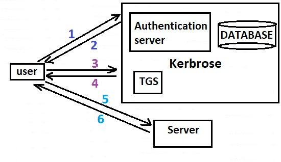

# 332.3 Resource Control

**Weight:** 3

**Description:** Candidates should be able to restrict the resources services and programs can consume.


**Key Knowledge Areas:**

* Understand and configure ulimits
* Understand cgroups, including classes, limits and accounting
* Manage cgroups and process cgroup association
* Understand systemd slices, scopes and services
* Use systemd units to limit the system resources processes can consume
* Awareness of cgmanager and libcgroup utilities

**Partial list of the used files, terms and utilities:**

* ulimit
* /etc/security/limits.conf
* pam\_limits.so
* /sys/fs/group/
* /proc/cgroups
* systemd-cgls
* systemd-cgtop

## Linux Login basics

### /etc/login.defs

The **/etc/login.defs** file provides default configuration information for several user account parameters. The useradd, usermod, userdel, and groupadd commands, and other user and group utilities take default values from this file. Each line consists of a directive name and associated value.

```
[root@rocky8 ~]# cat /etc/login.defs
#
# Please note that the parameters in this configuration file control the
# behavior of the tools from the shadow-utils component. None of these
# tools uses the PAM mechanism, and the utilities that use PAM (such as the
# passwd command) should therefore be configured elsewhere. Refer to
# /etc/pam.d/system-auth for more information.
#

# *REQUIRED*
#   Directory where mailboxes reside, _or_ name of file, relative to the
#   home directory.  If you _do_ define both, MAIL_DIR takes precedence.
#   QMAIL_DIR is for Qmail
#
#QMAIL_DIR      Maildir
MAIL_DIR        /var/spool/mail
#MAIL_FILE      .mail

# Default initial "umask" value used by login(1) on non-PAM enabled systems.
# Default "umask" value for pam_umask(8) on PAM enabled systems.
# UMASK is also used by useradd(8) and newusers(8) to set the mode for new
# home directories if HOME_MODE is not set.
# 022 is the default value, but 027, or even 077, could be considered
# for increased privacy. There is no One True Answer here: each sysadmin
# must make up their mind.
UMASK           022

# HOME_MODE is used by useradd(8) and newusers(8) to set the mode for new
# home directories.
# If HOME_MODE is not set, the value of UMASK is used to create the mode.
HOME_MODE       0700

# Password aging controls:
#
#       PASS_MAX_DAYS   Maximum number of days a password may be used.
#       PASS_MIN_DAYS   Minimum number of days allowed between password changes.
#       PASS_MIN_LEN    Minimum acceptable password length.
#       PASS_WARN_AGE   Number of days warning given before a password expires.
#
PASS_MAX_DAYS   99999
PASS_MIN_DAYS   0
PASS_MIN_LEN    5
PASS_WARN_AGE   7

#
# Min/max values for automatic uid selection in useradd
#
UID_MIN                  1000
UID_MAX                 60000
# System accounts
SYS_UID_MIN               201
SYS_UID_MAX               999

#
# Min/max values for automatic gid selection in groupadd
#
GID_MIN                  1000
GID_MAX                 60000
# System accounts
SYS_GID_MIN               201
SYS_GID_MAX               999

#
# If defined, this command is run when removing a user.
# It should remove any at/cron/print jobs etc. owned by
# the user to be removed (passed as the first argument).
#
#USERDEL_CMD    /usr/sbin/userdel_local

#
# If useradd should create home directories for users by default
# On RH systems, we do. This option is overridden with the -m flag on
# useradd command line.
#
CREATE_HOME     yes

# This enables userdel to remove user groups if no members exist.
#
USERGROUPS_ENAB yes

# Use SHA512 to encrypt password.
ENCRYPT_METHOD SHA512
```

/etc/login.defs has been replaced with pam over the time but some of parameters are still here:

* Location of user mailboxes **MAIL\_DIR**
* Password aging controls
* Minimum and maximum values for automatic **UID** selection (1000 to 60000)
* Minimum and maximum values for automatic **GID** selection (1000 to 60000)
* Whether home directories should be created when adding a new user
* Default **umask**
* Encryption method used to encrypt passwords


The /etc/login.defs file defines the configuration of the shadow password suite.(hidden passwords) for the system. This file is essential. His absence will not prevent the system to work, but will probably have undesirable consequences.


### chage

&#x20;the “chage” command is derived from the words **“Change Age”**, which is used to modify the information such as duration when to change password, make account status active or inactive, sets expiry date of the account, and sets a reminder to change the password through an alarm before user’s account will be inactive.

* note1: chage requires root for most functionality.
* note2: User must have entry in /etc/shadow (it must be a local user, it can't be stored in sssd or user in Remote Directory Server)

```
[root@rocky8 ~]# chage -h
Usage: chage [options] LOGIN

Options:
  -d, --lastday LAST_DAY        set date of last password change to LAST_DAY
  -E, --expiredate EXPIRE_DATE  set account expiration date to EXPIRE_DATE
  -h, --help                    display this help message and exit
  -I, --inactive INACTIVE       set password inactive after expiration
                                to INACTIVE
  -l, --list                    show account aging information
  -m, --mindays MIN_DAYS        set minimum number of days before password
                                change to MIN_DAYS
  -M, --maxdays MAX_DAYS        set maximum number of days before password
                                change to MAX_DAYS
  -R, --root CHROOT_DIR         directory to chroot into
  -W, --warndays WARN_DAYS      set expiration warning days to WARN_DAYS
```


A value of -1 may be used to inactive many options.


### NSS Concepts

NSS stands for Name Service Switch. It connects calls for information from a system data base to a back-end service.

#### /etc/nsswitch.conf

**/etc/nsswitch.conf** is a Linux configuration file that specifies how the system should switch between different name service providers. The file can be used to configure which services should be used for hostname lookup, password lookups, and so on.

“/etc/nsswitch.conf” file is read by the **Name Service Switch (NSS)** library when the system starts up. The NSS library then uses the information in “/etc/nsswitch.conf” to determine which name service providers should be used for each type of lookup.

```
[root@rocky8 ~]# cat /etc/nsswitch.conf
#
# /etc/nsswitch.conf
#
# Name Service Switch config file. This file should be
# sorted with the most-used services at the beginning.
#
# Valid databases are: aliases, ethers, group, gshadow, hosts,
# initgroups, netgroup, networks, passwd, protocols, publickey,
# rpc, services, and shadow.
#
# Valid service provider entries include (in alphabetical order):
#
#       compat                  Use /etc files plus *_compat pseudo-db
#       db                      Use the pre-processed /var/db files
#       dns                     Use DNS (Domain Name Service)
#       files                   Use the local files in /etc
#       hesiod                  Use Hesiod (DNS) for user lookups
#       nis                     Use NIS (NIS version 2), also called YP
#       nisplus                 Use NIS+ (NIS version 3)
#
# See `info libc 'NSS Basics'` for more information.
#
# Commonly used alternative service providers (may need installation):
#
#       ldap                    Use LDAP directory server
#       myhostname              Use systemd host names
#       mymachines              Use systemd machine names
#       mdns*, mdns*_minimal    Use Avahi mDNS/DNS-SD
#       resolve                 Use systemd resolved resolver
#       sss                     Use System Security Services Daemon (sssd)
#       systemd                 Use systemd for dynamic user option
#       winbind                 Use Samba winbind support
#       wins                    Use Samba wins support
#       wrapper                 Use wrapper module for testing
#
# Notes:
#
# 'sssd' performs its own 'files'-based caching, so it should generally
# come before 'files'.
#
# WARNING: Running nscd with a secondary caching service like sssd may
#          lead to unexpected behaviour, especially with how long
#          entries are cached.
#
# Installation instructions:
#
# To use 'db', install the appropriate package(s) (provide 'makedb' and
# libnss_db.so.*), and place the 'db' in front of 'files' for entries
# you want to be looked up first in the databases, like this:
#
# passwd:    db files
# shadow:    db files
# group:     db files

# In order of likelihood of use to accelerate lookup.
passwd:      sss files systemd
shadow:     files sss
group:       sss files systemd
hosts:      files dns myhostname
services:   files sss
netgroup:   sss
automount:  files sss

aliases:    files
ethers:     files
gshadow:    files
# Allow initgroups to default to the setting for group.
# initgroups: files
networks:   files dns
protocols:  files
publickey:  files
rpc:        files
```


“/etc/nsswitch.conf” is a critical part of the Linux operating system, and any changes to the file can potentially cause serious problems.


## pam concepts and configuration

PAM (pluggable authentication module) has become a core part of login in most modern linux distributions. PAM is made up number of modules each handling unique function regarding  authentication and authorization. Applications enabled to make use of PAM can be _plugged-in_ to new technologies without modifying the existing applications.

&#x20;PAM is divided to four management groups:

* **account**: provide services for account verification: has the user’s password expired?; is this user permitted access to the requested service?.
* **authentication**: authenticate a user and set up user credentials.
* **password**: are responsible for updating user passwords and work together with authentication modules.
* **session**: manage actions performed at the beginning of a session and end of a session.

The PAM framework consists of a library, pluggable modules, and a configuration file.

* The **PAM library** implements the PAM application programming interface (API) and serves to manage PAM transactions and invoke the PAM service programming interface (SPI) defined in the pluggable modules.
* **Pluggable modules** are dynamically loaded by the library based on the invoking service and its entry in the configuration file. Success is determined not only by the pluggable module but also by the behavior defined for the service. Through the concept of _stacking_, a service can be configured to authenticate through multiple authentication methods. If supported, modules can also be configured to use a previously submitted password rather than prompting for additional input.
* **configuration file** In earlier versions of PAM, the /etc/pam.conf file was used, but this file is now deprecated and is only used if the /etc/pam.d/ directory does not exist

#### How PAM Works

The functionality of the PAM system is actually fairly basic. Any service that requires authentication is linked against the PAM libraries included with Linux.

&#x20;For example, try the following:

```
[root@rocky8 ~]# ldd /bin/login
        linux-vdso.so.1 (0x00007fffef899000)
        libpam.so.0 => /lib64/libpam.so.0 (0x00007ff685477000)
        libpam_misc.so.0 => /lib64/libpam_misc.so.0 (0x00007ff685273000)
        libaudit.so.1 => /lib64/libaudit.so.1 (0x00007ff685049000)
        libselinux.so.1 => /lib64/libselinux.so.1 (0x00007ff684e1f000)
        libc.so.6 => /lib64/libc.so.6 (0x00007ff684a5a000)
        libdl.so.2 => /lib64/libdl.so.2 (0x00007ff684856000)
        libcap-ng.so.0 => /lib64/libcap-ng.so.0 (0x00007ff684650000)
        libpthread.so.0 => /lib64/libpthread.so.0 (0x00007ff684430000)
        libpcre2-8.so.0 => /lib64/libpcre2-8.so.0 (0x00007ff6841ac000)
        /lib64/ld-linux-x86-64.so.2 (0x00007ff685891000)
```

When a specific service such as login requires user authentication, it employs the PAM routines to complete this authentication. These routines look at the PAM configuration files for stack entries with a matching service name. They then process these entries in the order in which they are found, one by one.

#### /etc/pam.d

The /etc/pam.d/ directory contains the PAM configuration files for each PAM-aware application.

```
[root@rocky8 ~]# ll /etc/pam.d/*
-rw-r--r--. 1 root root 272 Apr 12  2021 /etc/pam.d/atd
-rw-r--r--. 1 root root 192 Oct 14  2021 /etc/pam.d/chfn
-rw-r--r--. 1 root root 192 Oct 14  2021 /etc/pam.d/chsh
-rw-r--r--. 1 root root 728 Sep  9  2021 /etc/pam.d/cockpit
-rw-r--r--. 1 root root 232 Oct 12  2021 /etc/pam.d/config-util
-rw-r--r--. 1 root root 328 Mar 14  2021 /etc/pam.d/crond
-rw-r--r--. 1 root root 701 Oct 12  2021 /etc/pam.d/fingerprint-auth
-rw-r--r--. 1 root root 715 Oct 14  2021 /etc/pam.d/login
-rw-r--r--. 1 root root 154 Oct 12  2021 /etc/pam.d/other
-rw-r--r--. 1 root root 168 Mar 15  2021 /etc/pam.d/passwd
-rw-r--r--. 1 root root 760 Oct 12  2021 /etc/pam.d/password-auth
-rw-r--r--. 1 root root 155 Oct 11  2021 /etc/pam.d/polkit-1
-rw-r--r--. 1 root root 398 Oct 12  2021 /etc/pam.d/postlogin
-rw-r--r--. 1 root root 640 Oct 14  2021 /etc/pam.d/remote
-rw-r--r--. 1 root root 143 Oct 14  2021 /etc/pam.d/runuser
-rw-r--r--. 1 root root 138 Oct 14  2021 /etc/pam.d/runuser-l
-rw-r--r--. 1 root root 743 Oct 12  2021 /etc/pam.d/smartcard-auth
lrwxrwxrwx. 1 root root  25 Apr  4 17:16 /etc/pam.d/smtp -> /etc/alternatives/mta-pam
-rw-r--r--. 1 root root  76 Oct 12  2021 /etc/pam.d/smtp.postfix
-rw-r--r--. 1 root root 727 Oct 11  2021 /etc/pam.d/sshd
-rw-r--r--. 1 root root 214 Oct 11  2021 /etc/pam.d/sssd-shadowutils
-rw-r--r--. 1 root root 566 Oct 14  2021 /etc/pam.d/su
-rw-r--r--. 1 root root 154 Nov  4  2021 /etc/pam.d/sudo
-rw-r--r--. 1 root root 178 Nov  4  2021 /etc/pam.d/sudo-i
-rw-r--r--. 1 root root 137 Oct 14  2021 /etc/pam.d/su-l
-rw-r--r--. 1 root root 760 Oct 12  2021 /etc/pam.d/system-auth
-rw-r--r--. 1 root root 248 Nov  9  2021 /etc/pam.d/systemd-user
-rw-r--r--. 1 root root  84 Mar 15  2021 /etc/pam.d/vlock
```

lets take a look at classic pam authenrication module `/etc/pam.d/system_auth` file:

```
[root@rocky8 ~]# cat /etc/pam.d/system-auth
#%PAM-1.0
# This file is auto-generated.
# User changes will be destroyed the next time authselect is run.
auth        required      pam_env.so
auth        sufficient    pam_unix.so try_first_pass nullok
auth        required      pam_deny.so

account     required      pam_unix.so

password    requisite     pam_pwquality.so try_first_pass local_users_only retry=3 authtok_type=
password    sufficient    pam_unix.so try_first_pass use_authtok nullok sha512 shadow
password    required      pam_deny.so

session     optional      pam_keyinit.so revoke
session     required      pam_limits.so
-session     optional      pam_systemd.so
session     [success=1 default=ignore] pam_succeed_if.so service in crond quiet use_uid
session     required      pam_unix.so
```

&#x20;PAM Configuration File Format is like this:

```
<service>   <module-interface>   <control-flag>   <module-name>   <module-arguments>
```

There are several simple flags, which use only a keyword to set the configuration:

* requisite : The module result must be successful for authentication to continue. However, if a test fails at this point, the user is notified immediately with a message reflecting the first failed`required`_or_`requisite`module test.
* required :The module result must be successful for authentication to continue. If the test fails at this point, the user is not notified until the results of all module tests that reference that interface are complete.
* sufficient : The module result is ignored if it fails. However, if the result of a module flagged `sufficient`is successful_and_\
  no previous modules flagged`required`have failed, then no other results are required and the user is authenticated to the service.
* optional : The module result is ignored. A module flagged as `optional`only becomes necessary for successful authentication when no other modules reference the interface.
* include : Unlike the other controls, this does not relate to how the module result is handled. This flag pulls in all lines in the configuration file which match the given parameter and appends them as an argument to the module.

#### pam\_cracklib Module

When added to the PAM password stack, the pam\_cracklib module performs strength checking of proposed user passwords. The module calls the cracklib routine that compares passwords against a dictionary of known (common, weak, default, etc.) words before performing further strength checks. install libpam-cracklib and read its man page for more information.


Visit my LPIC2 book for full review: [https://borosan.gitbook.io/lpic2-exam-guide/2102-pam-authentication#pam-pluggable-authentication-modules](https://borosan.gitbook.io/lpic2-exam-guide/2102-pam-authentication#pam-pluggable-authentication-modules)


#### pam\_tally2.so

pam\_tally2 module is used to lock user accounts after certain number of failed ssh login attempts made to the system. This module keeps the count of attempted accesses and too many failed attempts.

pam\_tally2 module comes in two parts, one is **pam\_tally2.so** and another is **pam\_tally2**. It is based on **PAM** module and can be used to examine and manipulate the counter file. It can display user login attempts counts, set counts on individual basis, unlock all user counts. By default, pam_tally2 module is already installed on the most of the Linux distributions and it is controlled by PAM package itself. try_ `man pam_tally2` for more information.

## Kerbrose

#### What is kerbrose?

Kerberos is a computer network security protocol that authenticates service requests between two or more trusted hosts across an untrusted network, like the internet. It uses secret-key cryptography and a trusted third party for authenticating client-server applications and verifying users' identities.


#### history

Initially developed by the Massachusetts Institute of Technology (MIT) for Project Athena in the late '80s, Kerberos is now the default authorization technology used by Microsoft Windows. Kerberos implementations also exist for other operating systems such as Apple OS, FreeBSD, UNIX, and Linux.

Microsoft rolled out its version of Kerberos in Windows 2000, and it's become the go-to protocol for websites and single sign-on implementations over different platforms. The[ Kerberos Consortium](http://kerberos.org/) maintains the Kerberos as an open-source project.


#### How Kerbrose works?

&#x20;In Kerberos Authentication server and database is used for client authentication. Kerberos runs as a third-party trusted server known as the Key Distribution Center (KDC). Each user and service on the network is a principal.&#x20;

The main components of Kerberos are:&#x20;

* **Authentication Server (AS):** The Authentication Server performs the initial authentication and ticket for Ticket Granting Service. \
  &#x20;
* **Database:** The Authentication Server verifies the access rights of users in the database. \
  &#x20;
* **Ticket Granting Server (TGS):** The Ticket Granting Server issues the ticket for the Server&#x20;

<figure><figcaption></figcaption></figure>

* **Step-1:** User login and request services on the host. Thus user requests for ticket-granting service.&#x20;
* **Step-2:** Authentication Server verifies user’s access right using database and then gives **ticket-granting-ticket** **(TGT)** and session key. Results are encrypted using the Password of the user.&#x20;
* **Step-3:** The decryption of the message is done using the password then send the ticket to Ticket Granting Server. The Ticket contains authenticators like user names and network addresses.&#x20;
* **Step-4:** Ticket Granting Server decrypts the ticket sent by User and authenticator verifies the request then creates the ticket for requesting services from the Server.&#x20;
* **Step-5:** The user sends the Ticket and Authenticator to the Server.&#x20;
* **Step-6:** The server verifies the Ticket and authenticators then generate access to the service. After this User can access the services.&#x20;


What is **REALM**?

Kerberos servers operate in a limited network region, called a _realm_. Realms are identified by domain name system named domains. A principal's realm is the domain name in which the Kerberos server operates.


#### /etc/krb5.conf

The krb5.conf file contains Kerberos configuration information, including the locations of KDCs and administration daemons for the Kerberos realms of interest, defaults for the current realm and for Kerberos applications, and mappings of host names onto Kerberos realms. This file must reside on all Kerberos clients.

The format of the krb5.conf consists of sections headings in square brackets. Each section can contain zero or more configuration variables (called relations), of the form:

`relation= relation-value`

or

```
relation-subsection = {
relation= relation-value
relation= relation-value
}
Understanding sssd
```

lets take a look at that:

```
[root@rocky8 ~]# cat /etc/krb5.conf
# To opt out of the system crypto-policies configuration of krb5, remove the
# symlink at /etc/krb5.conf.d/crypto-policies which will not be recreated.
includedir /etc/krb5.conf.d/

[logging]
    default = FILE:/var/log/krb5libs.log
    kdc = FILE:/var/log/krb5kdc.log
    admin_server = FILE:/var/log/kadmind.log

[libdefaults]
    dns_lookup_realm = false
    ticket_lifetime = 24h
    renew_lifetime = 7d
    forwardable = true
    rdns = false
    pkinit_anchors = FILE:/etc/pki/tls/certs/ca-bundle.crt
    spake_preauth_groups = edwards25519
#    default_realm = EXAMPLE.COM
    default_ccache_name = KEYRING:persistent:%{uid}

[realms]
# EXAMPLE.COM = {
#     kdc = kerberos.example.com
#     admin_server = kerberos.example.com
# }

[domain_realm]
# .example.com = EXAMPLE.COM
# example.com = EXAMPLE.COM
```

The krb5.conf file can contain any or all of the following sections:

* libdefaults: Contains default values used by the Kerberos V5 library.
* appdefaults: Contains subsections for Kerberos V5 applications, where relation-subsection is the name of an application. Each subsection describes application-specific defaults.
* realms :Contains subsections for Kerberos realms, where relation-subsection is the name of a realm. Each subsection contains relations that define the properties for that particular realm.
* domain\_realm: Contains relations which map domain names and subdomains onto Kerberos realm names. This is used by programs to determine what realm a host should be in, given its fully qualified domain name.
* logging :Contains relations which determine how Kerberos programs are to perform logging.
* capaths: Contains the authentication paths used with direct (nonhierarchical) cross-realm authentication. Entries in this section are used by the client to determine the intermediate realms which can be used in cross-realm authentication. It is also used by the end-service when checking the transited field for trusted intermediate realms.
* plugins: Control plogin module registration.

#### Kerberos Commands

List of some commands that are included in the Kerberos product:

| Command  | Description                                         |   |
| -------- | --------------------------------------------------- | - |
| kinit    | Obtains and caches Kerberos ticket-granting tickets |   |
| klist    | Displays current Kerberos tickets                   |   |
| kpasswd  | Changes a Kerberos password                         |   |
| kdestroy | Destroys Kerberos tickets                           |   |

## Understanding sssd

SSD (System Security Services Daemon)  provides a set of daemons to manage access to remote directories and authentication mechanisms.&#x20;

Key Integntions:

* Active Directory&#x20;
* &#x20;FreelPA
* &#x20;LDAP&#x20;
* &#x20;Kerberos&#x20;
* &#x20;Local Domain

#### sssd configuration

There are different configurations sssd has for different back-end service:

```
[root@rocky8 ~]# man -k sssd
pam_sss (8)          - PAM module for SSSD
pam_sss_gss (8)      - PAM module for SSSD GSSAPI authentication
sss-certmap (5)      - SSSD Certificate Matching and Mapping Rules
sssd (8)             - System Security Services Daemon
sssd-ad (5)          - SSSD Active Directory provider
sssd-files (5)       - SSSD files provider
sssd-ipa (5)         - SSSD IPA provider
sssd-kcm (8)         - SSSD Kerberos Cache Manager
sssd-krb5 (5)        - SSSD Kerberos provider
sssd-ldap (5)        - SSSD LDAP provider
sssd-ldap-attributes (5) - SSSD LDAP Provider: Mapping Attributes
sssd-session-recording (5) - Configuring session recording with SSSD
sssd-simple (5)      - the configuration file for SSSD's 'simple' access-control provider
sssd-sudo (5)        - Configuring sudo with the SSSD back end
sssd-systemtap (5)   - SSSD systemtap information
sssd.conf (5)        - the configuration file for SSSD
sssd_krb5_locator_plugin (8) - Kerberos locator plugin
```


.

.

.

resources:

[https://www.thegeekdiary.com/understanding-etclogin-defs-file/#:\~:text=The%20%2Fetc%2Flogin.,directive%20name%20and%20associated%20value.](https://www.thegeekdiary.com/understanding-etclogin-defs-file/)

[https://www.man7.org/linux/man-pages/man5/login.defs.5.html](https://www.man7.org/linux/man-pages/man5/login.defs.5.html)

[https://linuxhint.com/use-linux-chage-command/](https://linuxhint.com/use-linux-chage-command/)

[https://man7.org/linux/man-pages/man5/nss.5.html](https://man7.org/linux/man-pages/man5/nss.5.html)

[https://tecadmin.net/what-is-etc-nsswitch-conf-file/](https://tecadmin.net/what-is-etc-nsswitch-conf-file/)

[https://www.ibm.com/docs/en/aix/7.2?topic=system-pluggable-authentication-modules](https://www.ibm.com/docs/en/aix/7.2?topic=system-pluggable-authentication-modules)

[https://docs.oracle.com/cd/E19683-01/816-4883/pam-32/index.html#:\~:text=The%20PAM%20configuration%20file%2C%20%2Fetc,for%20each%20system%20entry%20application.](https://docs.oracle.com/cd/E19683-01/816-4883/pam-32/index.html)

[https://access.redhat.com/documentation/en-us/red\_hat\_enterprise\_linux/6/html/managing\_smart\_cards/pam\_configuration\_files](https://access.redhat.com/documentation/en-us/red\_hat\_enterprise\_linux/6/html/managing\_smart\_cards/pam\_configuration\_files)

[https://www.thegeekdiary.com/pam-password-complexity-and-pam\_cracklib-credit-system-in-centos-rhel/](https://www.thegeekdiary.com/pam-password-complexity-and-pam\_cracklib-credit-system-in-centos-rhel/)

[https://www.tecmint.com/use-pam\_tally2-to-lock-and-unlock-ssh-failed-login-attempts/](https://www.tecmint.com/use-pam\_tally2-to-lock-and-unlock-ssh-failed-login-attempts/)

[https://www.simplilearn.com/what-is-kerberos-article](https://www.simplilearn.com/what-is-kerberos-article)

[https://www.geeksforgeeks.org/kerberos/](https://www.geeksforgeeks.org/kerberos/)

[https://www.techtarget.com/searchsecurity/definition/Kerberos](https://www.techtarget.com/searchsecurity/definition/Kerberos)

[https://docs.oracle.com/cd/E86824\_01/html/E54775/krb5.conf-4.html#:\~:text=The%20krb5.,reside%20on%20all%20Kerberos%20clients.](https://docs.oracle.com/cd/E86824\_01/html/E54775/krb5.conf-4.html)

[https://access.redhat.com/documentation/en-us/red\_hat\_enterprise\_linux/7/html/system-level\_authentication\_guide/sssd](https://access.redhat.com/documentation/en-us/red\_hat\_enterprise\_linux/7/html/system-level\_authentication\_guide/sssd)

.


