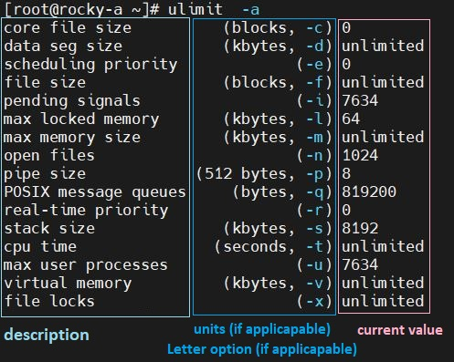
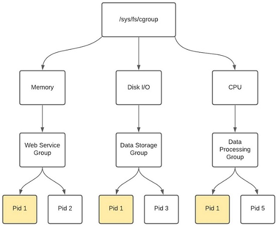
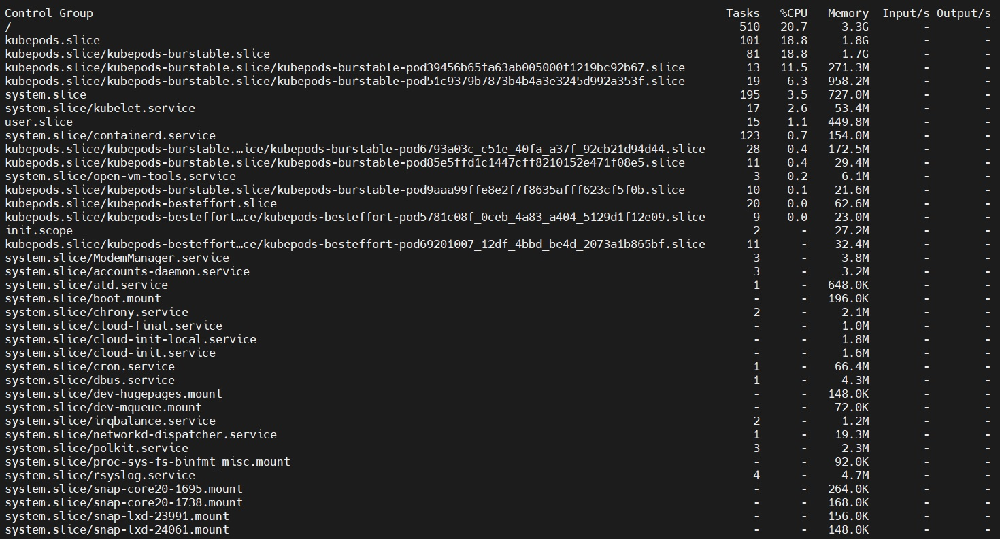

# 332.3 Resource Control

**Weight:** 3

**Description:** Candidates should be able to restrict the resources services and programs can consume.


**Key Knowledge Areas:**

* Understand and configure ulimits
* Understand cgroups, including classes, limits and accounting
* Manage cgroups and process cgroup association
* Understand systemd slices, scopes and services
* Use systemd units to limit the system resources processes can consume
* Awareness of cgmanager and libcgroup utilities

**Partial list of the used files, terms and utilities:**

* ulimit
* /etc/security/limits.conf
* pam\_limits.so
* /sys/fs/group/
* /proc/cgroups
* systemd-cgls
* systemd-cgtop

## Managing system resources

Linux operating systems have the ability to limit the amount of various system resources available to a user process. These limitations include how many files a process can have open, how large of a file the user can create, and how much memory can be used by the different components of the process. **ulimit** is the command used to accomplish this.

### ulimit

The ulimit command provides control over the resources available to the shell and/or to processes started by it.

```
[root@rocky-a ~]# ulimit
unlimited
```

To get the report in details, add the “-a” flag at the end. This will _print all the resource limits for the current user_.

<figure><figcaption></figcaption></figure>

To set ulimit value on a parameter use the below command:

`ulimit -<letter Option> <NewValue>`

as an example lets put limits on file size in the current shell:

```
[root@rocky-a ~]# ulimit -f 0
[root@rocky-a ~]#
[root@rocky-a ~]# ulimit -a | grep file
core file size          (blocks, -c) 0
file size               (blocks, -f) 0
open files                      (-n) 1024
file locks                      (-x) unlimited
[root@rocky-a ~]#
[root@rocky-a ~]# vim newfile.txt
Vim: Caught deadly signal XFSZ
Vim: Finished.


File size limit exceeded (core dumped)
```

### **/etc/security/limits.conf**

For the ulimits to persists across reboots we need to set the ulimit values in the configuration file `/etc/security/limits.conf`. it is also used for system wide limits:

```
[root@rocky-a ~]# cat /etc/security/limits.conf
# /etc/security/limits.conf
#
#This file sets the resource limits for the users logged in via PAM.
#It does not affect resource limits of the system services.
#
#Also note that configuration files in /etc/security/limits.d directory,
#which are read in alphabetical order, override the settings in this
#file in case the domain is the same or more specific.
#That means for example that setting a limit for wildcard domain here
#can be overriden with a wildcard setting in a config file in the
#subdirectory, but a user specific setting here can be overriden only
#with a user specific setting in the subdirectory.
#
#Each line describes a limit for a user in the form:
#
#<domain>        <type>  <item>  <value>
#
#Where:
#<domain> can be:
#        - a user name
#        - a group name, with @group syntax
#        - the wildcard *, for default entry
#        - the wildcard %, can be also used with %group syntax,
#                 for maxlogin limit
#
#<type> can have the two values:
#        - "soft" for enforcing the soft limits
#        - "hard" for enforcing hard limits
#
#<item> can be one of the following:
#        - core - limits the core file size (KB)
#        - data - max data size (KB)
#        - fsize - maximum filesize (KB)
#        - memlock - max locked-in-memory address space (KB)
#        - nofile - max number of open file descriptors
#        - rss - max resident set size (KB)
#        - stack - max stack size (KB)
#        - cpu - max CPU time (MIN)
#        - nproc - max number of processes
#        - as - address space limit (KB)
#        - maxlogins - max number of logins for this user
#        - maxsyslogins - max number of logins on the system
#        - priority - the priority to run user process with
#        - locks - max number of file locks the user can hold
#        - sigpending - max number of pending signals
#        - msgqueue - max memory used by POSIX message queues (bytes)
#        - nice - max nice priority allowed to raise to values: [-20, 19]
#        - rtprio - max realtime priority
#
#<domain>      <type>  <item>         <value>
#

#*               soft    core            0
#*               hard    rss             10000
#@student        hard    nproc           20
#@faculty        soft    nproc           20
#@faculty        hard    nproc           50
#ftp             hard    nproc           0
#@student        -       maxlogins       4

# End of file
```

There are two types of limits: A **soft limit** is like a warning and **hard limit** is a real max limit. For example, following will prevent anyone in the faculty group from having more than 50 processes, and a warning will be given at 20 processes.&#x20;

**note:** soft limit cannot be higher than the hard limit.


this part was from my lpic2 book: [https://borosan.gitbook.io/lpic1-exam-guide/1101-perform-security-administration-tasks#ulimit](https://borosan.gitbook.io/lpic1-exam-guide/1101-perform-security-administration-tasks#ulimit)


ulimits is a part of  pluggable authentication module(PAM) system.


to have a full review of PAM visit my lpic2 book: [https://borosan.gitbook.io/lpic2-exam-guide/2102-pam-authentication#pam-pluggable-authentication-modules](https://borosan.gitbook.io/lpic2-exam-guide/2102-pam-authentication#pam-pluggable-authentication-modules)


### pam\_limits.so


## cgroups

#### What are cgroups?

Red Hat Enterprise Linux 6 provides a new kernel feature: _control groups_, which are called by their shorter name _cgroups_ in this guide. Cgroups allow you to allocate resources — such as CPU time, system memory, network bandwidth, or combinations of these resources — among user-defined groups of tasks (processes) running on a system.


**Why we do need cgroups?**

the Linux kernel is responsible for all of the hardware interacting reliably on a system. That means, aside from just the bits of code (drivers) that enable the operating system (OS) to understand the hardware, it also sets limits on how many resources a particular program can demand from the system. This is most easily understood when talking about the amount of memory (RAM) a system has to divide up amongst all of the applications your computer may execute. In its most basic form, a Linux system is allowed to run most applications without restriction. This can be great for general computing if all applications play nicely together. But what happens if there is a bug in a program, and it starts to consume all of the available memory? The kernel has a facility called the Out Of Memory (OOM) Killer. Its job is to halt applications in order to free up enough RAM so that the OS may continue to function without crashing.

That's great, but what does this have to do with cgroups? Well, the OOM process acts as a last line of defense before your system comes crashing down around you. It's useful to a point, but since the kernel can control which processes must survive the OOM, it can also determine which applications cannot consume too much RAM in the first place.

Cgroups are, therefore, a facility built into the kernel that allow the administrator to set resource utilization limits on any process on the system.


#### How do cgroups work?

For the purposes of this discussion, we are talking about **cgroups V1**. While version 2 is available in Red Hat Enterprise Linux 8 (RHEL 8), it is disabled by default. Most container technologies such as Kubernetes, OpenShift, Docker, and so on still rely on cgroups version 1.

We have already discussed that cgroups are a mechanism for controlling certain subsystems in the kernel. These subsystems, such as devices, CPU, RAM, network access, and so on, are called _controllers_ in the cgroup terminology.

Each type of controller (`cpu`, `blkio`, `memory`, etc.) is subdivided into a tree-like structure. Each branch or leaf has its own weights or limits. A control group has multiple processes associated with it, making resource utilization granular and easy to fine-tune.

_**NOTE**: Each child inherits and is restricted by the limits set on the parent cgroup._

<figure><figcaption></figcaption></figure>

In the diagram above, you can see that it is possible to have `PID 1` in `memory`, `disk i/o`, and `cpu` control groups. The cgroups are created per resource type and have no association with each other. That means you could have a `database` group associated with all of the controllers, but the groups are treated independently. Like GIDs, these groups are assigned a numeric value upon creation and not a friendly name. Under the hood, the kernel uses these values to determine resource allocation.

#### /procs/cgroups

You may see enabled control groups on your computer via proc filesystem:

```
[root@rocky-a ~]# cat /proc/cgroups
#subsys_name    hierarchy       num_cgroups     enabled
cpuset  8       15      1
cpu     3       99      1
cpuacct 3       99      1
blkio   5       99      1
memory  9       133     1
devices 4       99      1
freezer 12      15      1
net_cls 2       15      1
perf_event      7       15      1
net_prio        2       15      1
hugetlb 11      15      1
pids    6       124     1
rdma    10      15      1
```

#### /sys/fs/group

or via sysfs `cat /sys/fs/group/`&#x20;

```
[root@rocky-a ~]# ls -l /sys/fs/cgroup/
total 0
dr-xr-xr-x 5 root root  0 Dec  5 12:20 blkio
lrwxrwxrwx 1 root root 11 Dec  5 12:20 cpu -> cpu,cpuacct
lrwxrwxrwx 1 root root 11 Dec  5 12:20 cpuacct -> cpu,cpuacct
drwxr-xr-x 2 root root 40 Dec  5 13:01 cpuacct,cpu
dr-xr-xr-x 5 root root  0 Dec  5 12:20 cpu,cpuacct
dr-xr-xr-x 4 root root  0 Dec  5 12:20 cpuset
dr-xr-xr-x 5 root root  0 Dec  5 12:20 devices
dr-xr-xr-x 4 root root  0 Dec  5 12:20 freezer
dr-xr-xr-x 4 root root  0 Dec  5 12:20 hugetlb
dr-xr-xr-x 7 root root  0 Dec  5 12:20 memory
lrwxrwxrwx 1 root root 16 Dec  5 12:20 net_cls -> net_cls,net_prio
dr-xr-xr-x 4 root root  0 Dec  5 12:20 net_cls,net_prio
lrwxrwxrwx 1 root root 16 Dec  5 12:20 net_prio -> net_cls,net_prio
drwxr-xr-x 2 root root 40 Dec  5 13:01 net_prio,net_cls
dr-xr-xr-x 4 root root  0 Dec  5 12:20 perf_event
dr-xr-xr-x 7 root root  0 Dec  5 12:20 pids
dr-xr-xr-x 4 root root  0 Dec  5 12:20 rdma
dr-xr-xr-x 7 root root  0 Dec  5 12:20 systemd
```

### Obtaining Information about Control Groups

the `systemd-cgls` command is provided to view the hierarchy of control groups and `systemd-cgtop` to monitor their resource consumption in real time.

### systemd-cgls

When `systemd-cgls` is issued without parameters, it returns the entire cgroup hierarchy. The highest level of the cgroup tree is formed by slices and can look as follows:

```
├─system
│ ├─1 /usr/lib/systemd/systemd --switched-root --system --deserialize 20  
│ ...
│      
├─user
│ ├─user-1000
│ │ └─ ...
│ ├─user-2000
│ │ └─ ...
│ ...
│     
└─machine  
  ├─machine-1000
  │ └─ ...
  ...
```

Note that machine slice is present only if you are running a virtual machine or a container.&#x20;

> For more information on the cgroup tree, read about “Systemd Unit Types”.

To reduce the output of `systemd-cgls`, and to view a specified part of the hierarchy, execute:

```
systemd-cgls name
```

Replace _name_ with a name of the resource controller you want to inspect.

### systemd-cgtop

The `systemd-cgls` command provides a static snapshot of the cgroup hierarchy. To see a dynamic account of currently running cgroups ordered by their resource usage (CPU, Memory, and IO), use:

```
systemd-cgtop
```

<figure><figcaption></figcaption></figure>

The behavior, provided statistics, and control options of `systemd-cgtop` are akin of those of the `top` utility. See `systemd-cgtop`(1) manual page for more information.

that's all.

.

.

.

resources:

[https://www.redhat.com/sysadmin/cgroups-part-one](https://www.redhat.com/sysadmin/cgroups-part-one)

[https://access.redhat.com/documentation/en-us/red\_hat\_enterprise\_linux/6/html/resource\_management\_guide/ch01#sec-How\_Control\_Groups\_Are\_Organized](https://access.redhat.com/documentation/en-us/red\_hat\_enterprise\_linux/6/html/resource\_management\_guide/ch01#sec-How\_Control\_Groups\_Are\_Organized)

[https://0xax.gitbooks.io/linux-insides/content/Cgroups/linux-cgroups-1.html](https://0xax.gitbooks.io/linux-insides/content/Cgroups/linux-cgroups-1.html)

[https://access.redhat.com/documentation/en-us/red\_hat\_enterprise\_linux/7/html/resource\_management\_guide/sec-obtaining\_information\_about\_control\_groups](https://access.redhat.com/documentation/en-us/red\_hat\_enterprise\_linux/7/html/resource\_management\_guide/sec-obtaining\_information\_about\_control\_groups)

.


