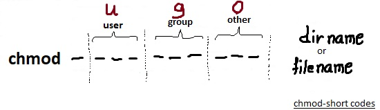
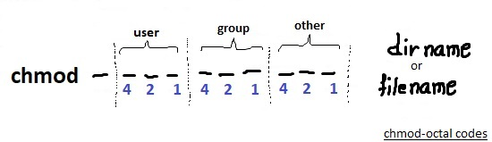
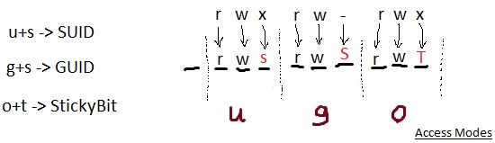

# 333.1 Discretionary Access Control

#### _Topic 333: Access Control_

**Weight:** 3

**Description:** Candidates should understand discretionary access control (DAC) and know how to implement it using access control lists (ACL). Additionally, candidates are required to understand and know how to use extended attributes.


**Key Knowledge Areas:**

* Understand and manage file ownership and permissions, including SetUID and SetGID bits
* Understand and manage access control lists
* Understand and manage extended attributes and attribute classes

**Partial list of the used files, terms and utilities:**

* getfacl
* setfacl
* getfattr
* setfattr

## basic System Permissions (DAC review)

First lets have a quick review

### chmod

The command you use to change the  permissions on files is called chmod , which stands for “change mode". There  are to ways to tell this command what you want to do:

* using short codes
* using ocatl codes

**1- using short codes:**  That is easier way.&#x20;

<figure><figcaption></figcaption></figure>

```
chmod [reference][operator][mode] file... 
```

reference can be

* &#x20;u as user  (file's owner)
* g as group (users who are members of the file's grou)
* o as others (users who are not the file's owner / members of the file's group)
* a as all (All three of the above, same as ugo)

Operator can be

* \+  Adds the specified modes to the specified classes
* &#x20;\- Removes the specified modes from the specified classes
* \= The modes specified are to be made the exact modes for the specified classes

obviously modes might be

* r  :Permission to read the file
* w :Permission to write (or delete) the file.
* x : Permission to execute the file, or, in the case of a directory, search it.

> Note1: If we want to set different permissions for user, group, or other, we can separate different expressions by commas —for example, `ug=rwx,o=rx`
>
> Note2: using a as ugo with = operator to set exact mode easier

**2- using ocatl codes :** So far we have used symbols (ugoa and rxw) to specify permissions. we can also set permissions using octal numbers instead of symbols.

<figure><figcaption></figcaption></figure>

For using octal codes with chmod we have to create an octal string, and that's is nothing more than a simple sum of numbers:

| Symbolic | Note  | Octal |
| -------- | ----- | ----- |
| rwx      | 4+2+1 | `7`   |
| rw-      | 4+2   | 6     |
| r-x      | 4+1   | 5     |
| r--      | 4     | 4     |
| -wx      | 2+1   | 3     |
| -w-      | 2     | 2     |
| --x      | 1     | 1     |
| ---      | 0     | 0     |

> Note: To change permissions  recursively on directories and files use `-R` option

### suid , guid

The Linux permissions model has two special access modes called suid (set user id) and sgid (set group id). When an executable program has the suid access modes set, it will run as if it had been started by the file’s owner, rather than by the user who really started it. Similarly, with the sgid access modes set, the program will run as if the initiating user belonged to the file’s group rather than to his own group.

> #### Directories and sgid <a href="#directories-and-sgid" id="directories-and-sgid"></a>
>
> When a directory has the sgid mode enabled, any files or directories created in it will inherit the group ID of the directory. This is particularly useful for directory trees that are used by a group of people working on the same project.

### sticky bit

We have just seen how anyone with write permission to a directory can delete files in it. This might be acceptable for a group project, but is not desirable for globally shared file space such as the /tmp directory. Fortunately, there is a solution.  That  is called the _sticky_ bit.

If set stickybit for a directory, it permits only the owning user or the superuser (root) to delete or unlink a file.&#x20;

| Access mode | on file                                 | on directory                                 |
| ----------- | --------------------------------------- | -------------------------------------------- |
| SUID        | executes with permissions of file owner | nothing                                      |
| GUID        | executes with the permissions of group  | new files have group membership of directory |
| Sticky Bit  | nothing                                 | only owner can delete files                  |

#### How suid, guid and stickybit are implemented?

As there is no more room for setting Access modes, execution character is used. "s" letter is used for both suid and guid but "t" letter is for stickybit. Again we use `+/-` for adding and removing permissions.

<figure><figcaption></figcaption></figure>

> As you have probably noticed, if the file or directory is already executable  **s** and **t** would be displayed  after setting access modes.&#x20;
>
> But if the file or directory hasn't been executable before setting access mode, **S** and **T** would be appear.

#### Setting Access Modes via octal codes:

We can also use octal codes to set suid, guid and stickybit:

| Access Mode | Octal |   |
| ----------- | ----- | - |
| SUID        | 4000  |   |
| GUID        | 2000  |   |
| Sticky Bit  | 1000  |   |


this part was from my LPIC1 book, visit: [https://borosan.gitbook.io/lpic1-exam-guide/1045-manage-file-permissions-and-ownership#chmod](https://borosan.gitbook.io/lpic1-exam-guide/1045-manage-file-permissions-and-ownership#chmod)


### chown

&#x20;The root user can change the ownership of a file using the `chown` command.We can use user name or user ID.

```
chown [OPTION]… [OWNER][:[GROUP]] FILE…
```

The file’s group may be changed at the same time by adding a colon and a group name or ID right after the user name or ID.

> note1: If only a colon is given, then the user’s default group is used
>
> note2: the -R option will apply the change recursively and `-c` Reports when a file change is made. We can also use other file ownership via `--referenece` switch.


review my LPIC1 book: [https://borosan.gitbook.io/lpic1-exam-guide/1045-manage-file-permissions-and-ownership#chown](https://borosan.gitbook.io/lpic1-exam-guide/1045-manage-file-permissions-and-ownership#chown)


## Extended Attributes

There  is a mechanism  for adding additional data to  a file or directory in a filesystem. This is called [Extended File Attributes](http://en.wikipedia.org/wiki/Extended\_file\_attributes) (abbreviated **xattr**). In Linux, many file systems support it such as the following: ext2, ext3, ext4, jfs, xfs, reiserfs, btrfs,... .


Many modern linux Filesystems support Extended Attributes if the **libattr feature** is enabled in the kernel configuration.


Extended file attributes are key-value pairs that can be set programmatically by the file system, by other middleware such as the Data Management API, by the operating system, or by users.&#x20;

The name of an extended attribute consists of a namespace name followed by a dot followed by an attribute name, as in the following extended attribute names:

`user.swift.metadata`

`system.posix_acl_access`

The public namespaces are:

* **user:** The _user_ namespace attributes are protected by the normal Unix user permission settings on the file. If you have write permission on the file, then you can set an extended attribute. If you give someone else read access to the file, they can read the extended attributes. If another user can write to the file, they can read, write, or delete any of the user extended attributes.
* **trusted:** To use the _trusted_ extended attributes the application or user has to have _CAP\_SYS\_ADMIN_ capability (e.g., the superuser).
* **security:** The _security_ namespace is used by SELinux. An example of a name in this namespace would be something like _security.selinux_.
* **system:** The _system_ namespace is used primarily by the kernel for access control lists (ACLs) and can only be set by root.

### Xattr

Lets take a look at attribute commands family available in `attr` package.

Getting xattrs:&#x20;

&#x20;**getfattr**&#x20;

* **-n  \<name>, --name=\<name>:** Dump the value of the named extended attribute.
* **-m \<pattern>, --match=\<pattern> :**Only include attributes with names matching the regular expression pattern. The default value for pattern is "^user\\.", which includes all the attributes in the user namespace. Specify "-" for including all attributes. Refer to attr(5) for a more detailed discussion of namespaces.

Setting xattrs:&#x20;

**setfattr**&#x20;

• **-n \<name>, --name=\<name>:** Specifies the name of the extended attribute to set.

• **-v \<value>, --value=\<value>:** Specifies the new value of the extended attribute. There are three methods available for encoding the value. If the given string is enclosed in double quotes, the inner string is treated as text. In that case, backslashes and double quotes have special meanings and need to be escaped by a preceding backslash. Any control characters can be encoded as a backslash followed by three digits as its ASCII code in octal. If the given string begins with 0x or 0X, it expresses a hexadecimal number. If the given string begins with 0s or 0S, base64 encoding is expected. Also see the --encoding option of getfattr(1).

• **-x \<name>, --remove=\<name>:** Remove the named extended attribute entirely.

example:

```
[root@rocky8 sandbox]# touch file1
[root@rocky8 sandbox]# getfattr file1
[root@rocky8 sandbox]# echo $?
0
```


getfattr doesn't show error if any attribute is not specified.


```
[root@rocky8 sandbox]# setfattr -n user.comment -v "comment" file1
[root@rocky8 sandbox]# getfattr file1
# file: file1
user.comment
```

delete:

```
[root@rocky8 sandbox]# setfattr -x user.comment file1
[root@rocky8 sandbox]# getfattr file1
[root@rocky8 sandbox]#
```

try `man getfattr` and `man setfattr` for more information.

## Using ACLs


.

.

.

resources:

[https://www.geeksforgeeks.org/chmod-command-linux/](https://www.geeksforgeeks.org/chmod-command-linux/)

[https://www.redhat.com/sysadmin/suid-sgid-sticky-bit](https://www.redhat.com/sysadmin/suid-sgid-sticky-bit)

[https://www.linuxtoday.com/blog/linux-extended-file-attributes/](https://www.linuxtoday.com/blog/linux-extended-file-attributes/)

[https://www.ibm.com/docs/en/spectrum-scale/5.0.5?topic=gpfs-planning-extended-attributes](https://www.ibm.com/docs/en/spectrum-scale/5.0.5?topic=gpfs-planning-extended-attributes)

[https://www.admin-magazine.com/HPC/Articles/Extended-File-Attributes](https://www.admin-magazine.com/HPC/Articles/Extended-File-Attributes)

.
