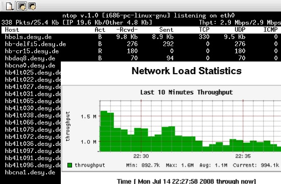
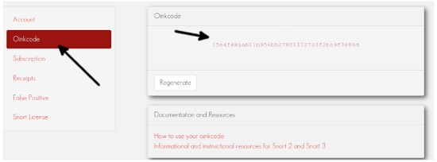
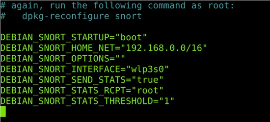
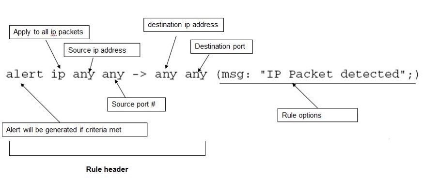

# 334.2 Network Intrusion Detection

**Weight:** 4

**Description:** Candidates should be familiar with the use and configuration of network security scanning, network monitoring and network intrusion detection software. This includes updating and maintaining the security scanners.


**Key Knowledge Areas:**

* Implement bandwidth usage monitoring
* Configure and use Snort, including rule management
* Configure and use OpenVAS, including NASL

**Partial list of the used files, terms and utilities:**

* ntop
* snort
* snort-stat
* pulledpork.pl
* /etc/snort/\*
* openvas-adduser
* openvas-rmuser
* openvas-nvt-sync
* openvassd
* openvas-mkcert
* openvas-feed-update
* /etc/openvas/\*


## Network Monitoring

### ntop

ntop is the best tool to see network usage in a way similar to what top command does for processes i.e. it is network traffic monitoring software. You can see network status, protocol wise distribution of traffic for UDP, TCP, DNS, HTTP and other protocols.

ntop is a hybrid layer 2 / layer 3 network monitor, that is by default it uses the layer 2 Media Access Control (MAC) addresses AND the layer 3 tcp/ip addresses. ntop is capable of associating the two, so that ip and non-ip traffic (e.g. arp, rarp) are combined for a complete picture of network activity.

<figure><figcaption></figcaption></figure>

ntop is a network probe that shows in interactive mode, it displays the network status on the user’s terminal. In Web mode, it acts as a Web server, creating a HTML dump of the network status.


ntop is currently replaced by **ntopng**


examples:

| ntop Command                         | Description                                                                |   |
| ------------------------------------ | -------------------------------------------------------------------------- | - |
| /usr/sbin/ntop -A                    | Set ntop admin user password                                               |   |
| ntop -P /etc/ntop -w4242 -d          | run ntop as daemon with /etc/ntop config files serving at port number 4242 |   |
| ntop --set-admin-password=newassword | setting new admin password                                                 |   |



**ntopng**

ntopng is the next generation version of the original ntop, a network traffic probe that monitors network usage. ntopng is based on libpcap and it has been written in a portable way in order to virtually run on every Unix platform, MacOSX and on Windows as well.



**cacti**

Cacti is **an open-source network monitoring tool** that uses the Simple Network Management Protocol (SNMP) to monitor network traffic and bandwidth utilization of network devices such as routers and switches. It is more General purpose than ntop.



## Working with Snort

### What is snort?

Snort is the foremost Open Source **I**ntrusion **P**revention **S**ystem (**IPS**) in the world. Snort IPS uses a series of rules that help define malicious network activity and uses those rules to find packets that match against them and generates alerts for users.

Snort can be deployed inline to stop these packets, as well.

&#x20;Snort has three primary uses:&#x20;

* As a packet sniffer like tcpdump,&#x20;
* as a packet logger — which is useful for network traffic debugging,&#x20;
* or it can be used as a full-blown network intrusion prevention system.&#x20;

Snort can be downloaded and configured for personal and business use alike.

### Installing Snort <a href="#installing-snort" id="installing-snort"></a>

At one time, installing Snort was a lengthy manual process. It wasn’t difficult, but there were a lot of steps and it was easy to miss one out. The major Linux distributions have made things simpler by making Snort available from their software repositories.

> The versions in the repositories sometimes lag behind the latest version that is available on the Snort website. If you want to, you can download and [install from source](https://www.snort.org/#get-started). As long as you have the latest _rules_, it doesn’t matter too much if your Snort isn’t the latest and greatest—as long as it isn’t ancient.

Red Hat based Linux distribution users can download the Snort package from [https://www.snort.org/downloads#snort-downloads](https://www.snort.org/downloads#snort-downloads) and then install it by running the following command, where <_Version_> must be replaced with the current version that you downloaded.

```
[root@rocky8 ~]# wget https://www.snort.org/downloads/snort/snort-2.9.20-1.centos.x86_64.rpm

[root@rocky8 ~]# yum snort-2.9.20-1.centos.x86_64.rpm
No such command: snort-2.9.20-1.centos.x86_64.rpm. Please use /usr/bin/yum --help
It could be a YUM plugin command, try: "yum install 'dnf-command(snort-2.9.20-1.centos.x86_64.rpm)'"
[root@rocky8 ~]# yum install snort-2.9.20-1.centos.x86_64.rpm
Last metadata expiration check: 2:58:16 ago on Fri 09 Sep 2022 08:53:58 AM +0430.
Dependencies resolved.
=======================================================================================================================================================
 Package                                Architecture                 Version                                  Repository                          Size
=======================================================================================================================================================
Installing:
 snort                                  x86_64                       1:2.9.20-1                               @commandline                       4.6 M
Installing dependencies:
 compat-openssl10                       x86_64                       1:1.0.2o-4.el8_6                         appstream                          1.1 M
 daq                                    x86_64                       2.0.6-9.el8                              epel                                88 k
 libnsl                                 x86_64                       2.28-189.5.el8_6                         baseos                             101 k

Transaction Summary
=======================================================================================================================================================
Install  4 Packages

Total size: 5.9 M
Total download size: 1.3 M
Installed size: 24 M
Is this ok [y/N]: y
.
.
.
```


Snort 2.9 introduces the DAQ, or **Data Acquisition library**, for packet I/O. The DAQ replaces direct calls to libpcap functions with an abstraction layer that facilitates operation on a variety of hardware and software interfaces without requiring changes to Snort.


#### Keeping the Snort Rules Updated

Snort contains two main types of rules: community rules developed by the Snort community and official rules. You can always update the community rules by default. But to update the official rules, you need an Oink Code – a code which allows you to download the latest rule

<figure><figcaption></figcaption></figure>

After registering, confirm the account from your email and login to the Snort site.

On the dashboard left side menu, press OinkCode and you will see your code.

<figure><figcaption></figcaption></figure>

```
https://www.snort.org/rules/snortrules-snapshot-<Version>.tar.gz?oinkcode=<OinkCode>
```

the result url would be something like this:&#x20;

```
https://www.snort.org/rules/snortrules-snapshot-29151.tar.gz?oinkcode=15e4f48aab11b956bb27801172720f2be9f3686d
```

> You can create a cron script to download and extract the rules to the proper directory.

### Configuring Snort

Snort configuration file is /etc/snort/snort.conf. Before getting started, Debian users must follow the steps mentioned in the following. Other distro users can continue reading from the /etc/snort/snort.conf file edition.


**Note for Debian users:** Debian Linux overwrites some network settings in the Snort default configuration file. Under the /etc/snort directory, there is the _/etc/snort/snort.debian.conf_ file from where the Debian network settings are imported.

If you are a Debian user, run the following code:

`nano /etc/snort/snort.debian.conf`

Check that all the information in this configuration file is correct including the CIDR address, network device, etc.

&#x20;

Save the file. Let’s start configuring the Snort.


### /etc/snort/\*

```
[root@rocky8 ~]# ls -l /etc/snort/
total 236
-rw-r--r--. 1 root root   3757 Apr 20 18:45 classification.config
-rw-r--r--. 1 root root  33339 Apr 20 18:45 gen-msg.map
-rw-r--r--. 1 root root    687 Apr 20 18:45 reference.config
drwxr-xr-x. 2 root root      6 May 24 09:10 rules
-rw-r--r--. 1 root root  26812 May 24 09:10 snort.conf
-rw-r--r--. 1 root root   2335 Apr 20 18:45 threshold.conf
-rw-r--r--. 1 root root 160606 Apr 20 18:45 unicode.map

```

#### /etc/snort/snort.conf

Snort has a big configuration file

```
[root@rocky8 ~]# cat /etc/snort/snort.conf | wc -l
689
```

```

###################################################
# This file contains a sample snort configuration.
# You should take the following steps to create your own custom configuration:
#
#  1) Set the network variables.
#  2) Configure the decoder
#  3) Configure the base detection engine
#  4) Configure dynamic loaded libraries
#  5) Configure preprocessors
#  6) Configure output plugins
#  7) Customize your rule set
#  8) Customize preprocessor and decoder rule set
#  9) Customize shared object rule set
###################################################
```

and we just mention some important sections of that here.

Check your network configuration and scroll down.

```
# Setup the network addresses you are protecting
ipvar HOME_NET any

# Set up the external network addresses. Leave as "any" in most situations
ipvar EXTERNAL_NET any

# List of DNS servers on your network
ipvar DNS_SERVERS $HOME_NET

# List of SMTP servers on your network
ipvar SMTP_SERVERS $HOME_NET
```

Define the ports that you want to be monitored.

```
# List of ports you run web servers on
portvar HTTP_PORTS [80,81,311,383,591,593,901,1220,1414,1741,1830,2301,2381,2809,3037,3128,3702,4343,4848,5250,6988,7000,7001,7144,7145,7510,7777,7779,8000,8008,8014,8028,8080,8085,8088,8090,8118,8123,8180,8181,8243,8280,8300,8800,8888,8899,9000,9060,9080,9090,9091,9443,9999,11371,34443,34444,41080,50002,55555]

# List of ports you want to look for SHELLCODE on.
portvar SHELLCODE_PORTS !80

# List of ports you might see oracle attacks on
portvar ORACLE_PORTS 1024:

# List of ports you want to look for SSH connections on:
portvar SSH_PORTS 22

# List of ports you run ftp servers on
portvar FTP_PORTS [21,2100,3535]
```

### Snort Rules


#### What is a Snort rule?

Rules are a different methodology for performing detection, which bring the advantage of 0-day detection to the table. Unlike signatures, rules are based on detecting the actual vulnerability, not an exploit or a unique piece of data. Developing a rule requires an acute understanding of how the vulnerability actually works.


Snort rules are enabled or disabled by commenting or uncommenting lines in the `/etc/snort/snort.conf` file. But the rules are stored in the __ `/etc/snort/rules` file.

To enable or disable the rules, open the `/etc/snort/snort.conf` with a text editor. Rules are located at the end of the file.

When you reach the end of the file, you will see a list of rules for different purposes. Uncomment the rules that you want to enable and comment the rules that you want to disable.

For example, to detect the traffic related to DOS attacks, uncomment the DOS rule. Or uncomment the FTP rule to monitor ports 21.

```
[root@rocky8 ~]# vim  /etc/snort/snort.conf
```

```
.
.
.
include $RULE_PATH/ddos.rules
include $RULE_PATH/dns.rules
include $RULE_PATH/dos.rules
include $RULE_PATH/experimental.rules
include $RULE_PATH/exploit-kit.rules
include $RULE_PATH/exploit.rules
include $RULE_PATH/file-executable.rules
include $RULE_PATH/file-flash.rules
include $RULE_PATH/file-identify.rules
include $RULE_PATH/file-image.rules
include $RULE_PATH/file-multimedia.rules
include $RULE_PATH/file-office.rules
include $RULE_PATH/file-other.rules
include $RULE_PATH/file-pdf.rules
include $RULE_PATH/finger.rules
include $RULE_PATH/ftp.rules
.
.
```

okey kets take a look at rules:

```
[root@rocky8 ~]# cd /etc/snort/rules/
[root@rocky8 rules]# ll
total 0
```

as you can see, by default there is no rule , let get comunity rules:

```
wget https://www.snort.org/downloads/community/community-rules.tar.gz -O community-rules.tar.gz
```

```
tar -xvzf community-rules.tar.gz -C /etc/snort/rules
```

and now:

```
[root@rocky8 rules]# ll
total 336
drwxr-xr-x. 2 1210 wheel    119 Sep 15 19:27 community-rules
-rw-r--r--. 1 root root  341250 Sep 15 19:27 community-rules.tar.gz
[root@rocky8 rules]# cd community-rules/
[root@rocky8 community-rules]# ll
total 2336
-rw-r--r--. 1 1210 wheel    7834 Nov  9  2018 AUTHORS
-rw-r--r--. 1 1210 wheel 1812522 Sep 15 19:27 community.rules
-rw-r--r--. 1 1210 wheel   15127 Mar 20  2013 LICENSE
-rw-r--r--. 1 1210 wheel  492280 Sep 15 19:27 sid-msg.map
-rw-r--r--. 1 1210 wheel   30249 Apr 25 18:51 snort.conf
-rw-r--r--. 1 1210 wheel   21084 Feb 25  2021 VRT-License.txt
```

there are tons of rules, try vim `community.rules` .&#x20;

#### Rules Syntax <a href="#0a94" id="0a94"></a>

<figure><figcaption></figcaption></figure>

**Rule Header**\
**alert** — Rule action. Snort will generate an alert when the set condition is met.\
**any** — Source IP. (If you use “any” Snort will look at all sources.)\
**any** — Source port. (If you use “any” Snort will look at all ports.)\
**->** — Direction. From source to destination.\
**any** — Destination IP. Snort will look at all destinations on the protected network.\
**any** — Destination port. Snort will look at all ports on the protected network.

**Rule Options**\
**msg:”ICMP test”** — Snort will include this message with the alert.\
**rev:1** — Revision number. This option allows for easier rule maintenance.\
**classtype:icmp-event** — Categorizes the rule as an “icmp-event”, one of the predefined Snort categories. This option helps with rule organization.

If we want to look at requests from a particular target, what should we do? It’s simple. Just replace “any” to the desired IP or port. For example a Snort rule;

```
alert tcp 192.168.x.x any -> $HOME_NET 21 (msg:”FTP connection attempt”; sid:1000002; rev:1;)
```

In here _$HOME\_NET is defined_ in snort.conf.

> Read more article about that _how to write a Snort rules file for secure  network and how to design a Snort architecture._

OpenVas and NASL


.

.

.

resources:

[https://www.cyberciti.biz/faq/debian-ubuntu-install-ntop-network-traffic-monitoring-software/](https://www.cyberciti.biz/faq/debian-ubuntu-install-ntop-network-traffic-monitoring-software/)

[https://www.snort.org/](https://www.snort.org/)

[https://linuxhint.com/intrusion\_detection\_snort\_tutorial/](https://linuxhint.com/intrusion\_detection\_snort\_tutorial/)

[https://www.howtogeek.com/devops/how-to-use-the-snort-intrusion-detection-system-on-linux/](https://www.howtogeek.com/devops/how-to-use-the-snort-intrusion-detection-system-on-linux/)

[https://www.snort.org/faq/what-is-a-snort-rule](https://www.snort.org/faq/what-is-a-snort-rule)

[https://medium.com/@acaremrullahkku/what-is-snort-547916bece5f](https://medium.com/@acaremrullahkku/what-is-snort-547916bece5f)

[https://www.rapid7.com/blog/post/2016/12/09/understanding-and-configuring-snort-rules/](https://www.rapid7.com/blog/post/2016/12/09/understanding-and-configuring-snort-rules/)

.

