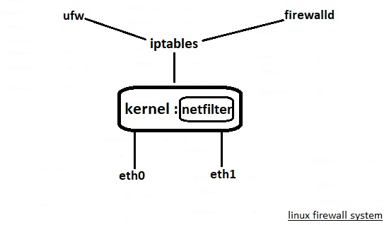
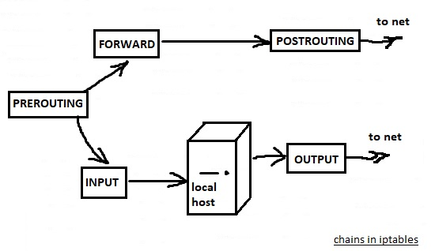
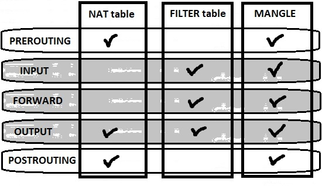
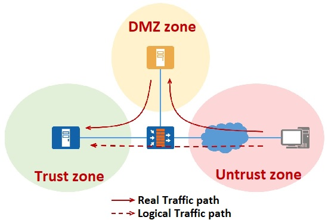
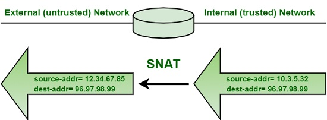
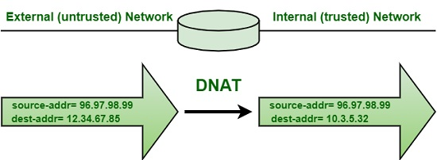

# 334.3 Packet Filtering

**Weight:** 5

**Description:** Candidates should be familiar with the use and configuration of the netfilter Linux packet filter.


**Key Knowledge Areas:**

* Understand common firewall architectures, including DMZ
* Understand and use iptables and ip6tables, including standard modules, tests and targets
* Implement packet filtering for IPv4 and IPv6
* Implement connection tracking and network address translation
* Manage IP sets and use them in netfilter rules
* Awareness of nftables and nft
* Awareness of ebtables
* Awareness of conntrackd

**Partial list of the used files, terms and utilities:**

* iptables
* ip6tables
* iptables-save
* iptables-restore
* ip6tables-save
* ip6tables-restore
* ipset

## Firewall Review

Lets review what we have learned from LPIC-2:

### netfilter

Like any other modern operating system, linux has firewall. First lets see how linux firewalling is organized:

<figure><figcaption></figcaption></figure>

There is a firewalling functionality which is implemented in linux kernel with netfilter. netfilter is a kernel module and any network traffic which kernel forward to any interface(s), is pass through netfilter. This way netfilter can make decision whether incoming or out going traffic is allowed or not. The major interface to the netfilter module is iptables. iptables has been around for a long time and it let us to do any advanced configuration on linux firewalls.

While being able to do any advanced firewall configuration is count as iptables advantage, the biggest disadvantage of iptables is its complexity. This disadvantage has been caused other solutions have been invented like ufw , firewalld . They both work with iptables behind the scenes and make firewall configuration easier for us.

### iptables

iptables works with tables! There are at present three tables:

* **Filter :** The filter table is used for packet filtering.
* **NAT :** The nat table is used for address translation.
* **Mangle :** The mangle table can be used for special-purpose processing of packets.

Within tables there are chains. Chains are used to define what kind of packet follow should be filtered exactly.

<figure><figcaption></figcaption></figure>

* **PREROUTING:** configured to block, redirect or allow the packet to the next chain. Commonly, used to redirect the packet to another address or/and port. (DNAT-Destination NAT).  If destination is local ( this machine) sent to INPUT chain. If bound for another network, sent to the FORWARD chain.
* INPUT: Configured to be blocked, logged or sent to the local system to be handled by the appropriate client, application or service.
* OUTPUT:  packet is sent from the firewall out to the network to its final destination.(Rules usually are not applied at this chain)
* FORWARD : Configured to block, logged or sent to the POSTROUTING chain.
* **POSTROUTING:**  make changes to the packet as it exits the firewall, commonly used to do masquerading.&#x20;

How tables and chain are related so ? All three tree tables (FILTER, NAT, MANGLE) can be present in chains(filter points) but not every chain has all three table represented:

<figure><figcaption></figcaption></figure>

* **PREROUTING ( **_**NAT**_** ,** MANGLE**)**
* INPUT (**FILTER** , MANGLE )
* FORWARD (**FILTER** , MANGLE )
* OUTPUT ( **** _**NAT**_ , **FILTER** , MANGLE)
* **POSTROUTING (**_**NAT**_** ,** MANGLE**)**

How rules are broken down within the firewall system? chains are filtering points that we can create rules, and rules are applied to the packet passing trough. The rules define what exactly should happen to a packet.

When packets are filtered trough the iptables firewall it will go tough the rules one by one, and the idea is "exit on match". So if a packet matches specific rule , the rule will be applied and nothing else will be applied in that chain any more. So ordering in iptables is very important.

In every rule there us target, The typical target is ACCEPT:

* **ACCEPT** : the package is allowed
* **DROP** : The package is not allowed, the package will be sileintly dropped and the sender of package doesn't know anything.
* **REJECT** :  Do not allow package, the sender of package will get an ICMP warnnig message.
* **LOG :** just LOGs
* **MASQUARATE :** used for NAT.

the target indicated with -j option. we will talk about that.

In every chain there is a policy. The policy define the default behaviour. The default policy is ACCEPT but its isa good practice to have a policy that will drop every thing that doesn't match specific packet in a chain. to set chain default policy

### iptables commands

iptables commands can be pretty long, and sometimes hard to understand so lets default components in iptables commands. to make it easier see this example:

```
iptables -A chain [-i/-o interface] [-s/-d address] -p udp --sport/--dport 80  -j TARGET
```

`-A` appends to the end glowed by the name of the chain, `[-i/-o interface]` incoming or outgoing interface,`[ -s/-d ]` source address or destination address,`-p` defines the protocol like tcp or udp, `[--sport/--dport]`for setting source or destination port number, `-j TARGET` which define what will happened to the packet that match this rule.

iptables command options outside of adding rules to chain:

<table><thead><tr><th>Option</th><th>Description</th><th data-hidden></th></tr></thead><tbody><tr><td>-L &#x3C;chain-name> -t &#x3C;table-name></td><td>Lists all of the rules in the  specified chain and table. If not chain or table specified, shows all.</td><td></td></tr><tr><td>-D</td><td>Deletes a rule in a particular chain by number</td><td></td></tr><tr><td>-X</td><td>Deletes chain</td><td></td></tr><tr><td>-F (or --flush)</td><td>flushes all (or indicated chain) of rules</td><td></td></tr><tr><td>-P</td><td>change the default policy for the chain(can be set to DROP or ACCEPT)</td><td></td></tr><tr><td>-v</td><td>typically used with -F(or --flush) to provide additional output</td><td></td></tr><tr><td>-n</td><td>Display IP address and port in numeric format</td><td></td></tr></tbody></table>

list current rules:

```
[root@rocky8 ~]# iptables -nvL
Chain INPUT (policy ACCEPT 398K packets, 525M bytes)
 pkts bytes target     prot opt in     out     source               destination

Chain FORWARD (policy ACCEPT 0 packets, 0 bytes)
 pkts bytes target     prot opt in     out     source               destination

Chain OUTPUT (policy ACCEPT 184K packets, 15M bytes)
 pkts bytes target     prot opt in     out     source               destination
```


In every chain there is a policy. The policy define the default behaviour. The default policy is ACCEPT but its isa good practice to have a policy that will drop every thing that doesn't match specific packet in a chain.

```
iptables -P INPUT DROP

```

**note:** linux uses loopback adapter for internal communication.


#### adding rules

```
iptables [-t table] {-A|-C|-D} chain rule-specification
```

<table><thead><tr><th>Option</th><th>Description</th><th data-hidden></th></tr></thead><tbody><tr><td>-A</td><td>Append one or more rules to the end of the selected chain.</td><td></td></tr><tr><td>-C</td><td>Check whether a rule matching the specification does exist in the selected chain.</td><td></td></tr><tr><td>-D</td><td>Delete one or more rules from the selected chain</td><td></td></tr></tbody></table>

examples:

```
### Block TCP traffic from Specific IP Address:
iptables -A INPUT -p tcp -s xxx.xxx.xxx.xxx -j DROP

### Allow All tcp xxx incoming port:
iptables -A INPUT -p tcp --dport xxx -j ACCEPT

### Allow Specific Network Range on Particular Port:
iptables -A OUTPUT -p tcp -d 192.168.100.0/24 --dport 22 -j ACCEPT
```

#### Inserting rules

```
iptables [-t table] -I chain [rulenum] rule-specification
```

You can use line numbers to delete or insert new rules into the firewall. example:

```
### To insert rule between 1 and 2, enter:
iptables -I INPUT 2 -s 202.54.1.2 -j DROP
```

#### deleting rules

```
iptables [-t table] -D chain rulenum
```

There are two ways for deleting a rule:

* using -D option with full length of rule&#x20;

```
iptables -D OUTPUT -p tcp --sport 22 -j ACCEPT
```

* or use iptables -L --line-numbers and delete a rule by using its number in the table (to show: `iptables -L --line-numbers`):

```
iptables -D INPUT 2
```

### /etc/sysconfig/iptables

The /etc/sysconfig/iptables config file **stores information used by the kernel to set up packet filtering services at boot time or whenever the service is started**. Do not modify this file by hand unless you are familiar with constructing iptables rules.

#### iptables-save

iptables rules are not persistent and they are vanished after reboot. rules are stored in /etc/sysconfig/iptables . for saving rules we use iptables-save command:

```
[root@rocky8 ~]# iptables-save > /etc/sysconfig/iptables.$(date +%d-%m-%y)
```

#### iptables-restore

use iptables-restore to restore  from the backup:

```
[root@rocky8 ~]# iptables-restore < /etc/sysconfig/iptables.20-09-22
```


to have more examples, read my LPIC-2 book::[https://borosan.gitbook.io/lpic2-exam-guide/2121-configuring-a-router#iptables](https://borosan.gitbook.io/lpic2-exam-guide/2121-configuring-a-router#iptables)


### ip6tables&#x20;

Ip6tables is used to set up, maintain, and inspect the tables of IPv6 packet filter rules where as Iptables is used to set up, maintain, and inspect the tables of IPv4 packet filter rules in the Linux kernel.however the syntax for both almost same.

```
ip6tables -A INPUT -i eth0 -p tcp -s 3ffe:ffff:100::1/128 --dport 22 -j ACCEPT
```

## Advanced Firewall Concepts

### ipsets

IP sets are stored collections of IP addresses, network ranges, MAC addresses, port numbers, and network interface names. The iptables tool can leverage IP sets for more efficient rule matching. For example, let’s say you want to drop traffic that originates from one of several IP address ranges that you know to be malicious. Instead of configuring rules for each range in iptables directly, you can create an IP set and then reference that set in an iptables rule. This makes your rule sets dynamic and therefore easier to configure; whenever you need to add or swap out network identifiers that are handled by the firewall, you simply change the IP set.

#### ipset

The **ipset** command enables you to create and modify IP sets. First you need to set a name, storage method, and data type for your set, such as:

```
# ipset create range_set hash:net
```

In this case, range\_set is the name, hash is the storage method, and net is the data type. Then, you can add the ranges to the set:

```
# ipset add range_set 192.168.100.0/24
# ipset add range_set 192.168.200.0/24
```

Then, you use iptables to configure a rule to drop traffic whose source matches the ranges in this set:

```
# iptables -I INPUT -m set --match-set range_set src -j DROP
```

Or, alternatively, to drop traffic whose destination matches the set:

```
iptables -I OUTPUT -m set --match-set range_set dst -j DROP
```

now that you know concept, lets see other ipset commands from its man page:

```
### Create a set identified with setname and specified type.       
ipset create SETNAME TYPENAME [ CREATE-OPTIONS ]

###Add a given entry to the set. 
ipset add SETNAME ADD-ENTRY [ ADD-OPTIONS ]

### Delete an entry from a set. 
ipset del SETNAME DEL-ENTRY [ DEL-OPTIONS ]

### Test wether an entry is in a set or not. 
### Exit status number is zero if the tested entry is in the set and nonzero if it is missing from the set.
ipset test SETNAME TEST-ENTRY [ TEST-OPTIONS ]

### Destroy the specified set or all the sets if none is given.
ipset destroy [ SETNAME ]

### List the header data and the entries for the specified set, or for all sets if none is given. 
ipset list [ SETNAME ]

### Flush all entries from the specified set or flush all sets if none is given.
ipset flush [ SETNAME ]

###Rename a set. Set identified by SETNAME-TO must not exist.
ipset rename SETNAME-FROM SETNAME-TO

### exchange the name of two sets. 
### The referred sets must exist and identical type of sets can be swapped only.
ipset swap SETNAME-FROM SETNAME-TO
```

example:

```
[root@rocky8 ~]# ipset create webserver hash:ip,port

[root@rocky8 ~]# ipset add webserver 10.0.0.1,80

[root@rocky8 ~]# ipset list  webserver
Name: webserver
Type: hash:ip,port
Revision: 5
Header: family inet hashsize 1024 maxelem 65536
Size in memory: 184
References: 0
Number of entries: 1
Members:
10.0.0.1,tcp:80
```

**note:** A set cannot be destroyed while there is a single reference pointing to it.

#### Making ipset persistent

The ipset you have created is stored in memory and will be gone after reboot. To make the ipset persistent you have to do the followings:

```
# ipset save > /etc/ipset.conf
```

and to restore:

```
# ipset restore < /etc/ipset.conf
```


ipset interactive mode

ipset also have an interactive modes, try **`ipset -`** command. The interactive mode can be finished by entering the pseudo-command quit.


### What is a DMZ Network?

A **DMZ Network** is a perimeter network that protects and adds an extra layer of security to an organization’s internal local-area network from untrusted traffic. A common DMZ is a subnetwork that sits between the public internet and private networks.

<figure><figcaption></figcaption></figure>

The end goal of a DMZ is to allow an organization to access untrusted networks, such as the internet, while ensuring its private network or LAN remains secure. Organizations typically store external-facing services and resources, as well as servers for the Domain Name System (DNS), File Transfer Protocol (FTP), mail, proxy, Voice over Internet Protocol (VoIP), and web servers, in the DMZ.&#x20;

These servers and resources are isolated and given limited access to the LAN to ensure they can be accessed via the internet but the internal LAN cannot. As a result, a DMZ approach makes it more difficult for a hacker to gain direct access to an organization’s data and internal servers via the internet.

### Connection tracking

Connection tracking (“conntrack”) is a core feature of the Linux kernel’s networking stack. It allows the kernel to keep track of all logical network connections or flows, and thereby identify all of the packets which make up each flow so they can be handled consistently together.

Conntrack is an important kernel feature that underpins some key mainline use cases:

* **NAT** relies on the connection tracking information so it can translate all of the packets in a flow in the same way. _For example, when a pod accesses a Kubernetes service, kube-proxy’s load balancing uses NAT to redirect the connection to a particular backend pod. It is conntrack that records that for a particular connection, packets to the service IP should all be sent to the same backend pod, and that packets returning from backend pod should be un-NATed back to the source pod._
* **Stateful firewalls**, _such as Calico, rely on the connection tracking information to precisely whitelist “response” traffic. This allows you to write a network policy that says “allow my pod to connect to any remote IP” without needing to write policy to explicitly allow the response traffic.  (Without this you would have to add the much less secure rule “allow packets to my pod from any IP”.)_

In addition, conntrack normally improves performance (reduced CPU and reduced packet latencies) since only the first packet in a flow needs to go through the full network stack processing to determine what to do with it.

The obvious question is how large this state tracking table can be. This setting is under "/proc/sys/net/nf\_conntrack\_max":

```
[root@rocky8 ~]# cat /proc/sys/net/nf_conntrack_max
65536
```

> This is a global setting.


#### What are the conntrack-tools?

The [conntrack-tools](http://conntrack-tools.netfilter.org/) package contains two programs:

* _**conntrack**_ provides a full featured command line utility to interact with the connection tracking system. The _conntrack_ utility provides a replacement for the limited /proc/net/nf\_conntrack interface. With _conntrack_, you can list, update and delete the existing flow entries; you can also listen to flow events.
* _**conntrackd**_ is the user-space connection tracking daemon. This daemon can be used to deploy fault-tolerant GNU/Linux firewalls but you can also use it to collect flow-based statistics of the firewall use.

Mind the trailing _**d**_ that refers to either the command line utility or the daemon.


### NAT

#### What is NAT?

**NAT (Network Address Translation)** is a process of changing the source and destination IP addresses and ports. Address translation reduces the need for IPv4 public addresses and hides private network address ranges. This process is usually done by routers or firewalls.

#### What Is Source NAT?

Source Network Access Translation otherwise known as SNAT is the process of translating the source’s private IP address into a public IP address to connect to the internet. As the name suggests, the whole process is about translating the source IP address. It is mostly used by private users for getting public access such as the internet. SNAT might also change the source port present in the TCP/UDP header

<figure><figcaption></figcaption></figure>

#### What Is Destination NAT?

Destination Network Access Translation otherwise known as DNAT is a process where the destination address is changed in the IP header of a packet. Unlike the Source NAT, Destination NAT deals with the IP address of the public access or internet. It changes the IP address from the destination as it passes through a router. It can also change the port translation in the TCP/UDP headers. It is used to redirect traffic from an internet host to a private host.

<figure><figcaption></figcaption></figure>

#### Different kinds of address translation

There are three types of address translation:

1. **Static NAT** – translates one private IP address to a public one. The public IP address is always the same.
2. **Dynamic NAT** – private IP addresses are mapped to the pool of public IP addresses.
3. **Port Address Translation (PAT)** – one public IP address is used for all internal devices, but a different port is assigned to each private IP address. Also known as **NAT Overload**.

NAT could be handled by firewalls and/or routers. In linux we can use **NAT tables** in **iptables** and the **OUTPUT, PREROUTING and POSTROUTING chains**.

**Teach the kernel to forward**

So we want to tell the kernel the following: For packets from the local network whose IP address does not match its own, it should change the sender address to itself. We also make the assumption that the first network interface of the Linux router "eth0" is connected to the local network and the Internet connection is available on the second interface "eth1". The command to release the Internet connection is then:

```
iptables -t nat -A POSTROUTING -o eth1 -j MASQUERADE
```

The command is explained as follows:

* iptable : the command line program that we use to configure the kernel&#x20;
* \-t : nat Select the "nat" table to run NAT.&#x20;
* \-A : POSTROUTING Add a rule to the POSTROUTING chain (-A stands for "append").&#x20;
* \-o : eth1 We want packets leaving the router on the second network interface "eth1" (-o for "output")...&#x20;
* \-j : MASQUERADE ... mask, so the router should set its own address as the source address.


that was a quick review on what we have learned in lpic2. Visit my LPIC-2 book: [https://borosan.gitbook.io/lpic2-exam-guide/2121-configuring-a-router#nat-ip-forwarding](https://borosan.gitbook.io/lpic2-exam-guide/2121-configuring-a-router#nat-ip-forwarding)


### ebtables

ebtables is an application program used to set up and maintain the tables of rules (inside the Linux kernel) that inspect Ethernet frames. It is similar to the iptables application, but less complicated, due to the fact that the Ethernet protocol is much simpler than the IP protocol.

• Defaults chains:&#x20;

* **filter**
* **broute**&#x20;
* **nat**&#x20;

• Specific options to ebtables&#x20;

* **-Ln** :List line numbers when printing a rule set&#x20;
* **-Lc** :List packet and byte counters with each rule

### Nftables

As we mentioned above, one of the notable drawbacks of iptables is the complexity of it. Several alternatives have been developed but LPIC-3 303 is only concerned with nftables. nftables is an  Alternative to iptables.

* Aims to provide a simpler interface to netfilter.&#x20;
* Use the nft command to interact with nftables.&#x20;
* Nftables is compatible with iptables style rules
* May use iptables rules but supports a more plain language rule set.

_Only brief familiarity required for the exam._


that's all.

.

.

.

resource:

[http://underpop.online.fr/l/linux/en/centos/s2-sysconfig-iptables.htm#:\~:text=The%20%2Fetc%2Fsysconfig%2Fiptables,familiar%20with%20constructing%20iptables%20rules.](http://underpop.online.fr/l/linux/en/centos/s2-sysconfig-iptables.htm)

[https://blog.knoldus.com/ip6tables-firewall/#:\~:text=configurable%20table%20rules.-,iptable%20vs%20ip6tables,syntax%20for%20both%20almost%20same.](https://blog.knoldus.com/ip6tables-firewall/)

[https://www.thegeekdiary.com/how-to-use-ipset-command-in-linux/](https://www.thegeekdiary.com/how-to-use-ipset-command-in-linux/)

[https://linux.die.net/man/8/ipset](https://linux.die.net/man/8/ipset)

[https://www.fortinet.com/resources/cyberglossary/what-is-dmz](https://www.fortinet.com/resources/cyberglossary/what-is-dmz)

[https://www.tigera.io/blog/when-linux-conntrack-is-no-longer-your-friend/#:\~:text=Connection%20tracking%20(%E2%80%9Cconntrack%E2%80%9D),can%20be%20handled%20consistently%20together.](https://www.tigera.io/blog/when-linux-conntrack-is-no-longer-your-friend/)

[https://blog.cloudflare.com/conntrack-tales-one-thousand-and-one-flows/](https://blog.cloudflare.com/conntrack-tales-one-thousand-and-one-flows/)

[https://conntrack-tools.netfilter.org/manual.html](https://conntrack-tools.netfilter.org/manual.html)

[https://arthurchiao.art/blog/conntrack-design-and-implementation/](https://arthurchiao.art/blog/conntrack-design-and-implementation/)

[https://study-ccna.com/what-is-nat/](https://study-ccna.com/what-is-nat/)

[https://gigmocha.com/source-nat-vs-destination-nat-key-differences/](https://gigmocha.com/source-nat-vs-destination-nat-key-differences/)

[https://www.karlrupp.net/de/computer/nat\_tutorial](https://www.karlrupp.net/de/computer/nat\_tutorial)

[https://www.geeksforgeeks.org/difference-between-snat-and-dnat/](https://www.geeksforgeeks.org/difference-between-snat-and-dnat/)

[https://guix.gnu.org/packages/ebtables-2.0.11/#:\~:text=ebtables%20is%20an%20application%20program,simpler%20than%20the%20IP%20protocol.](https://guix.gnu.org/packages/ebtables-2.0.11/)

.
