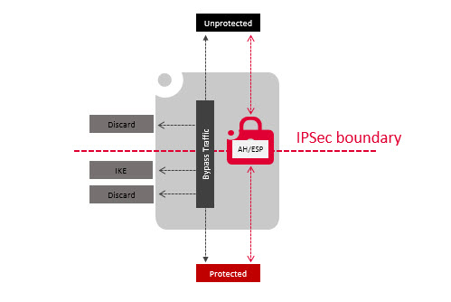
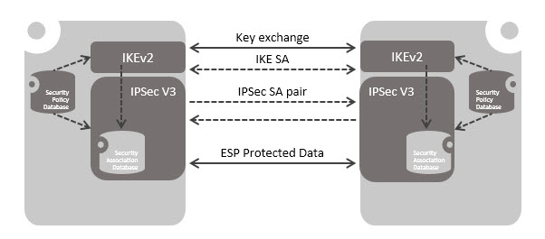
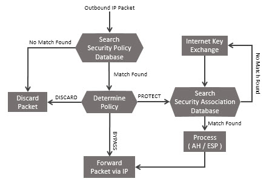
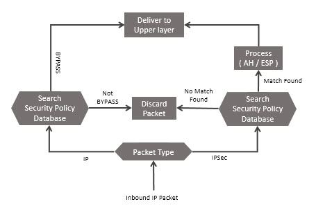
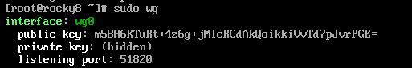
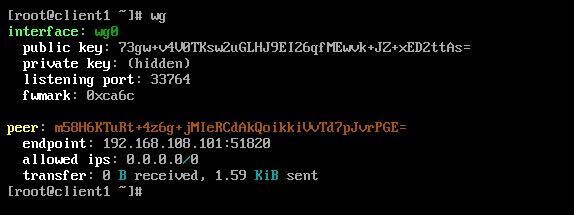

# 334.4 Virtual Private Networks

**Weight:** 4

**Description:** Candidates should be familiar with the use of OpenVPN, IPsec and WireGuard to set up remote access and site to site VPNs.


**Key Knowledge Areas:**

* Understand the principles of bridged and routed VPNs
* Understand the principles and major differences of the OpenVPN, IPsec, IKEv2 and WireGuard protocols
* Configure and operate OpenVPN servers and clients
* Configure and operate IPsec servers and clients using strongSwan
* Configure and operate WireGuard servers and clients
* Awareness of L2TP

**Partial list of the used files, terms and utilities:**

* /etc/openvpn/
* openvpn
* /etc/strongswan.conf
* /etc/strongswan.d/
* /etc/swanctl/swanctl.conf
* /etc/swanctl/
* swanctl
* /etc/wireguard/
* wg
* wg-quick
* ip

## Open VPN

### **What is OpenVPN?**

OpenVPN is Company that created the **OpenVPN Community Edition** VPN server which is open-source and free to use. They also developed the **OpenVPN tunneling protocol** which is a tunneling protocol based on SSL encryption protocol. Many VPN services use this protocol. There is something else which is called OpenVPN Access server which is an enterprise product that has a web Interface and only offers 2 simultaneous connections on the free version.

#### OpenVPN Community Edition (Open Source) <a href="#openvpn-community-edition-open-source" id="openvpn-community-edition-open-source"></a>

OpenVPN is an open-source software application that implements virtual private network (VPN) techniques to create secure point-to-point or site-to-site connections.

OpenVPN can use a variety of methods such as pre-shared secret keys, certificates, or usernames/passwords, to let clients authenticate to the server. OpenVPN uses the OpenSSL protocol and implements many security and control features such as challenge response authentication, single sign-on capability, load balancing and failover features and multi daemon support.

By default OpenVPN works on port 1194 UDP but Open VPN is highly capable of transparently traversing through firewalls especially when the default port is chanaged to 443.

#### Installing OpenVPN

For demonstration we install OpenVPN on rocky linux:

```
[root@rocky8 ~]# dnf install epel-release -y
[root@rocky8 ~]# dnf install openvpn -y
```

Now that OpenVPN is installed. Navigate to its installation folder and download easy-rsa. Easy-RSA builds and manages certificate authorities (CAs).

```
[root@rocky8 ~]# cd /etc/openvpn/
[root@rocky8 openvpn]# wget https://github.com/OpenVPN/easy-rsa/releases/download/v3.0.6/EasyRSA-unix-v3.0.6.tgz
[root@rocky8 openvpn]# tar -xvzf EasyRSA-unix-v3.0.6.tgz
[root@rocky8 openvpn]# mv EasyRSA-v3.0.6 easy-rsa
```

#### Configure Easy-RSA

Next, we need to add and build an SSL certificate. To do that, first, navigate to the easy-rsa directory

```
[root@rocky8 openvpn]# cd /etc/openvpn/easy-rsa
```

for ease of use, lets create a var file, with bellow contents:

```
[root@rocky8 easy-rsa]# vim vars
```

```
set_var EASYRSA "$PWD"
set_var EASYRSA_PKI "$EASYRSA/pki"
set_var EASYRSA_DN "cn_only"
set_var EASYRSA_REQ_COUNTRY "IR"
set_var EASYRSA_REQ_PROVINCE "Teh"
set_var EASYRSA_REQ_CITY "Teh"
set_var EASYRSA_REQ_ORG "LinuxCert CERTIFICATE AUTHORITY"
set_var EASYRSA_REQ_EMAIL "admin@linuxcert"
set_var EASYRSA_REQ_OU "LinuxCert EASY CA"
set_var EASYRSA_KEY_SIZE 2048
set_var EASYRSA_ALGO rsa
set_var EASYRSA_CA_EXPIRE 7500
set_var EASYRSA_CERT_EXPIRE 365
set_var EASYRSA_NS_SUPPORT "no"
set_var EASYRSA_NS_COMMENT "LinuxCert CERTIFICATE AUTHORITY"
set_var EASYRSA_EXT_DIR "$EASYRSA/x509-types"
set_var EASYRSA_SSL_CONF "$EASYRSA/openssl-easyrsa.cnf"
set_var EASYRSA_DIGEST "sha256"
```

> You can change the value of country, city, province, and email according to your requirements.

Now, initiate the PKI directory with the following command.

```
[root@rocky8 easy-rsa]# ./easyrsa init-pki
```

Finally, You can build your CA certificate.

```
[root@rocky8 easy-rsa]# sudo ./easyrsa build-ca
```

#### Generate Server Certificate Files

Use the following command to get your key-pair and certificate request.

```
[root@rocky8 easy-rsa]# sudo ./easyrsa gen-req myov-server nopass
.
.
.
Keypair and certificate request completed. Your files are:
req: /etc/openvpn/easy-rsa/pki/reqs/myov-server.req
key: /etc/openvpn/easy-rsa/pki/private/myov-server.key
```

#### Sign the Server Key With CA

To sign your server key with the CA, run the following command.

```
[root@rocky8 easy-rsa]# sudo ./easyrsa sign-req server myov-server
.
.
.
Certificate created at: /etc/openvpn/easy-rsa/pki/issued/myov-server.crt
```

We need the Diffie-Hellman key for key exchanging purposes. Generate the key by running the following command.

```
[root@rocky8 easy-rsa]# sudo ./easyrsa gen-dh
```

Next, copy all these files to the **/etc/openvpn/server/** directory.

```
[root@rocky8 easy-rsa]# cp pki/ca.crt /etc/openvpn/server/
[root@rocky8 easy-rsa]# cp pki/dh.pem /etc/openvpn/server/
[root@rocky8 easy-rsa]# cp pki/private/myov-server.key /etc/openvpn/server/
[root@rocky8 easy-rsa]# cp pki/issued/myov-server.crt /etc/openvpn/server/
```

#### Generate Client Key and Certificate

You can get the client key by running the following command.

```
[root@rocky8 easy-rsa]# sudo ./easyrsa gen-req client nopass
.
.
.
Keypair and certificate request completed. Your files are:
req: /etc/openvpn/easy-rsa/pki/reqs/client.req
key: /etc/openvpn/easy-rsa/pki/private/client.key
```

Next sign your client key with the generated CA certificate.

```
[root@rocky8 easy-rsa]# sudo ./easyrsa sign-req client client
.
.
.
Certificate created at: /etc/openvpn/easy-rsa/pki/issued/client.crt
```

Copy these files to the **/etc/openvpn/client/** directory

```
[root@rocky8 easy-rsa]# cp pki/ca.crt /etc/openvpn/client/
[root@rocky8 easy-rsa]# cp pki/issued/client.crt /etc/openvpn/client/
[root@rocky8 easy-rsa]# cp pki/private/client.key /etc/openvpn/client/
```

### Configure OpenVPN Server

Make and open a new config file in the client directory with the following command.

```
[root@rocky8 easy-rsa]# vim /etc/openvpn/server/server.conf
```

Then add the following code lines in the file.

```
port 1194
proto udp
dev tun
ca /etc/openvpn/server/ca.crt
cert /etc/openvpn/server/myov-server.crt
key /etc/openvpn/server/myov-server.key
dh /etc/openvpn/server/dh.pem
server 10.8.0.0 255.255.255.0
push "redirect-gateway def1"
push "dhcp-option DNS 208.67.222.222"
push "dhcp-option DNS 208.67.220.220"
duplicate-cn
cipher AES-256-CBC
tls-version-min 1.2
tls-cipher TLS-DHE-RSA-WITH-AES-256-GCM-SHA384:TLS-DHE-RSA-WITH-AES-256-CBC-SHA256:TLS-DHE-RSA-WITH-AES-128-GCM-SHA256:TLS-DHE-RSA-WITH-AES-128-CBC-SHA256
auth SHA512
auth-nocache
keepalive 20 60
persist-key
persist-tun
compress lz4
daemon
user nobody
group nobody
log-append /var/log/openvpn.log
verb 3
```

> All OpenVPN configuration files should be configured under /etc/openvpn directory but by default no configuration files are found here. So we should either create new ones (which seems complicated) or we can easily copy sample configuration files from /usr/share/doc/openvpn-x to /etc/openvpn directory and modify them

#### Start and Enable OpenVPN Service

Your OpenVPN is ready to launch. Start and enable the server using the following commands.

```
[root@rocky8 easy-rsa]# systemctl start openvpn-server@server
```

A new network interface **tun0** will be created on the successful start of the OpenVPN server. Run `ifconfig` command to see the details.

### Generate the Client Configuration File

The next step is to connect the client to the OpenVPN server. We need the client configuration file for that. To generate the client configuration file, run the following command.

```
[root@rocky8 easy-rsa]# vim /etc/openvpn/client/client.ovpn
```

Now, copy and paste the following code into the file.

```
client
dev tun
proto udp
remote vpn-server-ip 1194
ca ca.crt
cert client.crt
key client.key
cipher AES-256-CBC
auth SHA512
auth-nocache
tls-version-min 1.2
tls-cipher TLS-DHE-RSA-WITH-AES-256-GCM-SHA384:TLS-DHE-RSA-WITH-AES-256-CBC-SHA256:TLS-DHE-RSA-WITH-AES-128-GCM-SHA256:TLS-DHE-RSA-WITH-AES-128-CBC-SHA256
resolv-retry infinite
compress lz4
nobind
persist-key
persist-tun
mute-replay-warnings
verb 3
```

### Configure Routing

Set OpenVPN service settings with the following commands to allow it through the firewall.

```
firewall-cmd --permanent --add-service=openvpn
firewall-cmd --permanent --zone=trusted --add-service=openvpn
firewall-cmd --permanent --zone=trusted --add-interface=tun0
firewall-cmd --add-masquerade
firewall-cmd --permanent --add-masquerade
```

Set the routing to forward the incoming traffic from the VPN to the local network.

```
routecnf=$(ip route get 8.8.8.8 | awk 'NR==1 {print $(NF-2)}')
firewall-cmd --permanent --direct --passthrough ipv4 -t nat -A POSTROUTING -s 10.8.0.0/24 -o $routecnf -j MASQUERADE
```

Reload to make the changes effective.

```
firewall-cmd --reload
```

### Install and Use OpenVPN in Client Machine

You have to install epel-release and OpenVPN as you did on the server-side.

```
[root@client1 ~]# dnf install epel-release -y
[root@client1 ~]# dnf install openvpn -y
```

Now copy the client config files from the server using the command given below.

```
sudo scp -r root@vpn-server-ip:/etc/openvpn/client .
```

Go to the client directory and connect to the OpenVPN server using the following commands.

```
[root@client1 ~]# cd client/
[root@client1 client]# openvpn --config client.ovpn
```

Run the `ifconfig tun0` to see the assigned IP address.

### openvpn command

Lets take a look at two important openvpn command options:

**--mlok**

Using this option ensures that key material and tunnel data are never written to disk due to virtual memory paging operations which occur under most modern operating systems. It ensures that even if an attacker was able to crack the box running OpenVPN, he would not be able to scan the system swap file to recover previously used ephemeral keys

The downside of using **--mlock** is that it will reduce the amount of physical memory available to other applications.

**--push option**

Push a config file option back to the client for remote execution. Note that **option** must be enclosed in double quotes (""). The client must specify **--pull** in its config file. The set of options which can be pushed is limited by both feasibility and security. Some options such as those which would execute scripts are banned, since they would effectively allow a compromised server to execute arbitrary code on the client. Other options such as TLS or MTU parameters cannot be pushed because the client needs to know them before the connection to the server can be initiated.This is a partial list of options which can currently be pushed: **--route, --route-gateway, --route-delay, --redirect-gateway,** **--ip-win32, --dhcp-option,** **--inactive, --ping, --ping-exit, --ping-restart,** **--setenv,** **--auth-token,** **--persist-key, --persist-tun, --echo,** **--comp-lzo,** **--socket-flags,** **--sndbuf, --rcvbuf**


for more info review my LPIC-2 book: [https://borosan.gitbook.io/lpic2-exam-guide/2125-openvpn#openvpn](https://borosan.gitbook.io/lpic2-exam-guide/2125-openvpn#openvpn)


## Working with IPSec Server and Clients

### ipsec concpet

IPSec create boundary between protected and unprotected network. Traffic traversing the boundary is a subject to access controls that specified by user or administrator responsible for IPSec configuration. From the control, the traffic maybe cross the boundary with afforded security services via AH or ESP, or are discarded.

<figure><figcaption><p>Top Level IPSec Processing Model</p></figcaption></figure>

### **IPSec Policy**

Fundamental of IPSec service is the concept of security policy that determined by two database. Those are, Security Policy Database (SPD), and Security Association Database (SAD). This policy applied to each IP packet that transit from a source to a destination.

_**Security Association**_\
Security Association is a key concept to both node exchange information about authentication and encryption mechanism. An association is a one-way logical connection between a sender and a receiver that affords security services to the traffic carried on it

<figure><figcaption><p>IPSec Architecture</p></figcaption></figure>

There are three parameter that identify the security association:\
1\. _Security Parameters Index_ (SPI), bit string carry IPSec protocol header information to enable receiving system to select packet that will be received\
2\. _IP Destination Address_, the endpoint address of IPSec\
3\. _Security Protocol Identifier_, this field from the outer IP header indicates whether the association is an AH or ESP security association

_**Security Association Database (SAD)**_

In each IPsec implementation, there is a nominal Security Association Database that defines the parameters associated with each SA. This database stored a parameter to build IKE SA and IPSec SA. Below the parameter in an SAD entry:

&#x20;1\. **Security Parameter Index**: A 32-bit value selected by the receiving end of an SA to uniquely identify the SA\
2\. **Sequence Number Counter**: A 32-bit value used to generate the Sequence Number field in IPSec Protocol headers.\
3\. **Sequence Counter Overflow**: A flag indicating whether overflow of the Sequence Number Counter should generate an auditable event and prevent further transmission of packets on this SA\
4\. **Anti-Replay Window**: Used to determine whether an inbound AH or ESP packet is a replay\
5\. **AH Information**: Authentication algorithm, keys, key lifetimes, and related parameters being used with AH\
6\. **ESP Information**: Encryption and authentication algorithm, keys, initialization values, key lifetimes, and related parameters being used with ESP (required for ESP implementations).\
7\. **Lifetime of this Security Association**: A time interval or byte count after which an SA must be replaced with a new SA (and new SPI) or terminated, plus an indication of which of these actions should occur\
8\. **IPsec Protocol Mode**: Tunnel, transport, or wildcard\
9\. **Path MTU**: Any observed path maximum transmission unit (maximum size of a packet that can be transmitted without fragmentation) and aging variables\


_**Security Policy Database (SPD)**_

Security policy stores the IP traffic that related to specific SA, it means SPD contains the entries, each entry defines a subset of IP traffic and points to an SA for that traffic. Each SPD entry is defined by IP and upper-layer protocol field values, called selector. These selector is used to filter outgoing traffic in order to map it in to a particular SA. The following selectors determine an SPD entry:

1\. **Remote IP Address**: This may be a single IP address, an enumerated list or range of addresses, or a wildcard (mask) address for remote private network\
2\. **Local IP Address**: This may be a single IP address, an enumerated list or range of addresses, or a wildcard (mask) address for local private network\
3\. **Next Layer Protocol**: The IP protocol header (IPv4, IPv6, or IPv6 Extension) includes a field (Protocol for IPv4, Next Header for IPv6 or IPv6 Extension) that designates the protocol operating over IP\
4\. **Name**: A user identifier from the operating system. This is not a field in the IP or upper-layer headers but is available if IPsec is running on the same operating system as the user.\
5\. **Local and Remote Ports**: These may be individual TCP or UDP port values, an enumerated list of ports, or a wildcard port.


**setkey**

The setkey utility may add, update, dump, or flush SAD or SPD entries in the kernel

&#x20;The following are directives that may be used to manipulate the SAD:&#x20;

&#x20;     ****      • add&#x20;

&#x20;    • get&#x20;

&#x20;    • delete&#x20;

&#x20;    • flush&#x20;

&#x20;    • Dump&#x20;

• The directives may be prefaced with ‘spd’ (ie spdadd) and will work for the SPD.


### **IPSec Protocol**

IPSec using protocol Authentication Header (AH), and Encapsulation Security Payload (ESP), to provide traffic security services.

* **Authentication Header (AH)**

In this protocol, IP header and data payload is hashed. From this hash, a new AH header is build which is appended to the packet. This new packet is transmitted via router where the router hashes the header and the payload. Both the hashes need to be exactly matched. Even a single bit is changed, the AH header will not match.

* **Encapsulating Security Payload (ESP)**

This is a security protocol to provide encryption and integrity to the data packets. The ESP is added after the standard IP header. As it contains standard IP header, it can be routed easily with standard IP devices. This makes it backwards-compatible with IP routers and even those devices that were not designed to operate with IPsec. ESP is performed at the IP packet layer. It contains six parts of which two parts are only authenticated (Security Parameter Index, Sequence Number) whereas the rest of the four parts are encrypted during transmission (Payload Data, Padding, Pad Length and Next Header). It supports multiple encryption protocols and is up to the user to decide which one to opt.


Commonly, ESP using in Virtual Private Network or underlay network context, and we will focus with this protocol than Authentication Header. Because in service provider network, we often meet this kind of protocol



**What is IKE?**

**IKE.** Defined in RFC 7296, IKE is a protocol that enables two systems or devices to establish a secure communication channel over an untrusted network. The protocol uses a series of key exchanges to create a secure tunnel between a client and a server through which they can send encrypted traffic. The security of the tunnel is based on the Diffie-Hellman key exchange


### IPSec Encryption Technologies

Security Association (SA) can be configured two mode IPSec operation, they are Tunnel mode or Transport mode. Both modes have their own uses and should be used with caution depending upon the solution.

* **Tunnel Mode**

This encrypts both the payload and the header. IPsec in tunnel mode is used when the destination of the packet is different than the security termination point. The most common use of this mode is between gateways or from end station to gateway. The gateway serves as a proxy for the hosts. So when the origin of the packets differs from the device that is providing security, tunnel mode is used.

* **Transport Mode**

In this encryption mode, only the data portion of each packet is encrypted. This mode is applicable between end stations or between end station and gateway.

### **IP Traffic Processing**

IPSec is executed on a packet on packet-by-packet basis. When IPSec implemented, each outbound packet is processed by IPSec logic before transmission. The Packet that sent must be consulted with the Security Policy Database (SPD) (or associated caches). If no policy is found in the SPD that matches a packet (for either inbound or outbound traffic), the packet MUST be discarded, vice versa.

<figure><figcaption><p>Processing Model for Outbound Packets</p></figcaption></figure>

<figure><figcaption><p>Processing Model for Inbound Packets</p></figcaption></figure>


### How does it work <a href="#howdoesitwork" id="howdoesitwork"></a>

IPsec makes use of tunneling. The data packets that we define sensitive or interesting are sent through the tunnel securely. By defining the characteristics of the tunnel, the security protection measures of sensitive packets are defined. IPsec offers numerous technologies and encryption modes. But its working can be broken into five major steps. A brief overview is given below:

#### 1. Interesting Traffic Initiation <a href="#interestingtrafficinitiation" id="interestingtrafficinitiation"></a>

The sensitive traffic that needs to be monitored is deemed interesting. After deciding about the traffic, the security policy is implemented on the configuration interface for the peers. When this traffic transits the IPsec client, the IKE phase one is triggered.

#### 2. IKE Phase One <a href="#ikephaseone" id="ikephaseone"></a>

In this step, first the IPsec peers are authenticated thus protecting the identities of the peers. Then the Internet Key Exchange (IKE) Security Associations (SA) policy is negotiated among the peers. This results in both the parties to have a shared secret matching key that helps in the IKE phase two. Also, in this phase, there is setting up of a secure tunnel through which the exchange of information for phase two will occur. This phase has two operating modes

* _Main Mode:_ There are three exchanges among the initiator and the receiver. In first exchange, algorithms and hashes are exchanged. The second exchange is responsible for generations of shared secret keying using Diffie-Hellman exchange. The last exchange is for the verification of the other side’s identity. All three of these exchanges are bi-directional.
* _Aggressive Mode:_ There are fewer exchanges in this mode. All the required information is squeezed making it faster to use. The only trouble is that information is shared before there is a secure channel making this mode vulnerable.

#### 3. IKE Phase Two <a href="#ikephasetwo" id="ikephasetwo"></a>

This phase negotiates information for IPsec SA parameters through the IKE SA. Here as well IPsec policies are shared and then establish IPsec SAs. There is only a single mode (quick mode) in this phase. It exchanges nonce providing replay protection. These nonces generate new shared secret key material. If the lifetime for IPsec expires, it can renegotiate a new SA.

#### 4. Data Transfer <a href="#datatransfer" id="datatransfer"></a>

Here the data is safely and securely transmitted through the IPsec tunnel. The sent packets are encrypted and decrypted using the specified encryption in the IPsec SAs.

#### 5. Tunnel Termination <a href="#tunneltermination" id="tunneltermination"></a>

The tunnel may terminate by either deletion or by time out. Time out occurs when the specified time (sec) has passed or when specified number of bytes will have passed through the tunnel.


### Strongswan Overview

strongSwan is an OpenSource IPsec-based VPN solution. It was originally based on the discontinued FreeS/WAN project . StrongSwan originally was designed for Linux, but has since been ported to Android, FreeBSD, Mac OS X, Windows and other platforms. The focus of strongSwan is on:

1. Simplicity of configuration
2. Strong encryption and authentication methods
3. Powerful IPsec policies supporting large and complex VPN networks
4. Modular design with great expandability

> The maintainer of the strongSwan project is Andreas Steffen, who is a professor for security in communications and head of the Institute for Internet Technologies and Applications at the University of Applied Sciences Rapperswil in Switzerland and president of the consulting firm strongSec GmbH.

#### installing strongswan

for installing strongswan  on RedHat distributions first you need to enable epel-repo and then install it:

```
[root@rocky8 ~]# dnf install -y epel-release
[root@rocky8 ~]# dnf install -y strongswan.x86_64
```

check the strongswan configuration directory:

```
[root@rocky8 ~]# tree -L 2 /etc/strongswan/
/etc/strongswan/
├── ipsec.conf
├── ipsec.d
│   ├── aacerts
│   ├── acerts
│   ├── cacerts
│   ├── certs
│   ├── crls
│   ├── ocspcerts
│   ├── private
│   └── reqs
├── ipsec.secrets
├── strongswan.conf
├── strongswan.d
│   ├── aikgen.conf
│   ├── attest.conf
│   ├── charon
│   ├── charon.conf
│   ├── charon-logging.conf
│   ├── charon-systemd.conf
│   ├── imcv.conf
│   ├── pki.conf
│   ├── scepclient.conf
│   ├── sec-updater.conf
│   ├── starter.conf
│   ├── swanctl.conf
│   └── tnc.conf
└── swanctl
    ├── bliss
    ├── conf.d
    ├── ecdsa
    ├── pkcs12
    ├── pkcs8
    ├── private
    ├── pubkey
    ├── rsa
    ├── swanctl.conf
    ├── x509
    ├── x509aa
    ├── x509ac
    ├── x509ca
    ├── x509crl
    └── x509ocsp
```

#### strongswan.conf

Check the configuration file, strongswan.conf, you free to modify this file depend on your own and concern

```
[root@rocky8 ~]# cat /etc/strongswan/strongswan.conf
# strongswan.conf - strongSwan configuration file
#
# Refer to the strongswan.conf(5) manpage for details
#
# Configuration changes should be made in the included files

charon {
        load_modular = yes
        plugins {
                include strongswan.d/charon/*.conf
        }
}

include strongswan.d/*.conf 
```

#### swanctl

swanctl is **a cross-platform command line utility to configure, control and monitor the strongSwan IKE daemon (**[**charon**](https://docs.strongswan.org/docs/5.9/daemons/charon.html)**)** via the [**`vici`**](https://docs.strongswan.org/docs/5.9/plugins/vici.html) interface plugin. It is a replacement for the aging starter, ipsec and stroke tools.


The **`charon`** daemon was built from scratch to implement the IKEv2 protocol for the strongSwan project. Most of its code is located in the **`libcharon`** library making the IKE daemon core available to other programs such as [**`charon-systemd`**](https://docs.strongswan.org/docs/5.9/daemons/charon-systemd.html), [**`charon-svc`**](https://docs.strongswan.org/docs/5.9/daemons/charon-svc.html), [**`charon-cmd`**](https://docs.strongswan.org/docs/5.9/daemons/charon-cmd.html) or the [Android app](https://docs.strongswan.org/docs/5.9/os/androidVpnClient.html).

The **`vici`** \[ˈvitʃi] plugin for **`libcharon`** provides the [Versatile IKE Control Interface](https://github.com/strongswan/strongswan/blob/master/src/libcharon/plugins/vici/README.md) (VICI). As its name indicates, it provides an interface for external applications to not only configure, but also to control and monitor the IKE daemon [**`charon`**](https://docs.strongswan.org/docs/5.9/daemons/charon.html).



Subcommands:

| [`swanctl --initiate`](https://docs.strongswan.org/docs/5.9/swanctl/swanctlInitiate.html)   | [`swanctl --list-sas`](https://docs.strongswan.org/docs/5.9/swanctl/swanctlListSas.html)           | [`swanctl --load-all`](https://docs.strongswan.org/docs/5.9/swanctl/swanctlLoadAll.html)               |
| ------------------------------------------------------------------------------------------- | -------------------------------------------------------------------------------------------------- | ------------------------------------------------------------------------------------------------------ |
| [`swanctl --terminate`](https://docs.strongswan.org/docs/5.9/swanctl/swanctlTerminate.html) | [`swanctl --list-conns`](https://docs.strongswan.org/docs/5.9/swanctl/swanctlListConns.html)       | [`swanctl --load-conns`](https://docs.strongswan.org/docs/5.9/swanctl/swanctlLoadConns.html)           |
| [`swanctl --rekey`](https://docs.strongswan.org/docs/5.9/swanctl/swanctlRekey.html)         | [`swanctl --list-certs`](https://docs.strongswan.org/docs/5.9/swanctl/swanctlListCerts.html)       | [`swanctl --load-creds`](https://docs.strongswan.org/docs/5.9/swanctl/swanctlLoadCreds.html)           |
| [`swanctl --redirect`](https://docs.strongswan.org/docs/5.9/swanctl/swanctlRedirect.html)   | [`swanctl --list-algs`](https://docs.strongswan.org/docs/5.9/swanctl/swanctlListAlgs.html)         | [`swanctl --flush-certs`](https://docs.strongswan.org/docs/5.9/swanctl/swanctlFlushCerts.html)         |
| [`swanctl --install`](https://docs.strongswan.org/docs/5.9/swanctl/swanctlInstall.html)     | [`swanctl --list-authorities`](https://docs.strongswan.org/docs/5.9/swanctl/swanctlListAuths.html) | [`swanctl --load-authorities`](https://docs.strongswan.org/docs/5.9/swanctl/swanctlLoadAuths.html)     |
| [`swanctl --uninstall`](https://docs.strongswan.org/docs/5.9/swanctl/swanctlUninstall.html) | [`swanctl --list-pools`](https://docs.strongswan.org/docs/5.9/swanctl/swanctlListPools.html)       | [`swanctl --load-pools`](https://docs.strongswan.org/docs/5.9/swanctl/swanctlLoadPools.html)           |
| [`swanctl --log`](https://docs.strongswan.org/docs/5.9/swanctl/swanctlLog.html)             | [`swanctl --list-pols`](https://docs.strongswan.org/docs/5.9/swanctl/swanctlListPols.html)         | [`swanctl --reload-settings`](https://docs.strongswan.org/docs/5.9/swanctl/swanctlReloadSettings.html) |
| [`swanctl --stats`](https://docs.strongswan.org/docs/5.9/swanctl/swanctlStats.html)         | [`swanctl --version`](https://docs.strongswan.org/docs/5.9/swanctl/swanctlVersion.html)            | [`swanctl --counters`](https://docs.strongswan.org/docs/5.9/swanctl/swanctlCounters.html)              |

Each subcommand has additional options. Pass **`--help`** to a subcommand to get additional information.

swanctl uses a configuration file called swanctl. conf(5) to parse configurations and credentials.

#### swanctl.conf

The **`swanctl --load-…​`** commands read connections, secrets and IP address pools from [**`swanctl.conf`**](https://docs.strongswan.org/docs/5.9/swanctl/swanctlConf.html) located in the [swanctl configuration directory](https://docs.strongswan.org/docs/5.9/swanctl/swanctlDir.html), usually **`/etc/swanctl`**.

The configuration file to be loaded may be specified for each command explicitly via the **`--file`** argument, e.g. to use separate files for the **`connections`** and **`secrets`** sections.


**time formats**

For all options that define a time, the time is specified in seconds. The s, m, h and d suffixes explicitly define the units for seconds, minutes, hours and days, respectively.


> The path to the **`swanctl`** directory can also be set with the **`SWANCTL_DIR`** environment variable.

#### example:


Certificates for users, hosts and gateways are issued by a fictitious strongSwan CA. In our example scenarios the CA certificate `strongswanCert.pem` must be present on all VPN endpoints in order to be able to authenticate the peers. For your particular VPN application you can either use certificates from any third-party CA or generate the needed private keys and certificates yourself with the strongSwan **pki** tool, the use of which will be explained in one of the sections following below.


#### Site-to-Site Case

In this scenario two security gateways _moon_ and _sun_ will connect the two subnets _moon-net_ and _sun-net_ with each other through a VPN tunnel set up between the two gateways:

```
10.1.0.0/16 -- | 192.168.0.1 | === | 192.168.0.2 | -- 10.2.0.0/16
  moon-net          moon                 sun           sun-net
```

Configuration on gateway _moon_:

```
/etc/swanctl/x509ca/strongswanCert.pem
/etc/swanctl/x509/moonCert.pem
/etc/swanctl/private/moonKey.pem

/etc/swanctl/swanctl.conf:

    connections {
        net-net {
            remote_addrs = 192.168.0.2

            local {
                auth = pubkey
                certs = moonCert.pem
            }
            remote {
                auth = pubkey
                id = "C=CH, O=strongSwan, CN=sun.strongswan.org"
            }
            children {
                net-net {
                    local_ts  = 10.1.0.0/16
                    remote_ts = 10.2.0.0/16
                    start_action = trap
                }
            }
        }
    }
```

Configuration on gateway _sun_:

```
/etc/swanctl/x509ca/strongswanCert.pem
/etc/swanctl/x509/sunCert.pem
/etc/swanctl/private/sunKey.pem

/etc/swanctl/swanctl.conf:

    connections {
        net-net {
            remote_addrs = 192.168.0.1

            local {
                auth = pubkey
                certs = sunCert.pem
            }
            remote {
                auth = pubkey
                id = "C=CH, O=strongSwan, CN=moon.strongswan.org"
            }
            children {
                net-net {
                    local_ts  = 10.2.0.0/16
                    remote_ts = 10.1.0.0/16
                    start_action = trap
                }
            }
        }
    }
```

The local and remote identities used in this scenario are the _subjectDistinguishedNames_ contained in the end entity certificates. The certificates and private keys are loaded into the **charon** daemon with the command

```
swanctl --load-creds
```

whereas

```
swanctl --load-conns
```

loads the connections defined in `swanctl.conf`. With `start_action = trap` the IPsec connection is automatically set up with the first plaintext payload IP packet wanting to go through the tunnel.


to see more examples, visit the strongswan official github page: [https://github.com/strongswan/strongswan](https://github.com/strongswan/strongswan)


### Wiregaurd

WireGuard® is an extremely simple yet fast and modern VPN that utilizes **state-of-the-art cryptography**. It aims to be faster, simpler, leaner, and more useful than IPsec, while avoiding the massive headache. It intends to be considerably more performant than OpenVPN.&#x20;

WireGuard is designed as a general purpose VPN for running on embedded interfaces and super computers alike, fit for many different circumstances. Initially released for the Linux kernel, it is now cross-platform (Windows, macOS, BSD, iOS, Android) and widely deployable. It is currently under heavy development, but already it might be regarded as the most secure, easiest to use, and simplest VPN solution in the industry.

#### Install Wireguard <a href="#step-install-wireguard" id="step-install-wireguard"></a>

Here we use rocky8:

```
[root@rocky8 ~]# sudo dnf install elrepo-release epel-release -y
[root@rocky8 ~]# sudo dnf install kmod-wireguard wireguard-tools -y
```

> This step also installs GNU GCC compiler needed to build the Linux Kernel modules.

### Wiregaurd Configuration <a href="#step-configure-wireguard-server" id="step-configure-wireguard-server"></a>

WireGuard aims to be as easy to configure and deploy as SSH. A VPN connection is made simply by exchanging very simple public keys – exactly like exchanging SSH keys – and all the rest is transparently handled by WireGuard.

#### Configure Wireguard Server <a href="#step-configure-wireguard-server" id="step-configure-wireguard-server"></a>

Create an empty configuration file on the server for Wireguard settings with proper permissions.

```
[root@rocky8 ~]# mkdir /etc/wireguard
mkdir: cannot create directory ‘/etc/wireguard’: File exists

```

After creating the directory, create the public and private keys using the “wg” and “tee” command-line tools.

### wg

**wg** is the configuration utility for getting and setting the configuration of WireGuard tunnel interfaces. The interfaces themselves can be added and removed using `ip-link(8)` and their IP addresses and routing tables can be set using `ip-address(8)` and `ip-route(8)`. The **wg** utility provides a series of sub-commands for changing WireGuard-specific aspects of WireGuard interfaces.Available subcommands:

* show: Shows the current configuration and device information&#x20;
* showconf: Shows the current configuration of a given WireGuard interface, for use with `setconf'`&#x20;
* `set: Change the current configuration, add peers, remove peers, or change peers`&#x20;
* `setconf: Applies a configuration file to a WireGuard interface`
* `addconf: Appends a configuration file to a WireGuard interface`
* `syncconf: Synchronizes a configuration file to a WireGuard interface`&#x20;
* `genkey: Generates a new private key and writes it to stdout`&#x20;
* `genpsk: Generates a new preshared key and writes it to stdout`&#x20;
* `pubkey: Reads a private key from stdin and writes a public key to stdout`&#x20;

_`You may pass` --help' to any of these subcommands to view usage._

&#x20;okey, lets create a private/public key pair for the Wireguard server using wg command:

```
[root@rocky8 ~]# wg genkey | sudo tee /etc/wireguard/privatekey | wg pubkey | sudo tee /etc/wireguard/publickey
m58H6KTuRt+4z6g+jMIeRCdAkQoikkiVvTd7pJvrPGE=
```

> The generated key will be printed upon execution of the above command.

Next we need to Configure a Tunnel Device for Routing VPN Traffic.To set up a device, create a configuration file in the ‘/etc/wireguard’ directory

```
[root@rocky8 wireguard]# touch /etc/wireguard/wg0.conf
```

Before creating the configuration file, obtain the Private Key:

```
[root@rocky8 ~]# cat /etc/wireguard/privatekey
qMDM9LztKsMgEc8f2Go7AW8eDON5kolGwgtFeCJs/m4=
```

> Save the private key somewhere; you will need this key later in the configuration file.

Now, create the “wg0.conf” file.

```
[root@rocky8 ~]# vim  /etc/wireguard/wg0.conf
```

```
[Interface]

## IP Address of VPN server ##
Address = 192.168.108.101/24

## Save the configuration when a new client will add ##
SaveConfig = true

## port number of VPN server ##
ListenPort = 51820

## Private Key of VPN Server ##
PrivateKey = SERVER_PRIVATE_KEY

## Command to be executed before starting the interface ##
PostUp     = firewall-cmd --zone=public --add-port 51820/udp && firewall-cmd --zone=public --add-masquerade

## Command to be executed before turning off the interface ##
PostDown   = firewall-cmd --remove-port 51820/udp --zone=public && firewall-cmd --remove-masquerade --zone=public
```

This configuration file contains the following key terms:

* **Address** – the private IP address for the Interface (wg0).
* **SaveConfig** = true – saves the state of the interface on restart or shutdown of the server.
* **ListenPort** – the port where the WireGuard daemon listens.
* **PrivateKey** – the key that we have just generated.
* **PostUp** – this command will be executed before firing up the interface
* **PostDown** – this command will be executed before turning off the interface.

Do not forget to  Set Privileges of Configuration and “privatekey” File:

```
[root@rocky8 ~]# chmod 600 /etc/wireguard/privatekey
[root@rocky8 ~]# chmod 600 /etc/wireguard/wg0.conf
```

#### Start the Interface

To fire up the interface, issue the command given below:

```
sudo wg-quick up wg0
```

```
[root@rocky8 ~]# sudo wg-quick up wg0
[#] ip link add wg0 type wireguard
[#] wg setconf wg0 /dev/fd/63
[#] ip -4 address add 192.168.108.101/24 dev wg0
[#] ip link set mtu 1420 up dev wg0

```

If you have obtained the output shown in the section above, you have successfully started the interface. You check the status of the interface with `wg` command:

<figure><figcaption></figcaption></figure>

obviously you can bring down the interface via `sudo wg-quick up wg0` command.

> You can also enable the interface to auto-start the interface on boot of the OS via `sudo systemctl enable wg-quick@wg0`

At this stage, the server setup has been completed. Now, if you want to set up this VPN server for NAT, you will need to enable IPv4 forwarding.

#### Enable IPv4 Forwarding

To enable IPv4 forwarding for the NAT, create a “99-custom.conf” file in the “/etc/sysctl.d” directory

```
[root@rocky8 ~]# vim  /etc/sysctl.d/99-custom.conf
```

<pre><code>## for enabling IPv4 forwarding ##
net.ipv4.ip_forward = 1

## for enabling IPv6 forwarding ##
<strong>#net.ipv6.conf.all.forwarding = 1
</strong></code></pre>

```
[root@rocky8 ~]# sysctl -p /etc/sysctl.d/99-custom.conf
net.ipv4.ip_forward = 1
```

#### Configure Wireguard Client

First install wiregaurd by repeating same steps we have mentioned above.

```
[root@client1 ~]# dnf install kmod-wireguard wireguard-tools -y
[root@client1 ~]# dnf install kmod-wireguard wireguard-tools -y
```

#### Create Public and Private Keys

In this step, we will create a new ‘/etc/wireguard’ directory in the Client machine.

```
[root@client1 ~]# mkdir /etc/wireguard
mkdir: cannot create directory ‘/etc/wireguard’: File exists
```

After creating the directory, create the public and private keys using the “wg” and “tee” command-line tools.

```
[root@client1 ~]# wg genkey | sudo tee /etc/wireguard/privatekey | wg pubkey | sudo tee /etc/wireguard/publickey
73gw+v4V0TKsw2uGLHJ9EI26qfMEwvk+JZ+xED2ttAs=
```

Next, Configuration for Routing VPN Traffic. Before creating the configuration file, get the Private key using the following command:

```
[root@client1 ~]# cat /etc/wireguard/privatekey
qCi5ugILVhTOOmCzchqFzkNaHM3HP1qFUWgtYun2A3w=
```

Now, create the “wg0.conf” file:

```
[root@client1 ~]# vim /etc/wireguard/wg0.conf
```

```
[Interface]
## Private Key of VPN Client ##
PrivateKey = qCi5ugILVhTOOmCzchqFzkNaHM3HP1qFUWgtYun2A3w=

## IP address of VPN Client ##
Address = 192.168.108.102/24

[Peer]
## Public Key of Rocky 8 VPN Server ##
PublicKey = m58H6KTuRt+4z6g+jMIeRCdAkQoikkiVvTd7pJvrPGE=

## set ACL ##
AllowedIPs = 0.0.0.0/0

## IP address and Port of CentOS 8 VPN Server ##
Endpoint = 192.168.108.101:51820
```

The configuration file contains the following key terms:

* **PrivateKey** – the key generated on the client machine.
* **Address** – the IP address for the Interface (wg0).
* **PublicKey** – the public key of the VPN server machine to which we want to connect.
* **AllowedIPs** – all allowed IP addresses for traffic flow using the VPN.
* **Endpoint** – we will provide the IP address and port number of the CentOS 8 server machine to which we want to connect.

Set Privileges of Configuration and “privatekey” File:

```
[root@client1 ~]# chmod 600 /etc/wireguard/privatekey
[root@client1 ~]# chmod 600 /etc/wireguard/wg0.conf
```

Now that we have finalized the permissions, we can fire up the interface (wg0) using the `wg-quick` command-line tool.

```
[root@client1 ~]# wg-quick up wg0
[#] ip link add wg0 type wireguard
[#] wg setconf wg0 /dev/fd/63
[#] ip -4 address add 192.168.108.102/24 dev wg0
[#] ip link set mtu 1420 up dev wg0
```

and finnaly you can get the status of the link on client with simple wg command:

<figure><figcaption></figcaption></figure>

> Enable the interface to auto-start the interface on boot via `systemctl enable wg-quick@wg0` command.

#### Add IP Address and Public Key of Client to CentOS 8 Server

The final step is to add the IP address and public key of the VPN client machine to the configuration file of the Rocky 8 WireGuard VPN server machine.

Return to the server machine and add the following content to the “/etc/wireguard/wg0.conf” file:

```
[root@rocky8 ~]# vim  /etc/wireguard/wg0.conf
```

```
[Peer]
## Public Key of VPN Client ##
PublicKey = 73gw+v4V0TKsw2uGLHJ9EI26qfMEwvk+JZ+xED2ttAs=

## IP Address of VPN Client ##
AllowedIPs = 192.168.108.102/32
```

so it would be like this at the end:

```
[root@rocky8 ~]# cat   /etc/wireguard/wg0.conf
[Interface]
Address = 192.168.108.101/24
SaveConfig = true
PostUp = firewall-cmd --zone=public --add-port 51820/udp && firewall-cmd --zone=public --add-masquerade
PostDown = firewall-cmd --remove-port 51820/udp --zone=public && firewall-cmd --remove-masquerade --zone=public
ListenPort = 51820
PrivateKey = qMDM9LztKsMgEc8f2Go7AW8eDON5kolGwgtFeCJs/m4=

[Peer]
## Public Key of VPN Client ##
PublicKey = 73gw+v4V0TKsw2uGLHJ9EI26qfMEwvk+JZ+xED2ttAs=

## IP Address of VPN Client ##
AllowedIPs = 192.168.108.102/32

```

use `wg` command to Verify Tunnel Connection.

that's all!

.

.

.

resources:

[https://en.wikipedia.org/wiki/OpenVPN](https://en.wikipedia.org/wiki/OpenVPN)

[https://www.geeksforgeeks.org/how-to-install-and-setup-the-openvpn-server-on-ubuntu-debian/](https://www.geeksforgeeks.org/how-to-install-and-setup-the-openvpn-server-on-ubuntu-debian/)

[https://vitux.com/how-to-install-openvpn-on-almalinux-8-centos-8-or-rocky-linux-8/](https://vitux.com/how-to-install-openvpn-on-almalinux-8-centos-8-or-rocky-linux-8/)

[https://openvpn.net/community-resources/reference-manual-for-openvpn-2-4/](https://openvpn.net/community-resources/reference-manual-for-openvpn-2-4/)

[https://ngoprek.achyarnurandi.id/2016/07/learning-how-build-ipsec-site-to-site.html](https://ngoprek.achyarnurandi.id/2016/07/learning-how-build-ipsec-site-to-site.html)

[https://www.rapid7.com/blog/post/2017/02/13/basics-of-ipsec/#:\~:text=IPsec%20is%20a%20framework%20of,origin%20authentication%20and%20anti%2Dreplay.](https://www.rapid7.com/blog/post/2017/02/13/basics-of-ipsec/)

[https://github.com/strongswan/strongswan](https://github.com/strongswan/strongswan)

[https://docs.strongswan.org/docs/5.9/swanctl/swanctl.html](https://docs.strongswan.org/docs/5.9/swanctl/swanctl.html)

[https://docs.strongswan.org/docs/5.9/daemons/charon.html](https://docs.strongswan.org/docs/5.9/daemons/charon.html)

[https://docs.strongswan.org/docs/5.9/plugins/vici.html](https://docs.strongswan.org/docs/5.9/plugins/vici.html)

[https://docs.strongswan.org/docs/5.9/index.html](https://docs.strongswan.org/docs/5.9/index.html)

[https://www.wireguard.com/](https://www.wireguard.com/)

[https://www.howtoforge.com/how-to-set-up-wireguard-vpn-on-centos-8/](https://www.howtoforge.com/how-to-set-up-wireguard-vpn-on-centos-8/)

[https://manpages.debian.org/unstable/wireguard-tools/wg.8.en.html](https://manpages.debian.org/unstable/wireguard-tools/wg.8.en.html)

[https://linuxhint.com/install-wireguard-vpn-centos/](https://linuxhint.com/install-wireguard-vpn-centos/)

[https://gist.github.com/dockerlead/e9f025264b1b2caeba34f5d85fe1e866](https://gist.github.com/dockerlead/e9f025264b1b2caeba34f5d85fe1e866)

.
