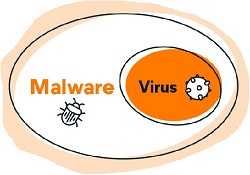
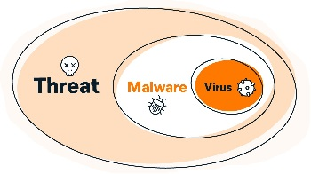
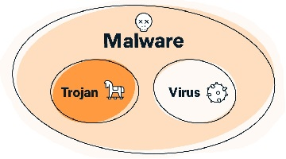
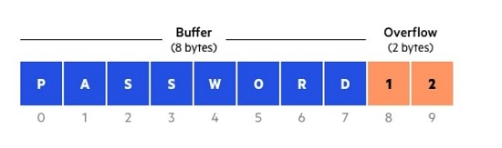

# 335.1 Common Security Vulnerabilities and Threats

#### _Topic 335: Threats and Vulnerability Assessment_

**Weight:** 2

**Description:** Candidates should understand the principle of major types of security vulnerabilities and threats.

**Key Knowledge Areas:**

* Conceptual understanding of threats against individual nodes
* Conceptual understanding of threats against networks
* Conceptual understanding of threats against application
* Conceptual understanding of threats against credentials and confidentiality
* Conceptual understanding of honeypots

**The following is a partial list of the used files, terms and utilities:**

* Trojans
* Viruses
* Rootkits
* Keylogger
* DoS and DDoS
* Man in the Middle
* ARP and NDP forgery
* Rogue Access Points, Routers and DHCP servers
* Link layer address and IP address spoofing
* Buffer Overflows
* SQL and Code Injections
* Cross Site Scripting
* Cross Site Request Forgery
* Privilege escalation
* Brute Force Attacks
* Rainbow tables
* Phishing
* Social Engineering

This Lesson is more about concepts than configurations and commands, so lets get started.

### Viruses

A computer virus is a type of computer program that, when executed, replicates itself by modifying other computer programs and inserting its own code. If this replication succeeds, the affected areas are then said to be "infected" with a computer virus.

Computer viruses generally require a host program. The virus writes its own code into the host program. When the program runs, the written virus program is executed first, causing infection and damage


&#x20;A [computer worm](https://en.wikipedia.org/wiki/Computer\_worm) does not need a host program, as it is an independent program or code chunk. Therefore, it is not restricted by the host program, but can run independently and actively carry out attacks.


### malware

**Malware**, short for **malicious software**, is any software intentionally designed to cause damage to a computer. Malware cause leak private information, gain unauthorized access to information or systems, deprive users access to information or which unknowingly interferes with the user's computer security and privacy.

#### What’s the difference between malware and a virus? 

The terms “virus” and “malware” are often used interchangeably, but they’re not the same thing.&#x20;

**Malware** is an umbrella term for any **mal**icious soft**ware** written specifically to infect and harm the host system or its user. While a computer virus is a type of malware, not all malware are computer viruses.

<figure><figcaption></figcaption></figure>

The easiest way to differentiate computer viruses from other forms of malware is to think about viruses in biological terms. Take the flu virus, for example. The flu requires some kind of interaction between two people—like a hand shake,... .Once the flu virus gets inside a person’s system it attaches to healthy human cells, using those cells to create more viral cells.

A computer virus works in much the same way:

1. A computer virus requires a host program.
2. A computer virus requires user action to transmit from one system to another.
3. A computer virus attaches bits of its own malicious code to other files or replaces files outright with copies of itself.

It’s that second virus trait that tends to confuse people. Viruses can’t spread without some sort of action from a user, like opening up an infected Word document.&#x20;

Above malware and viruses is a larger, overarching category: threats.&#x20;

### threats

A computer threat is a term that relates to the security of a computer system being compromised. This threat can lead to cyber-attacks and data being stolen, lost or edited.

<figure><figcaption></figcaption></figure>

The threat could be caused by poor information security practices or a ‘backdoor’ in the code of the system.

## &#x20;other kinds of malware  

### **Worms**

A computer worm is an insidious type of malware designed to spread across multiple devices while remaining active on each.

The key difference between a computer worm and a virus is how a worm can spread copies of itself to uninfected machines completely on its own. For a workable computer worm definition, think of worms as self-sufficient malware able to execute and proliferate without user interaction. You don’t need to even be using your computer in order for a worm to activate, replicate, and spread. **Once a worm lands on your computer, it can start spreading immediately**.

Whereas viruses need to borrow your computer’s programming or code in order to execute and replicate themselves, worms are self-contained. That’s why there’s no such thing as a “worm virus” — they’re two completely different, though similar, types of malware.

### Rootkits

A rootkit is a **malicious software bundle designed to give unauthorized access to a computer or other software**. Rootkits are hard to detect and can conceal their presence within an infected system. Hackers use rootkit malware to remotely access your computer, manipulate it, and steal data.

When a rootkit takes hold, your system acts as if it were a zombie computer, and the hacker can **exert absolute control over your device using remote access**. This part of the rootkit definition is what makes them so powerful.

Similar to how fileless malware uses legitimate programs without leaving a trace, rookits may also appear to be legitimate, because the hacker has privileged access to system files and system processes. Rootkits make your computer lie to you, and sometimes, lie to antivirus and security software, too.

### trojans

Trojan horse malware is a file, program, or piece of code that **appears to be legitimate and safe, but is actually malware**. Trojans are packaged and delivered inside legitimate software (hence their name), and they’re often designed to spy on victims or steal data. Many Trojans also download additional malware after you install them.

<figure><figcaption></figcaption></figure>

> The Trojan gets its name from the **Trojan Horse** in the Greek epic poem _The Iliad._ In the story, the Greek hero Odysseus hatches a plan to construct a giant wooden horse that his enemies — the Trojans — would receive into their city as a gift. But within the belly of the horse hid a legion of soldiers, who emerged under cover of night to decimate the city of Troy from within.

Trojan malware works the same way — **it pretends to be something harmless, but it’s just a cover for its real, malicious intent**.

### keyloggers

Short for “keystroke logging,” a keylogger is a type of malicious software that **records every keystroke you make on your computer**. Keyloggers are a type of spyware — malware designed to spy on victims. Because they can capture everything you type, keyloggers are one of the most invasive forms of malware.

There are two main types of keyloggers: software and hardware. Keylogger software is more common than keylogger hardware, because the latter requires actual physical access to a device.

#### Keylogger software

Keylogger software is more common than keylogger hardware, because you don’t need physical access to a targeted device. Keylogger software works like other malicious software: it infiltrates your device through malicious links or attachments, or even exploits or Trojans. A keylogger runs silently in the background of your computer until you discover and remove it.

Keylogger software is usually malicious, but some companies and parents use it to keep tabs on employees and kids. Depending on their application, time-tracking software and parental monitoring apps can easily verge into spying territory. When keyloggers are used to spy on loved ones, they’re referred to as **stalkerware**.

#### Hardware-based keyloggers

Hardware-based keyloggers take the form of a physical device, like a USB stick or another item that may look similar to a charger. They record keystrokes and other data, to be retrieved later by a hacker. Hardware keyloggers are difficult to detect with antivirus software.

For a hacker to install a hardware-based keylogger, they must have **physical access to your device**. They’ll usually try to hide the hardware in the back of a desktop PC tower or somewhere else you’re unlikely to look.

## Other terms , threats and attacks

### social engineering 

Social engineering is the practice of using psychological techniques to manipulate behavior. Social engineering happens by exploiting human error and encouraging victims to act against their interests. In information security, the social engineering definition refers to getting people to divulge private data online like login details or financial information.

In other contexts, social engineering means something slightly different. In the social sciences, for example, social engineering is simply the effort to psychologically influence social behaviors on a larger, group scale. That can include encouraging people to behave well on public transit, stop smoking, or even support political revolution.

Here, we’ll focus on social engineering in the information security context, where hackers deploy techniques online to gain access to confidential information. In this digital realm, social engineering can be defined as a cybercrime.

### Types of social engineering attacks: 

One of the best ways to protect yourself from a social engineering attack is to learn about the common methods used in social engineering. These days, social engineering happens frequently online, even via social media scams, where attackers pose as a trusted contact or authority figure to manipulate people into exposing confidential information. Here is one  common type of attacks in the social engineering toolkit:

### Phishing

Phishing is a type of social engineering attack in which communications are disguised to appear to come from a trusted source. These messages — often emails — are designed to trick victims into giving away personal or financial information.&#x20;

There are three components to a phishing attack:

1. The attack is conducted via electronic communications, such as email or a phone call.
2. The attacker pretends to be an individual or organization you can trust.
3. The goal is to obtain sensitive personal information, such as login credentials or credit card numbers.

> This deception is where phishing gets its name: The cybercriminal goes “fishing” with an attractive “bait” in order to hook victims from the vast “ocean” of internet users. The _ph_ in “phishing” comes from the mid-1900s hobby of “phone phreaking,” in which enthusiast “phreaks” would experiment with telecommunications networks to figure out how they worked. **Phreaking + fishing = phishing**.&#x20;

### brute force attack 

A brute force attack is when hackers try to crack a password through intensive computer-assisted trial and error. The scope and definition of brute force has broadened as computer technology has advanced.

> In the 1970s, a hacker could theoretically try _only_ thousands of different password variations every second. Today, modern computing allows for _hundreds of billions_ of login attempts per second.

Though the meaning of brute force has expanded, the method remains the same: **try as many password combinations as possible and hope one works.** Whether or not a hacker successfully finds the correct password often comes down to the amount of time and resources an attacker is willing to spend. But what methods do modern hackers use?

### Types of brute force attack 

There are five typical types of brute force attacks: simple attacks, dictionary attacks, hybrid attacks, reverse attacks, and credential stuffing. Anyone with an interest and a little know-how can **acquire a brute force decryption tool**, which is a type of software that automatically conducts brute force attacks.

### Rainbow Table Attack

A rainbow table attack is a password cracking method that uses a special table (a “rainbow table”) to crack the password hashes in a database. Applications don’t store passwords in plaintext, but instead encrypt passwords using hashes. After the user enters their password to login, it is converted to hashes, and the result is compared with the stored hashes on the server to look for a match. If they match, the user is authenticated and able to login to the application.&#x20;

The rainbow table itself refers to a precomputed table that contains the password hash value for each plain text character used during the authentication process. If hackers gain access to the list of password hashes, they can crack all passwords very quickly with a rainbow table.&#x20;

The prevalence of rainbow table attacks has dramatically decreased due to a technique known as “salting.” Salting is a modern technique used to thwart rainbow table attacks. It involves adding an extra random value to every hashed password to create a different hash value. Most modern password authentication systems include salting, which has significantly lessened the number of successful rainbow table attacks.&#x20;

Though salting is more prevalent, some developers still don’t utilize it and that puts them at increased risk of a rainbow table attack.


### How a Rainbow Table Attack Works

Hackers must first gain access to leaked hashes in order to carry out rainbow table attacks. The password database itself might be poorly secured, or they may have gained access to the Active Directory. Others gain access through phishing techniques of those that might have access to the password database. On top of all these techniques, there are already millions and millions of leaked password hashes on the dark web that are available to hackers.&#x20;

Once they have the password hashes the rainbow table is used to help decrypt the password hashes. As long as the password hashes don't include a “salt,” (explained above) they’ll be able to translate the encrypted passwords into plaintext easily.


### Buffer Overflows

Buffers are memory storage regions that temporarily hold data while it is being transferred from one location to another. A buffer overflow (or buffer overrun) occurs when the volume of data exceeds the storage capacity of the memory buffer. As a result, the program attempting to write the data to the buffer overwrites adjacent memory locations.

For example, a buffer for log-in credentials may be designed to expect username and password inputs of 8 bytes, so if a transaction involves an input of 10 bytes (that is, 2 bytes more than expected), the program may write the excess data past the buffer boundary.

Buffer overflows can affect all types of software. They typically result from malformed inputs or failure to allocate enough space for the buffer. If the transaction overwrites executable code, it can cause the program to behave unpredictably and generate incorrect results, memory access errors, or crashes

<figure><figcaption></figcaption></figure>

### Buffer Overflow Attack 

Attackers exploit buffer overflow issues by overwriting the memory of an application. This changes the execution path of the program, triggering a response that damages files or exposes private information. For example, an attacker may introduce extra code, sending new instructions to the application to gain access to IT systems.

If attackers know the memory layout of a program, they can intentionally feed input that the buffer cannot store, and overwrite areas that hold executable code, replacing it with their own code. For example, an attacker can overwrite a pointer (an object that points to another area in memory) and point it to an exploit payload, to gain control over the program.

### Types of Buffer Overflow Attacks 

**Stack-based buffer overflows** are more common, and leverage stack memory that only exists during the execution time of a function.

**Heap-based attacks** are harder to carry out and involve flooding the memory space allocated for a program beyond memory used for current runtime operations.


C and C++ are two languages that are highly susceptible to buffer overflow attacks, as they don’t have built-in safeguards against overwriting or accessing data in their memory. Mac OSX, Windows, and Linux all use code written in C and C++.

Languages such as PERL, Java, JavaScript, and C# use built-in safety mechanisms that minimize the likelihood of buffer overflow.


### Cross-Site Scripting (XSS)

Cross-site scripting, also known as XSS, is a cyberattack that happens when a hacker injects malicious code into a legitimate website.  XSS attacks are a type of **code injection attack**, a broad category of cybercrimes.

#### How does cross-site scripting work? 

Hackers can **exploit vulnerabilities in a website’s code to inject their own malicious scripts** that change the website’s behavior in some way.

Your browser can’t tell the difference between the website’s legitimate code and anything that has been injected by a cybercriminal. Your browser automatically executes all the scripts on a given website, so it will run the hacker’s code along with everything else.

XSS lets hackers turn legitimate websites into traps. Normal browsing turns dangerous when you land on a site that’s infected with hidden malicious scripts. Even worse, XSS means the hacker doesn’t have to attack each victim directly — they can sit back and let the infected websites do all the work — reaching far more people simultaneously.

### Cross Site Request Forgery (CSRF)

Cross-Site Request Forgery (CSRF) is an attack that forces an end user to execute unwanted actions on a web application in which they’re currently authenticated. With a little help of social engineering (such as sending a link via email or chat), an attacker may trick the users of a web application into executing actions of the attacker’s choosing. If the victim is a normal user, a successful CSRF attack can force the user to perform state changing requests like transferring funds, changing their email address, and so forth. If the victim is an administrative account, CSRF can compromise the entire web application.

### IP Spoofing

IP Spoofing is a hacker’s fake ID. It lets them use a fake IP address to conceal their identity and the true source of their device. With IP spoofing, hackers can infect your device with malware, steal sensitive information, or flood websites with DDoS attacks.

Although it’s often used maliciously, IP spoofing itself it’s not a cybercrime — there are some legitimate reasons to spoof an IP. For example, online businesses often use spoofed IP addresses to test websites before they’re live.

When used for the purpose of an IP spoofing attack — like using a fake IP address to hack into servers to shut them down or steal data — IP spoofing is considered a cybercrime. Hackers can also use other forms of spoofing, like website or phone spoofing to collect personal info.

### IP spoofing attacks

Hackers can use tools to modify the source address of the IP packets they send. With a fake source address, hackers can appear like a trusted device on your network, then request sensitive information that your device will freely give away. Once they gain trust, hackers can also directly attack your device.

IP address spoofing attacks can be difficult to detect. They occur on a network level, so there aren't any outward signs of tampering. And since the source address is false and randomized, it’s difficult to block these malicious requests or trace them back to their actual source.&#x20;

Using privacy and security software can defend against IP spoofing attacks.

### Types of IP spoofing 

IP spoofing can be used for a variety of attacks. Once hackers gain your device’s trust, they can use that vulnerability to request personal information, send a computer virus, or even turn your device into a zombie to support a large-scale bot attack on a target network.

Here are the most common types of IP spoofing attacks: DDOS attack, man-in-the-middle

### DDoS attack 

A DDoS (Distributed Denial of Service) attack is a malicious cyberattack that aims to **crash websites or servers by flooding them with internet traffic**. The sudden rush of traffic overwhelms the targeted site’s infrastructure, which usually causes it to fail. Regular users of the site or service won’t be able to access it until the DDoS attack is resolved.

While multiple types of DDoS attack exist, they mostly all use spam sent from a network of infected devices and seek to disrupt a website’s normal functionality by flooding it with traffic.


#### Dos vs DDoS Attacks 

A **DoS attack** is a denial of service attack where a computer is used to flood a server with TCP and UDP packets. A **DDoS attack** is where multiple systems target a single system with a DoS attack. The targeted network is then bombarded with packets from multiple locations.


### Man-in-the-middle

A man-in-the-middle attack occurs when hackers intercept communication between two computers that are unaware of the interference. It’s a common online threat that allows hackers to eavesdrop or even alter communication.

Using this IP spoofing method, man-in-the-middle attackers can intercept communication between two devices in order to quietly alter or steal IP packets. Your device may also freely give sensitive data to man-in-the-middle hackers, which they can use or sell on dark web marketplaces.

### Privilege escalation

Most computer systems are designed for use with multiple user accounts, each of which has abilities known as privileges. Common privileges include viewing and editing files or modifying system files.

Privilege escalation means users receive privileges they are not entitled to. These privileges can be used to delete files, view private information, or install unwanted programs such as viruses. It usually occurs when a system has a bug that allows security to be bypassed or, alternatively, has flawed design assumptions about how it will be used. Privilege escalation occurs in two forms:

* **Vertical privilege escalation**, also known as _privilege elevation_, where a lower privilege user or application accesses functions or content reserved for higher privilege users or applications (e.g. Internet Banking users can access site administrative functions or the password for a smartphone can be bypassed.)
* **Horizontal privilege escalation**, where a normal user accesses functions or content reserved for other normal users (e.g. Internet Banking User A accesses the Internet bank account of User B)

### SQL Injection

SQL injection is a covert type of cyberattack in which a hacker inserts their own code into a website to breach its security measures and access protected data. Once inside, they can control the website’s database and hijack user information.


**what SQL is**

Developed in the 1970s, SQL stands for “Structured Query Language,” and it’s since become **the standard language for database management.** If a website needs to access the database on its server to find or edit information, it uses SQL to handle that “query” or request.


If a web developer isn’t careful, they might build their site in such a way that a malicious actor can cause unintended effects in its database. This is how SQL injections (or SQLI) happen. The hacker inputs, or _injects_, malicious SQL code — a form of malware known as the _payload_ — on the website and fools it into delivering that code to its database as a legitimate query.

\

.

.

.

resources:

[https://en.wikipedia.org/wiki/Malware](https://en.wikipedia.org/wiki/Malware)

[https://en.wikipedia.org/wiki/Malware](https://en.wikipedia.org/wiki/Malware)

[https://www.malwarebytes.com/computer-virus](https://www.malwarebytes.com/computer-virus)

[https://www.avast.com/](https://www.avast.com/c-malware-vs-virus)

[https://www.imperva.com/learn/application-security/buffer-overflow/](https://www.imperva.com/learn/application-security/buffer-overflow/)

[https://portswigger.net/web-security/csrf](https://portswigger.net/web-security/csrf)

[https://www.comparitech.com/net-admin/dos-vs-ddos-attacks-differences-prevention/](https://www.comparitech.com/net-admin/dos-vs-ddos-attacks-differences-prevention/)

[https://en.wikipedia.org/wiki/Privilege\_escalation](https://en.wikipedia.org/wiki/Privilege\_escalation)

.
