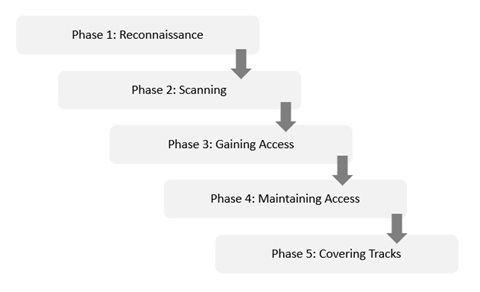
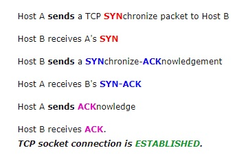
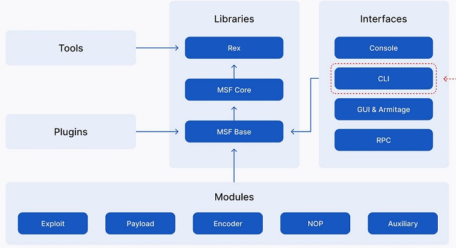

# 335.2 Penetration Testing

**Weight:** 3

**Description:** Candidates understand the concepts of penetration testing, including an understand of commonly used penetration testing tools. Furthermore, candidates should be able to use nmap to verify the effectiveness of network security measures.


**Key Knowledge Areas:**

* Understand the concepts of penetration testing and ethical hacking
* Understand legal implications of penetration testing
* Understand the phases of penetration tests, such as active and passive information gathering, enumeration, gaining access, privilege escalation, access maintenance, covering tracks
* Understand the architecture and components of Metasploit, including Metasploit module types and how Metasploit integrates various security tools
* Use nmap to scan networks and hosts, including different scan methods, version scans and operating system recognition
* Understand the concepts of Nmap Scripting Engine and execute existing scripts
* Awareness of Kali Linux, Armitage and the Social Engineer Toolkit (SET)

**Partial list of the used files, terms and utilities:**

* nmap

## Penetration test

A penetration test (pen test) is an authorized simulated attack performed on a computer system to evaluate its security. Penetration testers use the same tools, techniques, and processes as attackers to find and demonstrate the business impacts of weaknesses in a system. Penetration tests usually simulate a variety of attacks that could threaten a business. They can examine whether a system is robust enough to withstand attacks from authenticated and unauthenticated positions, as well as a range of system roles. With the right scope, a pen test can dive into any aspect of a system.

### Phases of Penetration Testing

Pen testers simulate attacks by motivated adversaries. To do this, they typically follow a plan that includes the following steps:

<figure><figcaption></figcaption></figure>

* **Reconnaissance.** Gather as much information about the target as possible from public and private sources to inform the attack strategy. Sources include internet searches, domain registration information retrieval, social engineering, nonintrusive network scanning, and sometimes even dumpster diving. This information helps pen testers map out the target’s attack surface and possible vulnerabilities. Reconnaissance can vary with the scope and objectives of the pen test; it can be as simple as making a phone call to walk through the functionality of a system.
* **Scanning.** Pen testers use tools to examine the target website or system for weaknesses, including open services, application security issues, and open source vulnerabilities. Pen testers use a variety of tools based on what they find during reconnaissance and during the test.
* **Gaining access.** Attacker motivations can include stealing, changing, or deleting data; moving funds; or simply damaging a company’s reputation. To perform each test case, pen testers determine the best tools and techniques to gain access to the system, whether through a weakness such as SQL injection or through malware, social engineering, or something else.
* **Maintaining access.** Once pen testers gain access to the target, their simulated attack must stay connected long enough to accomplish their goals of exfiltrating data, modifying it, or abusing functionality. It’s about demonstrating the potential impact.
* **Covering tracks:** The attacker must clear any trace of compromising the victim system, any type of data gathered, log events, in order to remain anonymous.


### **The Benefits of Penetration Testing**

There are many benefits to performing penetration testing. Some of the key ones include:

* **Maintaining compliance.** Many organizations must undergo periodic penetration tests to comply with laws and regulations like the Payment Card Industry Data Security Standard (PCI DSS) and the Health Insurance Portability and Accountability Act .
* **Preventing cyberattacks.** One of the main benefits of penetration testing is finding vulnerabilities in systems. These problems can then be addressed before hackers exploit them.
* **Avoiding costly security incidents.** Penetration testing can help improve an organization’s security posture. Performing penetration tests helps organizations save money through making themselves less susceptible to attacks.
* **Keeping cybersecurity professionals up to date.** To be a successful penetration tester, it’s essential to keep up with the latest trends and techniques. Conducting regular penetration tests can also be beneficial for cybersecurity professionals because it requires them to stay current on the latest cyberthreats and defense measures.


### Popular Penetration Testing Tools

There are many different penetration testing tools available, and each has its strengths and weaknesses. Some of the most popular include:

* **Nmap.** Nmap is a powerful network scanning tool that can scan for open ports and services. It also includes features for identifying vulnerable applications.
* **Metasploit.** Metasploit is a vulnerability exploitation tool. It includes a library of exploits for a variety of programs and operating systems, as well as a wizard that can assist penetration testers in capitalizing on known vulnerabilities.
* **Wireshark.** Wireshark is a network analysis tool that can capture packet data from a network and decode it into readable form. This can be useful for identifying malicious traffic or sensitive information being transmitted over a network.
* **Burp Suite.** Burp Suite is an all-in-one web application security testing tool. It can scan websites for vulnerabilities, manipulate requests and responses, and intercept traffic between the client and server.

These are just a few of the many penetration testing tools available . As a penetration tester, it’s essential to be familiar with as many of them as possible so that you can choose the right tool for each penetration testing phase.


#### Certified Ethical Hacker <a href="#firstheading" id="firstheading"></a>

**Certified Ethical Hacker** (**CEH**) is a qualification given by **EC-Council** and obtained by demonstrating knowledge of assessing the security of computer systems by looking for weaknesses and vulnerabilities in target systems, using the same knowledge and tools as a malicious hacker, but in a lawful and legitimate manner to assess the security posture of a target system. This knowledge is assessed by answering multiple choice questions regarding various ethical hacking techniques and tools.&#x20;


## nmap

**Nmap** is Linux command-line tool for network exploration and security auditing. This tool is generally used by hackers and cybersecurity enthusiasts and even by network and system administrators. It is used for the following purposes:&#x20;

* Real time information of a network
* Detailed information of all the IPs activated on your network
* Number of ports open in a network
* Provide the list of live hosts
* Port, OS and Host scanning


Before start scanning please note that Port scanning without authorization is sometimes against the provider's acceptable use policy (AUP).


nmap command with no option just prints its long list of switches and options. For our demonstartion we scan scanme.nmap.org :

```
[root@rocky8 ~]# nmap -v scanme.nmap.org

Starting Nmap 7.01 ( https://nmap.org ) at 2018-01-22 03:25 PST
Initiating Ping Scan at 03:25
Scanning scanme.nmap.org (45.33.32.156) [4 ports]
Completed Ping Scan at 03:25, 0.24s elapsed (1 total hosts)
Initiating Parallel DNS resolution of 1 host. at 03:25
Completed Parallel DNS resolution of 1 host. at 03:25, 0.35s elapsed
Initiating SYN Stealth Scan at 03:25
Scanning scanme.nmap.org (45.33.32.156) [1000 ports]
Discovered open port 80/tcp on 45.33.32.156
Discovered open port 22/tcp on 45.33.32.156
Increasing send delay for 45.33.32.156 from 0 to 5 due to 11 out of 24 dropped probes since last increase.
SYN Stealth Scan Timing: About 12.63% done; ETC: 03:29 (0:03:34 remaining)
SYN Stealth Scan Timing: About 14.37% done; ETC: 03:32 (0:06:04 remaining)
Increasing send delay for 45.33.32.156 from 5 to 10 due to 11 out of 11 dropped probes since last increase.
SYN Stealth Scan Timing: About 58.53% done; ETC: 03:28 (0:01:04 remaining)
Completed SYN Stealth Scan at 03:27, 109.38s elapsed (1000 total ports)
Nmap scan report for scanme.nmap.org (45.33.32.156)
Host is up (0.0018s latency).
Other addresses for scanme.nmap.org (not scanned): 2600:3c01::f03c:91ff:fe18:bb2f
Not shown: 987 filtered ports
PORT     STATE  SERVICE
21/tcp   closed ftp
22/tcp   open   ssh
53/tcp   closed domain
80/tcp   open   http
110/tcp  closed pop3
143/tcp  closed imap
443/tcp  closed https
587/tcp  closed submission
993/tcp  closed imaps
995/tcp  closed pop3s
3389/tcp closed ms-wbt-server
8080/tcp closed http-proxy
8291/tcp closed unknown

Read data files from: /usr/bin/../share/nmap
Nmap done: 1 IP address (1 host up) scanned in 110.55 seconds
           Raw packets sent: 3033 (133.256KB) | Rcvd: 1500 (60.008KB)
```

The `-v` option enables verbose mode. other examples:

<table><thead><tr><th>nmap Target selection</th><th>Description</th><th data-hidden></th></tr></thead><tbody><tr><td>nmap 192.168.10.151</td><td>scan a single IP</td><td></td></tr><tr><td>nmap scanme.nmap.org</td><td>scan a host</td><td></td></tr><tr><td>nmap 192.168.10.150-155</td><td>scan a range of IPs</td><td></td></tr><tr><td>nmap 192.168.10.0/24</td><td>scan a subnet</td><td></td></tr><tr><td>nmap -iL myserverlist.txt</td><td>scan targets from a text file</td><td></td></tr><tr><td>nmap -6 [IP-V6-HERE]</td><td>enables IP v6 scanning</td><td></td></tr></tbody></table>

Scanning ports with nmap:

<table><thead><tr><th>nmap port selection</th><th></th><th data-hidden></th></tr></thead><tbody><tr><td>nmap -p 22 192.168.10.151</td><td>scan a single port</td><td></td></tr><tr><td>nmap -p 1-100 192.168.10.151</td><td>scan a range of port</td><td></td></tr><tr><td>nmap -F 192.168.10.151</td><td>Fast-scan 100 most common ports</td><td></td></tr><tr><td>nmap -p- 192.168.10.151</td><td>scan all 65535 ports</td><td></td></tr></tbody></table>

nmap has different techniques for scanning. But before explaining them we review some fundamentals.

### TCP 3-Way Handshake Diagram

Below is a very simplified diagram of the TCP 3-way handshake process. Have a look at the diagram on the right as you examine the list of events on the left

<table><thead><tr><th align="center">Event</th><th align="center">Diagram</th><th data-hidden></th></tr></thead><tbody><tr><td align="center"></td><td align="center"></td><td></td></tr></tbody></table>

after this small review we can talk about nmap different methods of scanning:

### nmap scan methods

* **TCP SYN Scan (-sS)**

It is a basic scan, and it is also called half-open scanning because this technique allows Nmap to get information from the remote host without the complete TCP handshake process, Nmap sends SYN packets to the destination, but it does not create any sessions, As a result, the target computer can’t create any log of the interaction because no session was initiated, making this feature an advantage of the TCP SYN scan.`nmap -sT 192.168.10.151`

* **TCP connect() scan (-sT)**

This the default scanning technique used, if and only if the SYN scan is not an option, because the SYN scan requires root privilege. Unlike the TCP SYN scan, it completes the normal TCP three way handshake process and requires the system to call connect(), which is a part of the operating system. Keep in mind that this technique is only applicable to find out the TCP ports, not the UDP ports. `nmap -sT 192.168.10.151`

* **UDP Scan (-sU)**

As the name suggests, this technique is used to find an open UDP port of the target machine. It does not require any SYN packet to be sent because it is targeting the UDP ports. But we can make the scanning more effective by using -sS along with –sU. UDP scans send the UDP packets to the target machine, and waits for a response—if an error message arrives saying the ICMP is unreachable, then it means that the port is closed; but if it gets an appropriate response, then it means that the port is open.

`nmap -sU 192.168.10.151`

* **FIN Scan (-sF)**

Sometimes a normal TCP SYN scan is not the best solution because of the firewall. IDS and IPS scans might be deployed on the target machine, but a firewall will usually block the SYN packets. A FIN scan sends the packet only set with a FIN flag, so it is not required to complete the TCP handshaking.

The target computer is not able to create a log of this scan (again, an advantage of FIN). Just like a FIN scan, we can perform an xmas scan (-sX) and Null scan (-sN). The idea is same but there is a difference between each type of scan.

* **Ping Scan (-sP)**

Ping scanning is unlike the other scan techniques because it is only used to find out whether the host is alive or not, it is not used to discover open ports. Ping scans require root access s ICMP packets can be sent, but if the user does not have administrator privilege, then the ping scan uses connect() call. `nmap -sP 192.168.10.151`

* **Version Detection (-sV)**

Version detection is the right technique that is used to find out what software version is running on the target computer and on the respective ports. It is unlike the other scanning techniques because it is not used to detect the open ports, but it requires the information from open ports to detect the software version. In the first step of this scan technique, version detection uses the TCP SYN scan to find out which ports are open. **** `nmap -sV 192.168.10.151`

* **Idle Scan (-sI)**

Idle scan is one of my favorite techniques, and it is an advance scan that provides complete anonymity while scanning. In idle scan, Nmap doesn’t send the packets from your real IP address—instead of generating the packets from the attacker machine, Nmap uses another host from the target network to send the packets. ex: **** `nmap -sI 192.168.1.6 192.168.1.1`

The idle scan technique (as mentioned above) is used to discover the open ports on 192.168.1.1 while it uses the zombie\_host (192.168.1.6) to communicate with the target host. So this is an ideal technique to scan a target computer anonymously.

### Nmap Scripting Engine (NSE)

NSE (Nmap Scripting Engine) enables additional functions in the Nmap scan process by allowing scripts for additional tasks such as brute force, vulnerability detection, or exploitation.

The Nmap Scripting Engine (NSE) contains a set of scripts classified by category, and users can write their own scripts with custom features (using the [Lua programming language](http://lua.org/) ).

### **NSE (Nmap Scripting Engine) Scripts categories and types**

The scripts included in the NSE are classified according to different criteria based on the moment of the execution, the script purpose, and methods.

The first classification based mainly on the moment of execution includes 4 script types:

* **Prerule scripts** are executed before any Nmap scan phase, for example, scripts used to generate new targets.
* **Host scripts** are executed during the scan process.
* **Service scripts** are executed after each batch of hosts is scanned, like Host scripts.
* **Postrule scripts** are executed after the scan process; these scripts can exploit a vulnerability discovered during the scan process.

The second classification is based on the script’s purposes and safety. Categories order scripts according to that criteria. The categories are:

* **Auth:** Scripts under this category are useful to deal with authentication.&#x20;
* **Broadcast:** These scripts allow to discover hosts by broadcasting the local network.
* **Brute:** This category contains scripts to execute brute force attacks&#x20;
* **Default:** This category includes scripts meeting requirements based on speed, usefulness, verbosity, reliability, intrusiveness, and privacy. Scripts under this category must finish quickly and need to report valuable information on the target. The output must be readable and limited to accurate information. Intrusive scripts likely to crash the target system or service are less suitable for this category. ****&#x20;
* **Discovery:** Scripts under this category try to discover more about the target by querying public sources, SNMP-enabled devices, directories, and the like.&#x20;
* **DOS:** These scripts are useful to test targets for vulnerabilities before DOS attacks; these scripts are prone to crash a vulnerable system or service.
* **Exploit:** Scripts in this category are used to exploit vulnerabilities on targets.
* **External:** This category contains the scripts involving external resources during the scan process, such as database information requests on the target. Scripts sharing information on the scan process with third-party databases are placed in this category.&#x20;
* **Fuzzer:** this category contains scripts to send randomized fields massively to discover vulnerabilities to exploit a buffer overflow, DOS (denial of service), cross-site scripting, or SQL injection**.**
* **Intrusive:** Scripts in this category are likely to crash the target by using a significant amount of resources or to be detected as malicious activity.
* **Malware:** Malware scripts are designed to detect the possible malware or backdoors presence on the target.
* **Safe:** Contrary to intrusive scripts, safe scripts unlikely to crash the target, which doesn’t need a significant amount of resources and is unlikely to be detected as malicious by the target can be placed here. Scripts under this category mainly deal with discovery tasks.
* **Version:** Version scripts extend the version Nmap feature; an example is the script [docker-version](https://nmap.org/nsedoc/scripts/docker-version.html) used to detect a service docker version.
* **Vuln:** Vuln scripts are useful to test vulnerabilities on targets accurately.

NSE scripts are located at _**/usr/share/nmap/scripts,**_ and any new script you want to add (e.g., Vulscan) should be placed there. ****&#x20;

#### How to use Nmap Scripting Engine (NSE)

NSE is included in Nmap, to begin to install Nmap in case you don’t have it yet, or if you already have Nmap installed, run the following command to update the Nmap Scripting Engine database:

```
[root@rocky8 ~]# nmap --script-updatedb
Starting Nmap 7.70 ( https://nmap.org ) at 2022-09-29 02:20 +0330
NSE: Updating rule database.
NSE: Script Database updated successfully.
Nmap done: 0 IP addresses (0 hosts up) scanned in 1.14 seconds
```

NSE scripts are loaded using the `--script` flag, which also allows you to run your own scripts by providing categories, script file names, or the name of directories where your scripts are located.

```
nmap --script filename|category|directory|expression,...   target 
```

To perform a scan with most of the default scripts, use the `-sC` flag or alternatively use `--script=default` as shown.

```
 nmap -sC scanme.nmap.org   #load default scripts
# OR
 nmap --script=default scanme.nmap.org
# OR
 nmap --script default scanme.nmap.org
```

As an example, I will show how Nmap NSE can hack a WordPress website with brute force using the script [http-wordpress-brute.nse](https://nmap.org/nsedoc/scripts/http-wordpress-brute.html). In this example, the imaginary hacked website is example.com:

```
nmap -sV --script http-wordpress-brute --script-args 'userdb=users.txt,passdb=pass.txt' example.com
```

Where:

> **Nmap -sV:** calls nmap and enables version detection.
>
> **–script http-wordpress-brute:** calls the http-wordpress-brute script to brute force wordpress sites.
>
> **–script-args ‘userdb=users.txt,passdb=pass.txt’:** specifies the user and password dictionaries, in this case, you can create  the files users.txt and pass.txt containing dummy data and the correct credentials, the files were located in the same directory in which Nmap was executed, you can also specify the path: **–script-args ‘userdb=/path/to/dicionaty/users.txt,passdb=/path/to/dicionaty/pass.txt’**

The following example shows how to run all scripts belonging both to the Default and Safe categories with a user-friendly syntax:

```
nmap --script "default and safe" example.com
```

The last example shows how to crack SSH credentials using NSE:

```
nmap --script ssh-brute.nse localhost
```

> Like with http-WordPress-brute, with this script, you can also specify dictionaries bypassing the argument: `--script-args userdb=users.txt,passdb=pass.txt`


to learn more visit: [https://nmap.org/book/nse-tutorial.html](https://nmap.org/book/nse-tutorial.html)


## Metasploit Framework <a href="#metasploit-framework" id="metasploit-framework"></a>

The Metasploit Framework is a Ruby-based, modular penetration testing platform that enables you to write, test, and execute exploit code.&#x20;

Metasploit initially created by H. D Moore in 2003, until it was acquired and developed further by Rapid7(a US-based cybersecurity firm) on October 21, 2009.

Metasploit comes with several editions, generally divided into two categories, free version and paid version. The free versions: **Metasploit Framework Community Edition (CLI based interface)** and **Armitage** (**GUI based interface**). The paid versions : Metasploit Express, Metasploit Pro, and Cobalt Strike (it is similiar with Armitage, which is provided by Strategic Cyber LLC).

### Metasploit Framework architecture

The Metasploit Framework architecture consists of the following parts:

* Interfaces
* Libraries
* Modules
* Tools
* Plugins

<figure><figcaption></figcaption></figure>

#### Interfaces

Interfaces are the different platforms through which users can access the Metasploit Framework.&#x20;

There are four interfaces available:&#x20;

1. **MSFConsole** **(Metasploit Framework Console)**: The most widely-used Metasploit interface, the Metasploit console allows users to access the Metasploit Framework through an interactive command line interface.
2. **MSFWeb**: A browser-based interface that allows users to access the Metasploit framework.
3. **Armitage**: Developed by Raphael Mudge in 2013, Armitage is a Java-based GUI interface that allows security red teams to collaborate by sharing their access to compromised hosts.
4. **RPC (Remote Procedure Call):** Allows users to programmatically drive the Metasploit Framework using HTTP-based remote procedure call (RPC) services. In addition to Metasploit’s native Ruby, RPC services can operate through other languages, such as Java, Python, and C.

#### Libraries

Libraries contain the different Metasploit Framework functions that allow users to run exploits without writing additional code.

There are three Metasploit libraries:

1. **REX:** Enables most basic tasks; contains Base64, HTTP, SMB, SSL, and Unicode.
2. **MSF Core:** Provides common API and defines the Metasploit Framework.
3. **MSF Base:** Provides user-friendly API.

#### Modules

The Metasploit Framework uses software called modules that are used for performing tasks like scans and target exploitation.&#x20;

There are six main Metasploit module types, categorized by which tasks they perform:

1. **Payloads:** Payloads are shellcodes that perform the user’s intended actions once an exploit has compromised a target system. They can be used to open Meterpreters or command shells. Meterpreters are sophisticated payloads used during a **cyber attack** to execute code and perform further exploratory tasks.
2. **Exploits:** Execute command sequences to leverage system or application weaknesses and gain access to target systems.&#x20;
3. **Posts (Post-Exploitation Modules):** Posts allow users to conduct deeper information gathering and further infiltrate a target system after exploitation. For example, posts can be used to perform service enumeration.
4. **Encoders:** Encoders obfuscate payloads in transit to ensure they are successfully delivered to the target system and evade detection from antivirus software, intrusion detection systems (**IDSs**), and intrusion prevention systems (**IPSs**).
5. **NOPs (No Operation):** NOP generators create randomized sequences of bytes to bypass intrusion detection and prevention systems.
6. **Auxiliaries:** Auxiliary modules include vulnerability scanning, port scanning, fuzzers, sniffers, and other exploitation tools.

#### Tools and Plugins

Tools and plugins are add-ons to the Metasploit framework that extend its functionality. For example, the `pattern_create` tool is often used during exploit development to form non-repeating string patterns; the `pentest` plugin helps perform common tasks undertaken during penetration testing.

> Metasploit-framework is a standard package installed in Kali Linux system (and also almost all Penetration Testing OS).&#x20;

### What is Kali Linux?

**Kali Linux** _(formerly known as_ [_**BackTrack Linux**_](https://www.backtrack-linux.org/)_)_ is an [open-source](https://www.kali.org/docs/policy/kali-linux-open-source-policy/), [Debian-based Linux](https://www.kali.org/docs/policy/kali-linux-relationship-with-debian/) distribution aimed at advanced Penetration Testing and Security Auditing. It [does this by](https://www.kali.org/features/) providing common tools, configurations, and automations which allows the user to focus on the task that needs to be completed, not the surrounding activity.

Kali Linux contains industry specific modifications as well as [several hundred tools](https://www.kali.org/docs/policy/penetration-testing-tools-policy/) targeted towards various Information Security tasks, such as Penetration Testing, Security Research, Computer Forensics, Reverse Engineering, Vulnerability Management and Red Team Testing.

Kali Linux is a multi-platform solution, accessible and freely available to information security professionals and hobbyists.

### The Social-Engineer Toolkit (SET)

The **S**ocial-**E**ngineer **T**oolkit (SET) was created and written by Dave Kennedy, the founder of TrustedSec. It is an open-source Python-driven tool aimed at penetration testing around Social-Engineering.

It has been presented at large-scale conferences including Blackhat, DerbyCon, Defcon, and ShmooCon. With over two million downloads, it is the standard for social-engineering penetration tests and supported heavily within the security community.

It has over 2 million downloads and is aimed at leveraging advanced technological attacks in a social-engineering type environment. TrustedSec believes that social-engineering is one of the hardest attacks to protect against and now one of the most prevalent.

for more info visit: [https://github.com/trustedsec/social-engineer-toolkit](https://github.com/trustedsec/social-engineer-toolkit)


that's all.

## Congratulation we have done lpic3-303 !!! do not forget to give a [star](https://github.com/Borosan) and [donate](http://linuxcert.ir/donation.html) :-)

.

.

.

resources:

[https://www.synopsys.com/glossary/what-is-penetration-testing.html](https://www.synopsys.com/glossary/what-is-penetration-testing.html)

[https://www.eccouncil.org/cybersecurity-exchange/penetration-testing/penetration-testing-phases/#:\~:text=There%20are%20five%20penetration%20testing,assessment%2C%20exploitation%2C%20and%20reporting.](https://www.eccouncil.org/cybersecurity-exchange/penetration-testing/penetration-testing-phases/)

[https://www.synopsys.com/glossary/what-is-penetration-testing.html](https://www.synopsys.com/glossary/what-is-penetration-testing.html)

[https://en.wikipedia.org/wiki/Penetration\_test](https://en.wikipedia.org/wiki/Penetration\_test)

[https://en.wikipedia.org/wiki/Certified\_Ethical\_Hacker](https://en.wikipedia.org/wiki/Certified\_Ethical\_Hacker)

[https://www.geeksforgeeks.org/nmap-command-in-linux-with-examples/](https://www.geeksforgeeks.org/nmap-command-in-linux-with-examples/)

[https://www.linux.org/threads/nmap-installation.4473/](https://www.linux.org/threads/nmap-installation.4473/)

[https://www.linux.org/threads/nmap-common-scans-%E2%80%93-part-one.4476/](https://www.linux.org/threads/nmap-common-scans-%E2%80%93-part-one.4476/)

[https://www.linux.org/threads/nmap-common-scans-%E2%80%93-part-two.4483/](https://www.linux.org/threads/nmap-common-scans-%E2%80%93-part-two.4483/)

[https://linuxhint.com/nmap-scripting-engine-tutorial/](https://linuxhint.com/nmap-scripting-engine-tutorial/)

[https://www.tecmint.com/use-nmap-script-engine-nse-scripts-in-linux/](https://www.tecmint.com/use-nmap-script-engine-nse-scripts-in-linux/)

[https://www.upguard.com/blog/metasploit](https://www.upguard.com/blog/metasploit)

[https://www.kali.org/docs/introduction/what-is-kali-linux/](https://www.kali.org/docs/introduction/what-is-kali-linux/)

[https://www.trustedsec.com/tools/the-social-engineer-toolkit-set/](https://www.trustedsec.com/tools/the-social-engineer-toolkit-set/)

.


